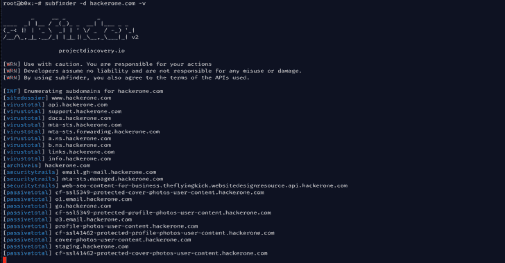

# Subfinder:一个子域发现工具，用于发现有效的网站子域

> 原文：<https://kalilinuxtutorials.com/subfinder/>

**Subfinder** 是一个子域发现工具，通过使用被动的在线资源为网站发现有效的子域。它具有简单的模块化架构，并针对速度进行了优化。它只做一件事——被动子域枚举，而且做得很好。

我们将它设计为符合所有被动源许可证和使用限制，并保持一致的被动模式，使其对渗透测试人员和 bug 赏金猎人都有用。

**特性**

*   简单和模块化的代码基础使其易于贡献。
*   快速和强大的决议和通配符消除模块
*   **策划**被动来源以最大化结果(截至目前有 26 个来源)
*   支持多种输出格式(Json，File，Stdout)
*   针对速度进行了优化，非常快并且**轻量级**占用资源
*   **标准输入**和**标准输出**支持集成到工作流中

**另请阅读-[多台榨汁机:运行捕获标志【OWASP 果汁店](https://kalilinuxtutorials.com/multijuicer/)的安全培训**

**用途**

**子查找器-h**

这将显示该工具的帮助。这里是它支持的所有开关。

| 旗 | 描述 | 例子 |
| --- | --- | --- |
| -配置字符串 | API 密钥等的配置文件 | subfinder -config config.yaml |
| -d | 要为其查找子域的域 | 子 finder-d uber.com |
| -dL | 包含要枚举的域列表的文件 | sub finder-dL hacker one-hosts . txt |
| -排除-来源 | 要从枚举中排除的源列表 | 子查找器-排除-源存档 |
| -最长时间 | 等待枚举结果的分钟数(默认为 10) | 子查找器-最大时间 1 |
| -数控 | 不要在输出中使用颜色 | 子 finder -nC |
| -西北 | 从输出中删除通配符和死子域 | 子查找器-西北 |
| 表示“具有…性质的” | 要写入输出的文件(可选) | 子 finder -o output.txt |
| -oD | 将枚举结果写入的目录(可选) | 子 finder-oD ~/输出 |
| -喂 | 以主机、IP 格式写入输出 | 子 finder -oI |
| -橙汁 | 以 JSON 行格式编写输出 | 子查找器-oJ |
| -r | 要使用的以逗号分隔的解析程序列表 | 子 finder -r 1.1.1.1，1.0.0.1 |
| -rL | 包含要使用的解析程序列表的文本文件 | 子 finder -rL resolvers.txt |
| -沉默 | 在输出中只显示子域 | 子查找器-无声 |
| -来源 | 要使用的逗号分隔的源列表 | subfinder -sources shodan，censys |
| 相当于-ED | 用于解析的并发 goroutines 数(默认为 10) | 子 finder -t 100 |
| -超时 | 超时前等待的秒数(默认为 30) | 子查找器-超时 30 |
| -v | 显示详细输出 | 子查找器-v |
| -版本 | 显示当前程序版本 | 子查找器-版本 |

**安装说明**

**直接安装**

*   **需要 go1.13+才能安装成功！**

安装很容易。您可以从 [Releases](https://github.com/projectdiscovery/subfinder/releases/) 页面下载不同平台的预构建二进制文件。使用 tar 提取它们，移动到您的$PATH 中，您就可以开始了。

**>tar-xzvf subfinder-linux-amd64.tar
>mv 子查找器-Linux-amd64/usr/bin/子查找器
子查找器**

如果你想自己建，你可以去回购

去找 github.com/projectdiscovery/subfinder/cmd/subfinder

**升级**

如果您希望升级软件包，您可以使用:

**去 github.com/projectdiscovery/subfinder/cmd/subfinder**

*   **在 Docker 容器中运行**

可以在[子 finder](https://hub.docker.com/r/ice3man/subfinder) 使用官方 dockerhub 图片。只需运行–

**>码头工人拉 ice3man/subfinder**

上面的命令将从 dockerhub 存储库中提取最新的带标签的版本。

如果您想自己手工构建容器，git 克隆 repo，然后构建并运行以下命令

*   使用`**git clone https://github.com/projectdiscovery/subfinder.git**`克隆回购
*   构建您的 docker 容器

**docker build-t ice 3 man/sub finder**

*   使用任一种方法构建容器后，运行以下命令–

**docker run-it ice 3 man/sub finder**

> 上述命令与运行`**-h**`相同

例如，这将针对 uber.com 运行该工具，并将结果输出到您的主机文件系统:

**docker run -v $HOME/。config/subfinder:/root/。config/sub finder-it ice 3 man/sub finder-d uber.com【uber.com.txt>**

*   **张贴安装说明**

它将在使用安装说明后工作，但是要配置它与某些服务一起工作，您将需要安装 API 密钥。没有 API 密钥，下列服务无法工作:

*   [Virustotal](https://www.virustotal.com/)
*   [被动总计](http://passivetotal.org/)
*   [安全轨道](http://securitytrails.com/)
*   [Censys](https://censys.io)
*   [二进制边缘](https://binaryedge.io)
*   [庄丹](https://shodan.io)
*   [URLScan](https://urlscan.io)

这些值存储在$HOME/中。首次运行该工具时将创建的 config/subfinder/config.yaml 文件。配置文件使用 YAML 格式。可以为这些服务中的每一个指定多个 API 键，其中一个将用于枚举。

对于需要多个键的源，即`Censys`、`Passivetotal`，可以通过冒号(:)分隔来添加。

配置文件示例–

**解析器:**
–1 . 1 . 1
–1 . 0 . 0 . 1
**来源:**
–binary edge
–缓冲
–普查
–被动总计

如果您正在使用 docker，您需要首先创建保存配置文件的目录结构。修改默认的 config.yaml 文件后，您可以运行:

**> mkdir $HOME/。config/sub finder
>CP config . YAML $ HOME/。config/sub finder/config . YAML
nano $ HOME/。config/sub finder/config . YAML**

之后，您可以使用下面的示例命令将其作为一个卷进行传递。

**> docker run -v $HOME/。config/subfinder:/root/。config/sub finder-it ice 3 man/sub finder-d freelancer.com**

**运行中**

要在目标上运行该工具，只需使用以下命令。

**【freelancer.com】子 finder-d**

这将针对 freelancer.com 运行该工具。有许多配置选项可以和这个命令一起传递。详细开关(-v)可用于显示详细信息。

【证书波特】www.fi.freelancer.com
【DNSDUMPSTER】hosting.freelancer.com
【DNSDUMPSTER】support.freelancer.com
【DNSDUMPSTER】accounts.freelancer.com
【DNSDUMPSTER】phabricator.freelancer.com
【DNSDUMPSTER】cdn1.freelancer.com
【DNSDUMPSTER】t1.freelancer.com
【DNSDUMPSTER】wdc.t1.freelancer.com
【DNSDUMPSTER】dal . T1 . freelancer . com

o 命令可用于指定输出文件。

**【freelancer.com】sub finder-d o output . txt**

要在域列表上运行该工具，可以使用`-dL`选项。这需要一个目录来写入输出文件。列表中每个域的子域被写入由`-oD`标志指定的目录中的文本文件中，它们的名称就是域名。

>猫 domains . txt
hackerone.com
google.com
T3>sub finder-dL domains . txt-oD ~/path/to/output
ls ~/path/to/output
hackerone.com.txt
google.com.txt

如果希望在使用域列表时将结果保存到单个文件中，请使用输出文件的名称指定-o 标志。

>猫 domains . txt
hackerone.com
google.com
T3>子 finder-dL domains . txt-o ~/path/to/output . txt
ls ~/path/to/

output . txt

您还可以使用-oJ 开关获得 json 格式的输出。该开关以 JSON 行格式保存输出。

如果您使用 JSON 格式，或者 Host:IP 格式，那么您必须使用 **-nW** 格式，因为解析对于这些输出格式是必不可少的。默认情况下，禁用解析找到的子域。

**>sub finder-d hackerone.com-o output . JSON-oJ-nW
>cat output . JSON

{ " host ":" www . hacker one . com " IP ":" 104 . 16 . 99 . 52 "}
{ " host ":" MTA-STS . hacker one . com " IP ":" 185 . 199 . 108 . 153 "{ " host ":" hacker one . com " IP**

–silent 开关可用于仅显示没有任何其他信息的子域。

您也可以指定自定义的解析器。

**>子 finder-d freelancer.com-o result . txt-nW-v-r 8 . 8 . 8 . 8，1.1.1.1
>子 finder-d freelancer.com-o result . txt-nW-v-rL resolvers . txt**

此版本的新亮点是增加了标准输入/标准输出功能。现在，域可以通过管道连接到它，并且可以在其上运行枚举。例如–

**>echo " hacker one . com " | sub finder-v
>cat targets . txt | sub finder-v**

发现的子域也可以通过管道传输给其他工具。例如，您可以通过@tomnomnom 将它发现的子域通过管道传输到 awesome[http probe](https://github.com/tomnomnom/httprobe)工具，该工具将在主机上找到正在运行的 http 服务器。

**>echo " hacker one . com " | sub finder-silent | http probe
http://hackerone.com
http://www.hackerone.com
http://docs.hackerone.com
http://api.hackerone.com
https://docs.hackerone.com
http://mta-sts.managed.hackerone.com**

[**Download**](https://github.com/projectdiscovery/subfinder)