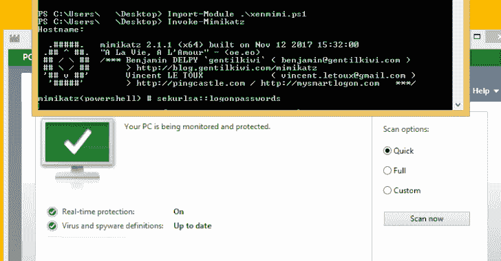

# Xencrypt:一个 PowerShell 脚本反病毒规避工具

> 原文：<https://kalilinuxtutorials.com/xencrypt/>

Xencrypt 是一个 PowerShell crypter，它使用 AES 加密和 Gzip/DEFLATE 压缩来为每个调用生成一个完全唯一但功能相当的输出脚本，给定任何输入脚本。

它通过压缩和加密输入脚本并将此数据作为有效负载存储在新脚本中来实现这一点，新脚本将在运行前对有效负载进行解密和解压缩。本质上，它对 PowerShell 来说就是 PE crypter。

**特性**

*   绕过 AMSI 和所有在 VirusTotal 上使用的现代反病毒软件
*   压缩和加密 powershell 脚本
*   具有最小的甚至经常是负的(由于压缩)开销
*   随机化的变量名，以进一步混淆解密器存根
*   随机化加密、压缩，甚至语句在代码中出现的顺序，以获得最大熵！
*   超级容易修改，以创建自己的密码变种
*   支持递归分层(加密输出加密)，测试多达 500 层。
*   支持导入模块和标准运行，只要输入脚本也支持它
*   GPLv3——免费和开源！
*   所有功能都在一个文件中，因此您可以将它带到任何地方！
*   尽管存在上述所有情况，但并不是每种配置都适用的灵丹妙药——买者自负！

**又读-[鼠标:iOS & macOS 后剥削框架](https://kalilinuxtutorials.com/mouse/)**

**用途**

**导入-模块。/Xen crypt . PS1
Invoke-Xen crypt-InFile Invoke-mimikatz . PS1-OutFile Xen Mimi . PS1**

现在，在当前工作目录中，您将拥有一个加密的 xenmimi.ps1 文件。您可以像使用原始脚本一样使用它，因此在这种情况下:

**导入-模块。/Xen Mimi . PS1
Invoke-Mimi Katz**

它还通过-Iterations 标志支持递归分层。

**Invoke-Xen crypt-InFile Invoke-mimikatz . PS1-OutFile Xen Mimi . PS1-迭代 100 次**

这将压缩和加密它 100 倍，是有用的动态反病毒旁路，因为他们有一个超时分析代码。这里没有像 sleeps 这样的伪装，动态扫描可以跳过它而到达终点，它必须通过整个链才能到达恶意有效负载，但它通常不会这样做，因为它们通常在一两秒钟或扫描后超时。

但是警告，文件可能会变得很大，生成输出文件可能需要很长时间，这取决于脚本和请求的迭代次数。

[**Download**](https://github.com/the-xentropy/xencrypt)