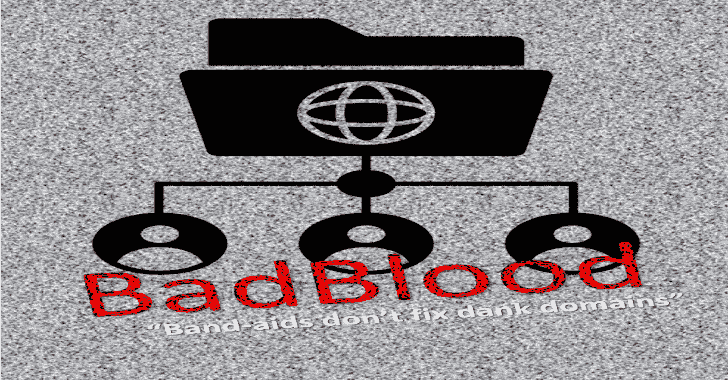
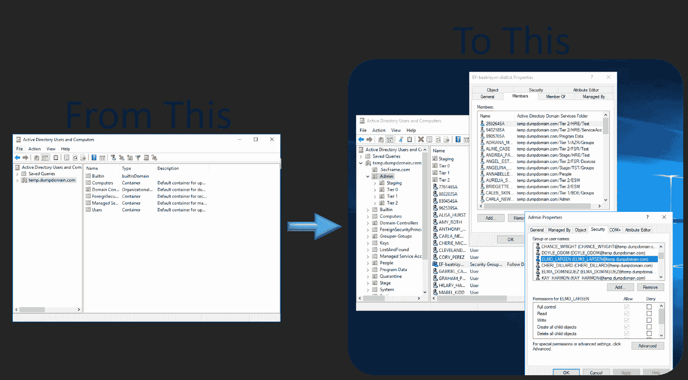
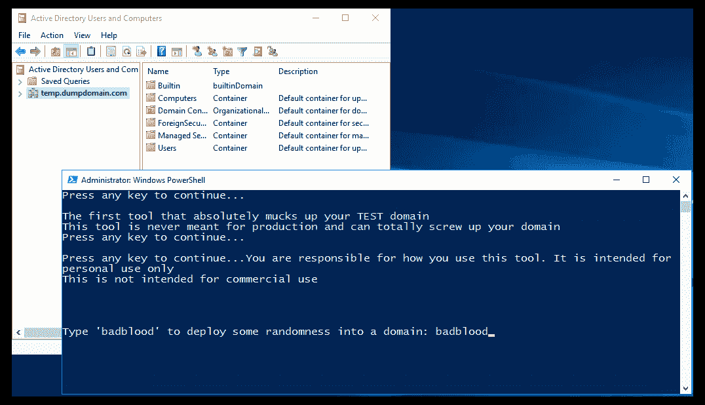
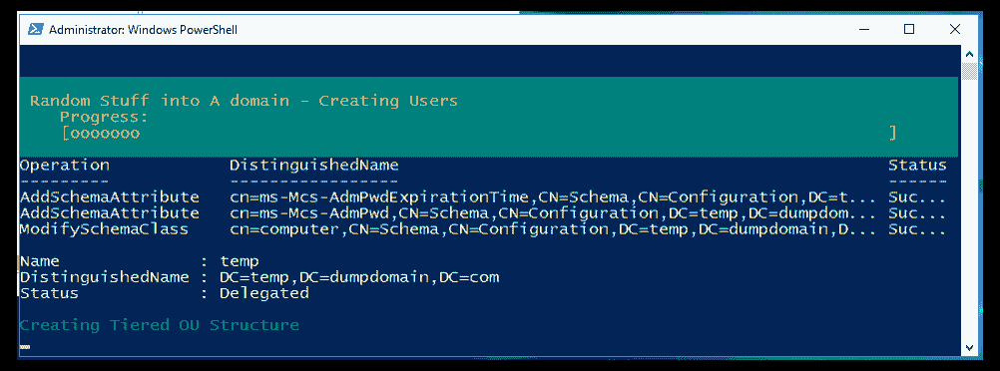
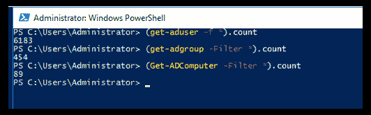
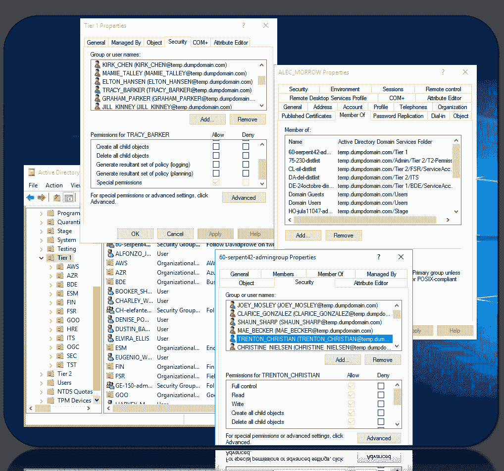
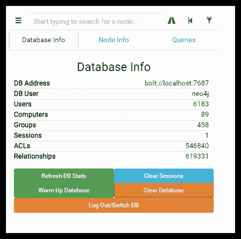

# BadBlood:具有结构的 Microsoft Active Directory 域

> 原文：<https://kalilinuxtutorials.com/badblood/>

Secframe 的 BadBlood 用一个结构和数千个对象填充了一个 Microsoft Active Directory 域。该工具的输出是一个与真实世界中的域相似的域。

在域上运行 BadBlood 之后，安全分析师和工程师可以练习使用工具来了解和规定如何保护 Active Directory。

该工具每次运行时都会产生不同的结果。域、用户、组、计算机和权限是不同的。每一个。单身。时间。

**安装**

**要求:**

*   域管理和模式管理权限
*   已安装 Active Directory Powershell

**在 Windows 上运行:**

**#克隆回购**
git 克隆 https://github.com/davidprowe/badblood.git
**#运行 Invoke-badblood.ps1**
。/badblood/invoke-badblood.ps1

**也可阅读-[扩展的 SSRF 搜索:使用不同方法的智能 SSRF 扫描仪](https://kalilinuxtutorials.com/extended-ssrf-search/)**

**谈论坏人**

*   在 twitter @ davidprowe 上留言或关注我
*   给 secframe.com 写封短信
*   如果在生产域中运行，我不负责清理

**执照**

这个项目是在 gplv3 许可下授权的——详情见 LICENSE.md 文件

**截图**

**免责声明**

请注意:本回购协议中的所有工具/脚本均按“原样”发布使用，没有任何形式的担保，包括但不限于它们的安装、使用或性能。我们拒绝任何及所有明示或暗示的担保，包括但不限于任何不侵权、适销性和/或特定用途适用性的担保。我们不保证该技术将满足您的要求，其操作将不间断或无错误，或任何错误将得到纠正。

使用这些脚本和工具的风险由您自行承担。不能保证它们已经在可比较的环境中通过了彻底的测试，我们对因使用它们而导致的任何损坏、数据丢失或时间损失不承担任何责任。

在任何非测试环境中使用之前，您有责任彻底检查和测试您运行的任何脚本。该工具不是为生产环境设计的。

[**Download**](https://github.com/davidprowe/badblood)