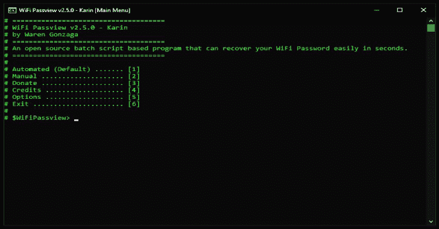

# WiFi Passview:一个基于开源批处理脚本的 Based WiFi Passview

> 原文：<https://kalilinuxtutorials.com/wifi-passview/>

**WiFi Passview** 是一个基于开源批处理脚本的程序，可以在几秒钟内轻松恢复您的 WiFi 密码。这仅适用于 Windows 操作系统。基本上这个脚本程序和其他 passview 软件如 webpassview、mailpassview 的功能是一样的。

**免责声明** : WiFi Passview 是**而不是**为恶意使用而设计的！请负责任地使用这个程序！

它是如何工作的？

基本上，这是一种使用命令提示符的流行 WiFi 密码管理器查看方法的快捷方式和批处理脚本文件版本。这是它的工作方式…

**netsh wlan 显示配置文件**

当您使用此工具时，您可以在几秒钟内提取目标机器上存储的 WiFi 密码。

**也可阅读-[sub finder:一个子域发现工具，用于找到有效的网站子域](https://kalilinuxtutorials.com/subfinder/)**

**特性**

这个简单的工具为您提供了以下功能…

*   提取目标机器中存储的所有可用 WiFi 密码，只需几秒钟即可完成。
*   从特定的目标 SSID 提取密码。
*   保存提取的密码。
*   附加选项。
*   不需要手动读取 **`Key Content`** ，工具会帮你做到！
*   运行该程序不需要管理员权限。
*   独立批处理程序。
*   可定制。

**用途**

下载资源库，找到 **`"wifi-passview-vX.X.X.bat"`** 文件，作为普通`*.bat`文件运行(*无需以管理员*身份运行)。你所要做的就是按照屏幕上的指示去做。

想用于 WiFi 黑客？访问此 BMC [博客](https://www.buymeacoffee.com/p/40225) …

**截图**

这是节目的截图…

**在行动中**

以下是该工具的工作原理…

https://www.youtube.com/watch?v=dYWuXBjMyVc

**白色标签/个性化/定制/发展**

*   下载存储库
*   做 **`"npm install"`** 和 **`"npm install gulp-cli -g && npm install gulp -D"`**
*   之后，编辑 **`"./src/config.json"`** 文件进行定制或个性化。
*   当你觉得满意时，只需做 **`"gulp build"`** 或 **`"gulp"`** 即可启动构建过程。
*   如果你想重置构建过程只需做 **`"gulp cleandev"`** 。
*   如果您正在编辑 **`"./src/core.bat"`** ，您可以使用 **`"gulp test"`** 它是 **`"gulp build"`** 和 **`"gulp cleandev"`** 的组合，这样您可以快速检查生产版本的质量。
*   做 **`"gulp --tasks"`** 来查看所有可用的 **`"gulp"`** 命令。

信用:**商品是冈萨加**

[**Download**](https://github.com/WarenGonzaga/wifi-passview)