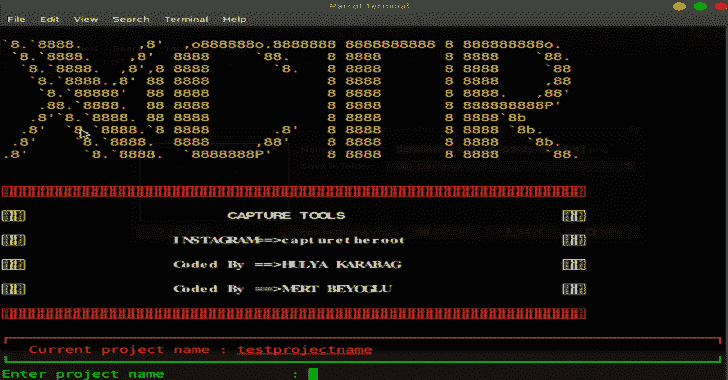
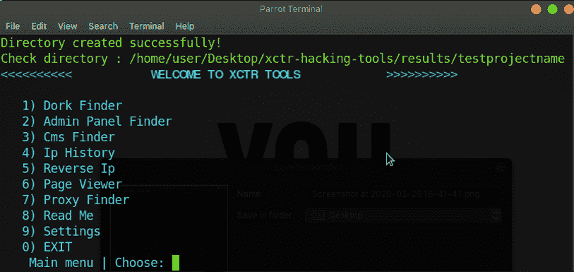
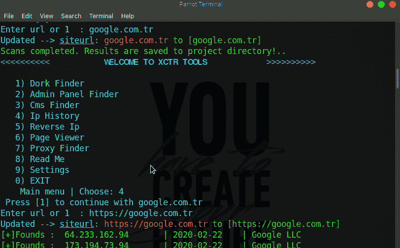
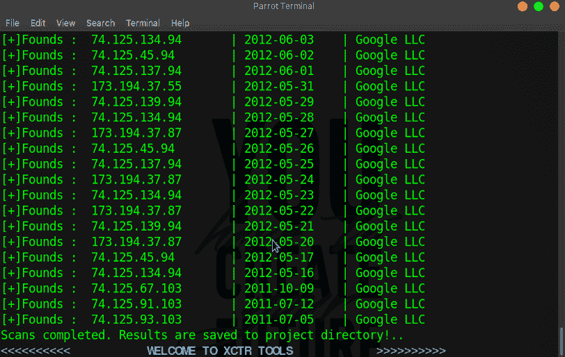
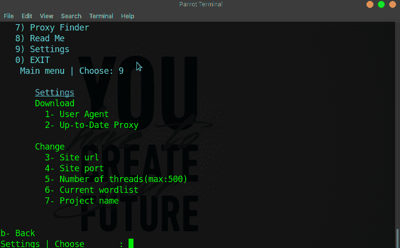
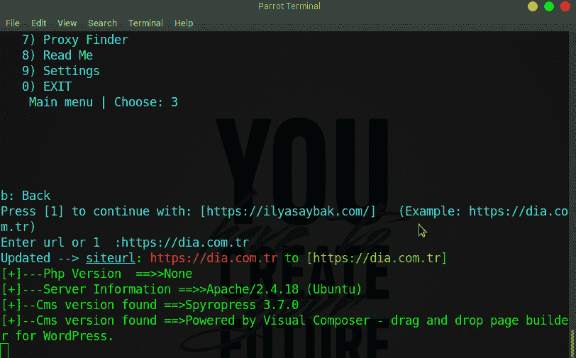
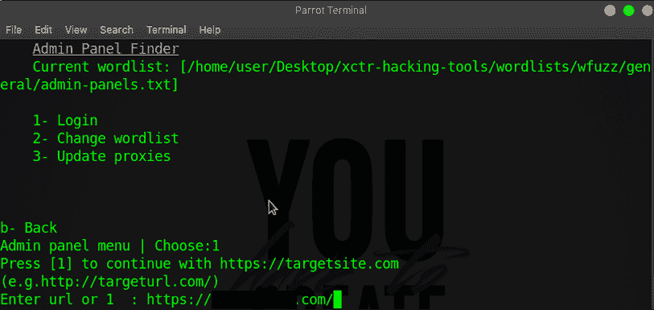
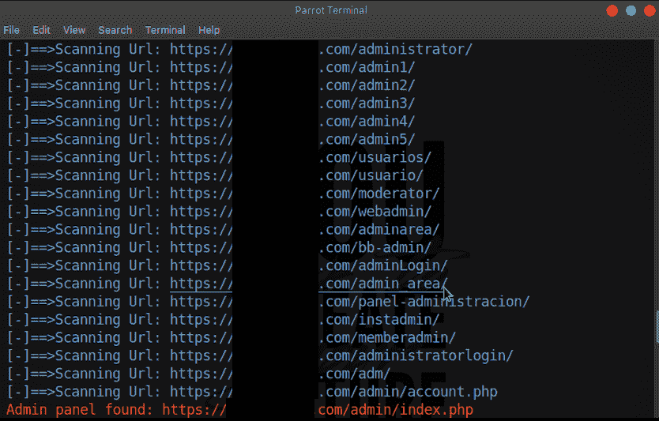

# XCTR 黑客工具 2020

> 原文：<https://kalilinuxtutorials.com/xctr-hacking/>

**XCTR 黑客工具**最初，**你需要创建一个项目**在那里你会保存一切。所有收集的信息在结果目录中保存为**【项目名称】**。

您可以在设置部分更新用户代理和代理信息，也可以更新 url、代理、项目名称、单词表、线程号。

**特性**

该工具**包括:**

*   多克会找到的
*   管理面板查找器
*   Cms 查找器
*   知识产权历史
*   反向 Ip
*   页面查看器
*   代理查找器

**安装**

*   **安装有要求. txt**

**git 克隆 https://github.com/capture0x/XCTR-Hacking-Tools/
CD xctr-hacking-tools
pip 3 install-r requirements . txt**

**也可阅读-[xecrypt:PowerShell 脚本反病毒规避工具](https://kalilinuxtutorials.com/xencrypt/)**

**用途**

**python3 xctr.py**

**所有结果保存在结果/项目名称中。**

*   **布林搜寻工具**

呆子发现者有 2 部分。冰和 yandex。

例如:

***。php？id=**

*   **管理面板查找器**

*   在这一部分，首先需要选择一个要扫描的词表。
*   按 2 更改单词列表并登录。
*   网址应该是**[【https://targetsite.com/】](https://targetsite.com/)**(网址末尾的 http 或 s 和/符号。)
*   如果扫描很慢，你将更新代理。(按 3 更新)

**CMS 查找器**

您将从元名称中找到 cms 版本。

**IP 历史记录**

该工具显示并保存域的 ip 历史。

e.g .使用:

**targetsite.com**

**反向 IP**

使用这个工具，您可以在服务器上找到域。

e.g .使用:

**212.57.147.54**

**页面查看器**

您可以增加目标网站的页面浏览量。

e.g .使用:

https://targetsite.com

**代理查找器**

这个工具，在 free-proxy-list.net 上查找代理，并更新主目录上的 proxy.txt。

**截图**

**信用:**胡利亚卡拉巴格

[**Download**](https://github.com/capture0x/XCTR-Hacking-Tools)