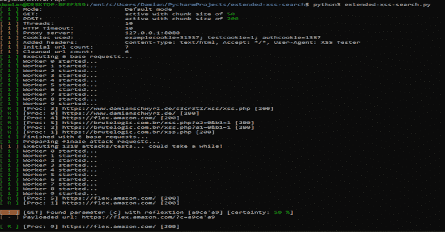
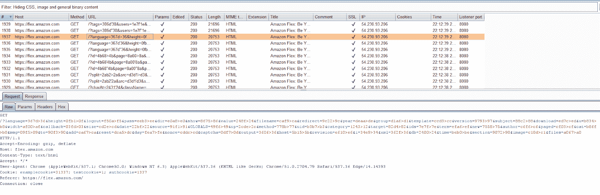
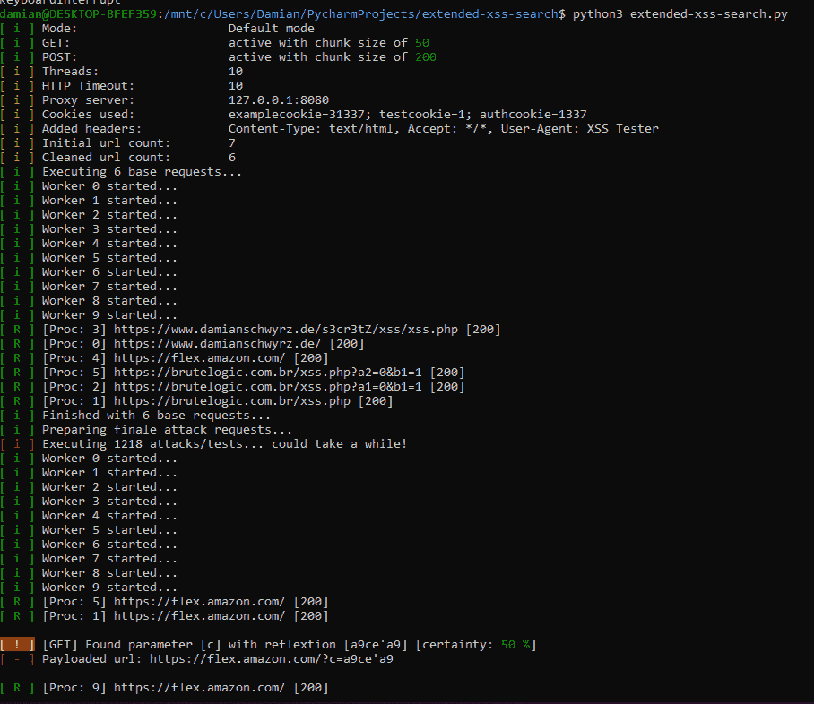
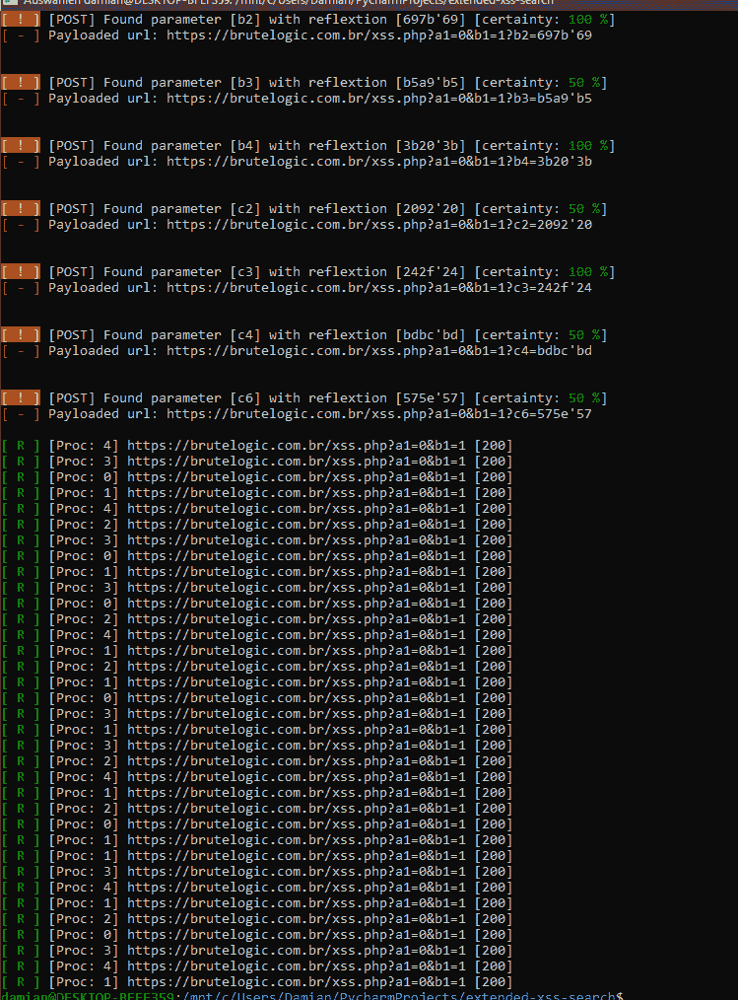

# 扩展的 XSS 搜索:我的 XSSFinder 工具的更好版本

> 原文：<https://kalilinuxtutorials.com/extended-xss-search/>

**扩展的 XSS 搜索器**是基于已经发布的“xssfinder”的最初想法的扩展版本。该私有版本不仅允许攻击者执行 GET 请求，还允许攻击者执行 POST 请求。此外，它可以通过 Burp 或另一个隧道代理每个请求。

**第一步**

将**example . app-settings . conf**重命名为 **app-settings.conf** 并调整设置。它应该开箱即用，但根据目标，我会建议调整块大小。

**执行**

该工具不希望通过 CLI 获得任何参数，因此只需键入:

**python 3 extended-XSS-search . py**

**配置**

它可以设置许多选项和设置，所以这里有一些解释。

**文件**

主配置文件是“app-settings.conf”，所有的事情都必须在这个文件中完成！除此之外，还有一些其他文件允许设置更复杂的数据，如标题，网址和 cookies。

*   **config/cookie-jar.txt**

使用此文件添加 cookie 字符串。我通常复制你能在每个打嗝请求中看到的那个。请复制“Cookie:”头的值。默认文件中有一个示例输入。

*   **config/http-headers.txt**

这个文件定义了添加到请求中并被操作的 http 头(每个头都添加了有效负载)。最重要的已经在文件里了。但是请随意添加更多内容。

*   **配置/参数. txt**

该工具具有强力获取和发布参数的选项。在这种情况下，将使用这些参数(以及查询字符串中的参数)。每个参数都以值的形式获得有效负载。最重要的已经在文件里了。

*   **config/urls-to-test.txt**

这就是你需要的文件！请在此添加您要扫描的链接。允许以下格式:

*   [https://domain.com](https://domain.com)
*   [https://domain.com/path](https://domain.com/path)
*   [https://domain.com/path?param=value&param 1 = value 1](https://domain.com/path?param=value&param1=value1)
*   domain.com

当检测到最后一种情况时，在前面加上“http://”。该工具旨在处理一个良好的 URL 列表。得到它的一个好方法是使用打嗝输出它。那么你就有了一个有效的 URL 列表。你需要做的只是添加你的饼干。

*   **日志/**

这是记录一切的日志文件夹！

**亦读-[XCTR 黑客工具 2020](https://kalilinuxtutorials.com/xctr-hacking/)**

**设置**

app-settings.conf 定义了程序工作流程。这是最重要的文件，你可以激活/关闭不同的模块。

**基础设置**

*   ***HTTPTimeout***

有些请求可能需要很长时间。您可以在这里定义最大值。一个请求的执行时间。我推荐 2 到 6 秒之间的值。

*   ***MaxThreads***

线程越多，脚本越快——但是因为我们要处理大量的连接，我通常在我的个人电脑上保持在 10 以下，在我的 VPS 上保持在 30 左右。

**攻击类型**

*   ***OnlyBaseRequest***

将此设置为真将导致只有“基本请求”-这意味着 url 列表只是蜘蛛和有趣的参数提取。你可以用它来快速填充你的打嗝网站地图。

*   ***【use post】***

将此项设置为“假”时，用户可以跳过发布请求

*   ***使用获取***

这与此类似——如果设置为“false ”,则跳过 GET 请求

**攻击类型设置**

*   ***GetChunkSize***

一个请求要测试多少 GET 参数？

 **一个请求要测试多少 POST 参数？

**隧道挖掘**

也可以使用隧道，例如“127 . 0 . 0 . 1:8080”(Burp 代理)，来监控 Burp 内的所有流量。

*   ***主动***

将此项设置为“true”将强制脚本使用隧道连接。

*   ***隧道***

在这里设定你的代理服务器“ip:port”。

结果如下，当你打开 Burp 你可以看到你的 http 历史:

**截图**

[**Download**](https://github.com/Damian89/extended-xss-search#screenshot)**