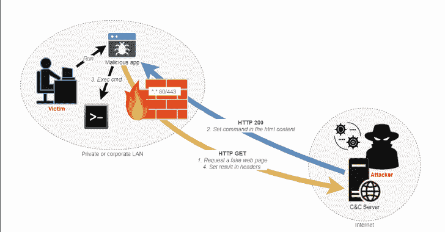
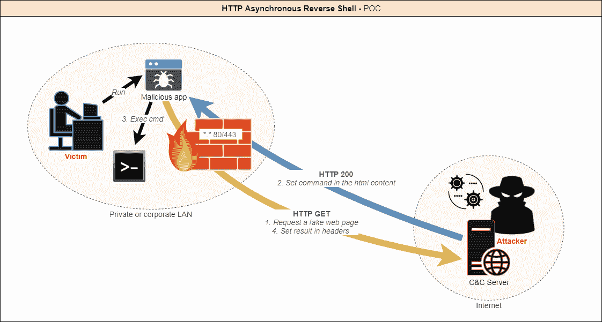
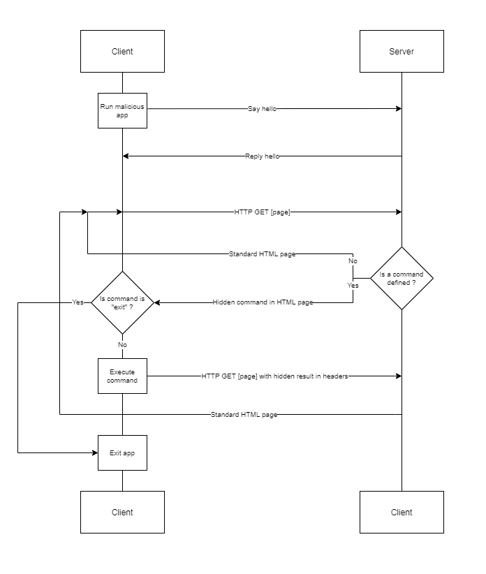
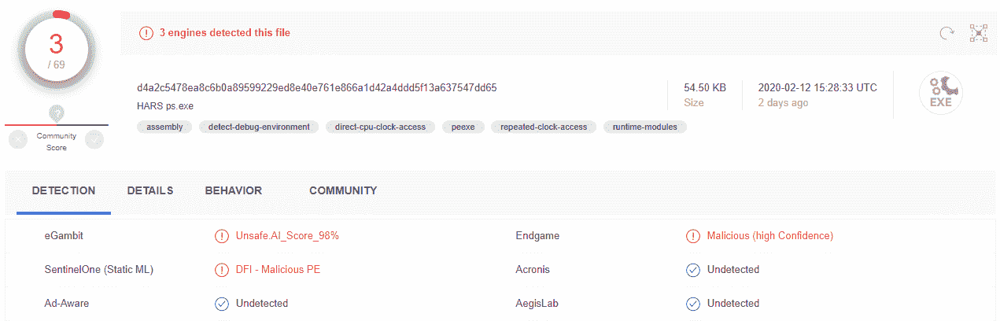
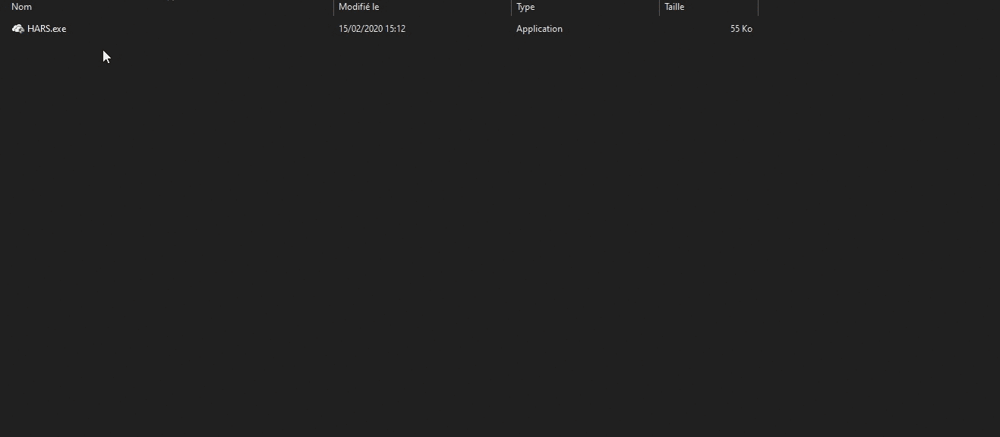
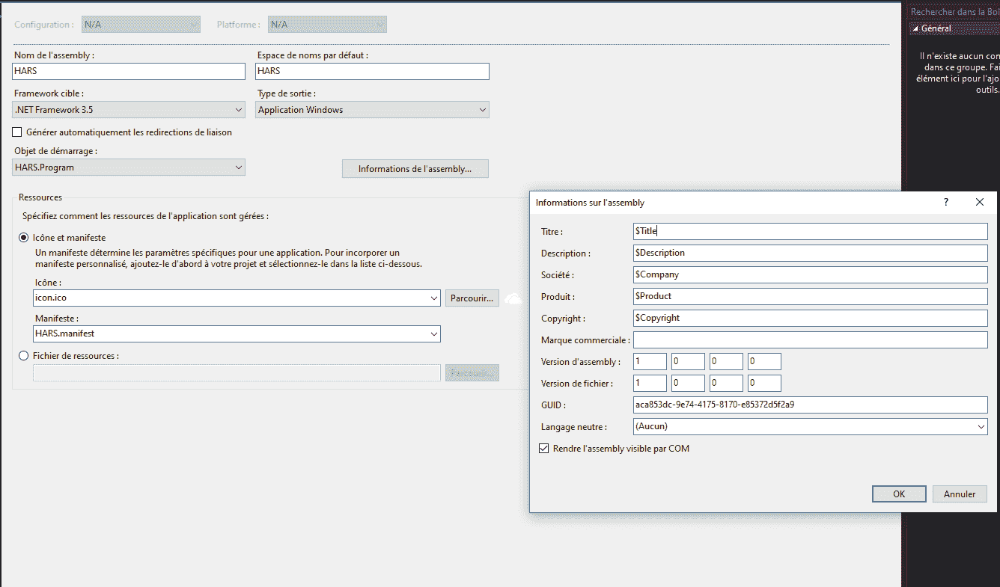

# HTTP 异步反向外壳

> 原文：<https://kalilinuxtutorials.com/http-asynchronous-reverse-shell/>

[](https://1.bp.blogspot.com/-44l9zrnhGJM/XmjW2eacEsI/AAAAAAAAFaI/y21Z6y6A8VQCEy-Z7YQeqvXhIfF0w-KwACLcBGAsYHQ/s1600/HTTP-1%25281%2529.png)

**Http 异步反向外壳**是一个使用 Http 协议进行异步反向外壳的工具。

**为什么？**

今天，有许多方法可以创建反向外壳，以便能够通过防火墙远程控制机器。事实上，传出连接并不总是被过滤。

然而，安全软件和硬件(入侵防御、入侵检测、代理、反病毒、EDR……)越来越强大，可以检测到这些攻击。大多数情况下，到反向 shell 的连接是通过 TCP 或 UDP 隧道建立的。

我认为不被发现的最好方法是让它看起来像合法的流量。HTTP 协议是标准用户使用最多的协议。此外，它几乎从来没有被过滤，以免阻止访问网站。



它是如何工作的？

*   客户端应用在目标机器上执行。
*   客户端启动与服务器的连接。
*   服务器接受连接。

*   然后:
    *   客户端查询服务器，直到它得到指示。
    *   攻击者向服务器提供指令。
    *   当一个命令被定义时，客户端执行它并返回结果。

依此类推，直到攻击者决定结束会话。



**也可阅读—[Raspberry Pi 成像仪实用程序 2020](https://kalilinuxtutorials.com/raspberry-pi-imager/)**

**特性**

如今，作为 poc，实现了以下功能:

1.  假冒的 HTTP 流量出现在 bing.com 的搜索中。
2.  HTML 响应中的命令是 base64 编码的。
3.  命令的结果由客户端以 base64 编码为 cookie。
4.  [可选] SSL 支持；默认情况下，这是一个假的 bing.com 证书。
5.  每个客户端调用之间的随机延迟，以避免触发 IDSs。
6.  随机模板用于来自服务器的每个响应。
7.  重用相同的 powershell 进程以避免触发 EDRs。
8.  支持所有 Cmd 和 Powershell 命令。
9.  [可选]客户端可以在启动时显示虚假的错误消息。
10.  客户端对任务管理器隐藏。
11.  [可选]客户端可以作为管理员运行。

##### AV 检测

69 个产品中只有 3 个能够检测到客户端是恶意的，而没有应用任何回避或混淆技术。



**演示**



**服务器端**


**配置**

**委托人:C 夏普**

1.  在 Visual Studio 中打开 *HARS.sln*

**配置文件**

该文件包含参数；分配所需的值:

```
class Config
    {
        /* Behavior */
        // Display a fake error msg at startup
        public static bool DisplayErrorMsg = true;
        // Title of fake error msg
        public static string ErrorMsgTitle = "This application could not be started.";
        // Description of fake error msg
        public static string ErrorMsgDesc = "Unhandled exception has occured in your application. \r\r Object {0} is not valid.";
        // Min delay between the client calls
        public static int MinDelay = 2;
        // Max delay between the client calls
        public static int MaxDelay = 5;
        // Fake uri requested - Warning : it must begin with "search" (or need a change on server side)
        public static string Url = "search?q=search+something&qs=n&form=QBRE&cvid=";
        /* Listener */
        // Hostname/IP of C&C server
        public static string Server = "https://127.0.0.1";
        // Listening port of C&C server
        public static string Port = "443";
        // Allow self-signed or "unsecure" certificates - Warning : often needed in corporate environment using proxy
        public static bool AllowInsecureCertificate = true;
    } 
```

**HARS.manifest**

将此行更改为默认运行具有特定权限的客户端:

`**<requestedExecutionLevel level="requireAdministrator" uiAccess="false" />**`

用
`**<requestedExecutionLevel level="asInvoker" uiAccess="false" />**`
或
`**<requestedExecutionLevel level="requireAdministrator" uiAccess="false" />**`
或
`**<requestedExecutionLevel level="highestAvailable" uiAccess="false" />**`

**项目属性**

您可以在这里自定义文件的装配信息和图标。



**注:**目标。NET framework 版本设置为 Windows 10 中默认可用的 4.6。

对于 Windows 7，选择。NET 3.5，如果你不想安装缺少的功能。

**建造**

从 Visual Studio 生成项目。客户端应该生成在`**Http** **Asynchronous Reverse Shell\HARS_Client\HARS\bin\Release**`文件夹中。

**搞定！**

**服务器:Python**

**HARS _ 服务器. py** 地点:`**Http Asynchronous Reverse Shell\HARS_Server\www**`

如果需要，只需在配置部分更改证书上的端口或位置。

**#配置**
PORT = 443
CERT_FILE = '../server.pem '

**运行**

`**python HARS_Server.py**`

**注释**

*   HTTP 日志位于 **`Http Asynchronous Reverse Shell\HARS_Server\logs` \**
*   您可以在`**Http Asynchronous Reverse Shell\HARS_Server\templates**`中添加自己的模板(任何 html 页面)

**免责声明**

该工具仅用于授权安全测试的概念验证演示工具。在运行此工具之前，请确保您遵守了当地的法律。

[**Download**](https://github.com/onSec-fr/Http-Asynchronous-Reverse-Shell)