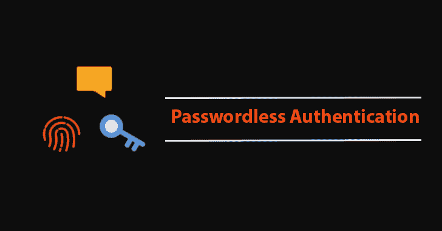

# 无密码认证将在 2022 年成为主流

> 原文：<https://kalilinuxtutorials.com/passwordless-authentication/>

自古罗马和埃及时代起，人们就使用密码进行身份验证和授权访问。如今，密码比以往任何时候都更常见。从网飞到亚马逊和所有其他在线平台，平均每个人拥有 90 个在线账户。

为了节省时间并使登录凭证更容易记忆，大多数人会在不同账户间循环使用[密码](https://kalilinuxtutorials.com/dllpasswordfilterimplant-dll-password-filter-implant-with-exfiltration-capabilities/)。也就是说，他们使用同一个密码来锁定他们所有的账户。当然，它确实在短期内让事情变得更简单。

但是许多网络罪犯利用这个漏洞来破坏个人账户。他们从一个帐户获得凭证，并可以自由进入其他帐户。由于数据泄露几乎每天都在发生，许多人已经成为受害者。

完美的密码是唯一的、随机的、复杂的。但是记住 90 个或更多账户的密码几乎是不可能的。因此，研究人员设计了许多新型的认证技术。无密码认证也在这里。

## 新认证技术的兴起

你很可能已经使用了一些“无密码”技术。最常见的一种是双因素身份认证(2FA)。2FA 依赖于连接的电子邮件地址或电话号码以及一次性密码(OTP)。虽然 2FA 确实增加了重要的第二层防御，但它不是防弹的。

已经获得您电子邮件访问权限的欺诈者可以使用 OTP 代码访问您的其他帐户。由于精明的网络罪犯现在可以使用 [SIM 交换攻击](https://www.wired.com/story/sim-swap-attack-defend-phone/)来获取 SMS 消息，甚至您的电话号码也面临风险。

这就是为什么公司正在采用其他新的认证技术。生物识别安全工具是最重要的。另外，指纹识别和面部识别软件不仅安全而且方便。

无密码技术的另一个很好的例子是认证工具。授权码以更安全的方式利用一次性密码。

用户通常将它们与授权设备配对，最常见的是智能手机。它可以防止中间人泄漏和其他攻击。结合生物识别技术，授权码变得不可战胜。

在不久的将来，你会看到更多的技术出现。硬件密钥、令牌和其他形式的加密将变得更加主流。

最终，越来越多的人意识到互联网上的大量网络安全威胁。只要对更好的安全性有需求，新的工具就会不断出现。

## 一个好的密码大有帮助

在电影中，黑客利用先进的软件技术侵入账户。这比你意识到的更现实。黑客使用[蛮力攻击](https://en.wikipedia.org/wiki/Brute-force_attack)。他们在几毫秒内尝试了数千种不同的密码组合。

例如，他们可以马上破解密码“pizza ”,而破解“pizza1234”则需要大约 10 个小时。但是像“EVFY1t#*fXE2”这样的随机密码可能需要[540 万年](https://random-ize.com/how-long-to-hack-pass/)才能破解。但是怎么会有人像那样记住 90 个密码呢？

这并不意味着你应该继续使用“pizza1234”作为你的密码，直到无密码技术变得更加可行。开始将密码管理器整合到您的计算机使用中。

事实上，密码永远不会完全消失。当其他身份验证方法失败时，总需要某种形式的身份验证作为备份。

密码管理器的主要功能是存储您的密码。但它们也包括密码生成器，可以创建随机密码，就像你在上面看到的那样。

您可以使用它们快速、安全、方便地登录所有在线帐户。它们通常与生物识别和 2FA 工具兼容。

最后，密码管理器还有许多其他功能。例如，一些公司启用笔记和 OCR 扫描([https://nordpass.com/features/ocr-scanning/](https://nordpass.com/features/ocr-scanning/))将手写数据转换成电子笔记。

你可以把它们和密码一起储存在数字保险箱里。然后你可以把文件撕碎，以确保没有人能得到它。密码管理器在浏览器中自动填充数据，并在您的所有设备之间同步密码。

## 您现在和将来的帐户安全

每天有超过 350 万次黑客攻击，其中最大的目标是个人账户。黑客知道，一旦他们从一个网站获得用户数据，那么他们就可以轻而易举地侵入无数其他网站。

在日益加剧的网络安全军备竞赛中，您需要防御这些攻击。这包括使用最新的技术。

也就是说，开始寻找像授权码和生物识别这样的无密码工具。并在任何可用的地方集成它们。如果没有的话，使用密码生成器为你创建一个密码，不要重复使用相同的密码。永远不会。