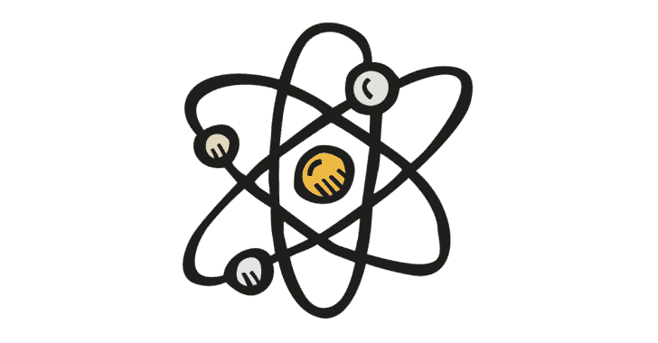
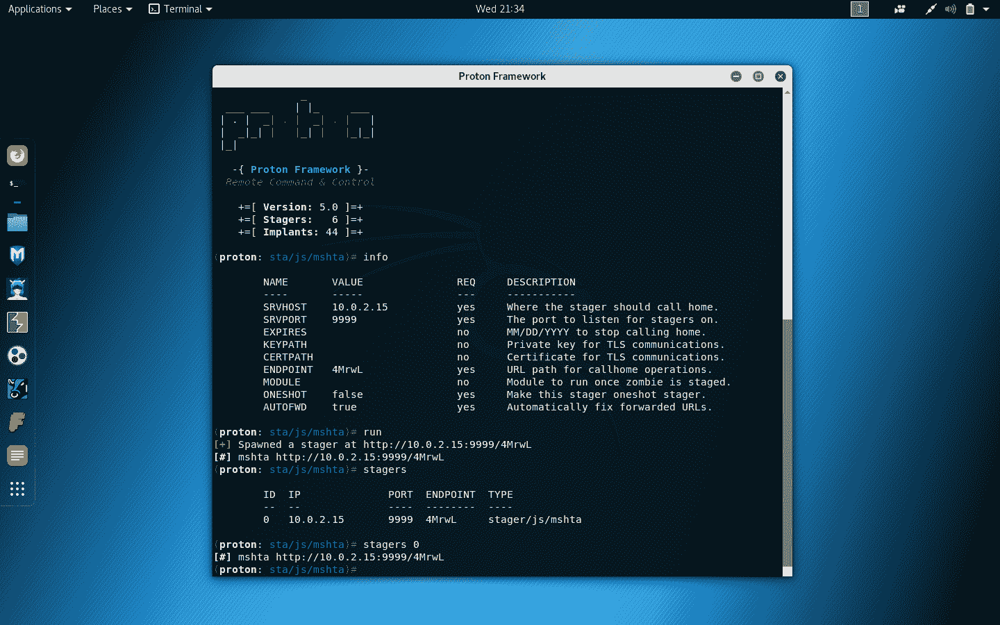
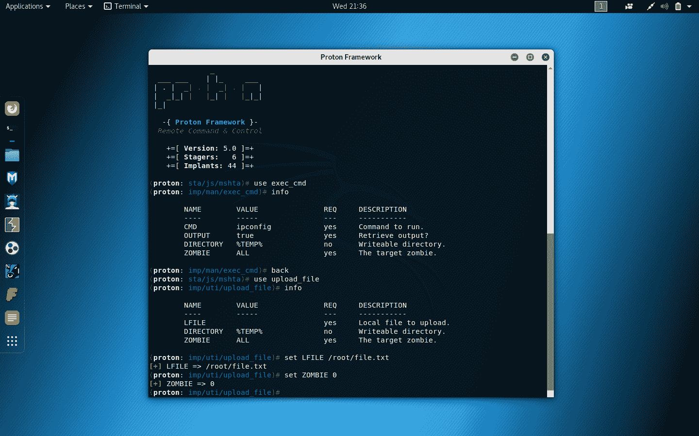

# 质子:Windows 后开发框架类似

> 原文：<https://kalilinuxtutorials.com/proton/>

**质子框架**是一个类似于其他渗透测试框架的 Windows 后开发框架。主要区别在于，它使用 Windows Script Host 执行大多数操作，其核心兼容性支持默认安装 Windows 2000，从 Windows 10 一直到 Windows 2000 都没有服务包。

**安装**

**cd 质子
chmod +x install.sh
。/install.sh**

**卸载**

**cd 质子
chmod +x uninstall.sh
。/uninstall.sh**

**也可理解为-[特权检查:用于 Windows](https://kalilinuxtutorials.com/privesccheck/)T3 的特权提升枚举脚本**

**执行**

要执行，您应该执行以下命令。

**质子**

**为什么？**

*   它有一个简单明了的 UX/用户界面。它很容易理解，你也更容易掌握它。
*   其中有许多 stager，如 mshta、disk 和 wmic stagers。
*   里面有很多植入比如 bypassuac_compdefaults，mimikatz_dotnet 植入。

**免责声明**

未经双方事先同意，使用该工具攻击目标是非法的。最终用户有责任遵守所有适用的地方、州、联邦和国际法律。开发者不承担任何责任，也不对本程序造成的任何误用或损害负责。

[**Download**](https://github.com/entynetproject/proton)