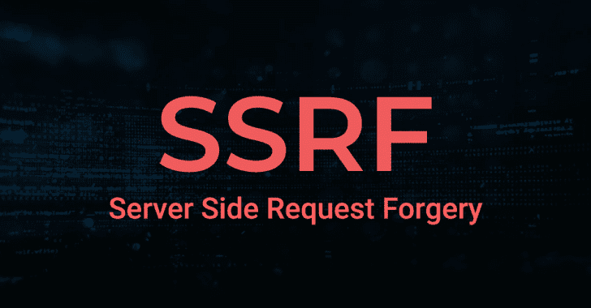

# SSRF 警长:服务器端请求伪造

> 原文：<https://kalilinuxtutorials.com/ssrf-sheriff/>

**SSRF 警长**是一个用 Go 写的 SSRF 测试警长。它最初是为[优步·H1-4420 2019 伦敦直播黑客事件](https://www.hackerone.com/blog/london-called-hackers-answered-recapping-h1-4420)而创建的，但现在它正在开源，供其他组织实施和贡献。

**特性**

*   响应任何 HTTP 方法(`GET`、`POST`、`PUT`、`DELETE`等)。)
*   可配置的秘密令牌(见 [base.example.yaml](https://github.com/teknogeek/ssrf-sheriff/blob/master/config/base.example.yaml) )
*   特定内容的响应
    *   响应正文中带有秘密标记
        *   JSON
        *   可扩展标记语言
        *   超文本标记语言
        *   战斗支援车
        *   文本文件（textfile）
    *   响应正文中没有标记
        *   GIF 格式
        *   PNG
        *   联合图像专家组
        *   MP3 文件
        *   MP4

**也读作-[SharpRDP:RDP 认证命令执行申请](https://kalilinuxtutorials.com/sharprdp/)**

**用途**

**去拿 github.com/teknogeek/ssrf-sheriff
CD $ GOPATH/src/github . com/teknogeek/ssrf-sheriff
CP config/base . example . YAML config/base . YAML

#…configure…

去运行 main.go**

**示例请求**

**明文**

$ curl-sSD-HTTP://127 . 0 . 0 . 1:8000/foobar
HTTP/1.1 200 OK
Content-Type:text/plain
X-Secret-Token:SUP3R _ s3c ret _ 1337 _ K3y
日期:2019 年 10 月 14 日星期一 16:37:36 GMT
Content-Length:21

SUP3R _ s3c ret _ 1337 _ K3y

**XML**

$ curl-sSD-HTTP://127 . 0 . 0 . 1:8000/foobar . XML
HTTP/1.1 200 OK
Content-Type:application/XML
X-Secret-Token:SUP3R _ s 3c ret _ 1337 _ K3y
Date:Mon，2019 年 10 月 14 日 16:37:41 GMT
Content-Length:81

<serializable response><Token

**待办事项**

*   使用对可见的机密令牌动态生成有效响应
    *   GIF 格式
    *   PNG
    *   联合图像专家组
    *   MP3 文件
    *   MP4
*   为每个请求生成/创建/签名的 HTTP 响应中的秘密，而不是为所有请求返回一个秘密
*   TLS 支持

**鸣谢:** [弗兰斯·罗森](https://twitter.com/fransrosen)

[**Download**](https://github.com/teknogeek/ssrf-sheriff)