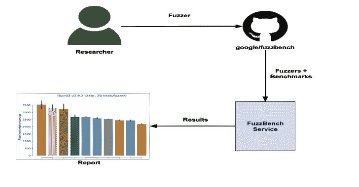
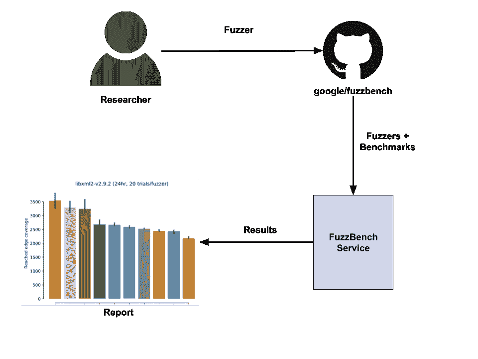

# FuzzBench : Fuzzer 基准测试即服务

> 原文：<https://kalilinuxtutorials.com/fuzzbench/>

FuzzBench 是一项免费服务，它在谷歌的范围内，在各种各样的现实世界基准上评估 fuzzers。FuzzBench 的目标是使严格评估 fuzzing 研究变得容易，并使 fuzzing 研究更容易被社区采用。

我们邀请研究社区的成员贡献他们的 fuzzers，并给我们反馈改进我们的评估技术。

FuzzBench 提供:

*   集成模糊器的简单 API。
*   来自真实项目的基准。FuzzBench 可以使用任何 OSS-Fuzz 项目作为基准。
*   一个报告库，它生成带有图表和统计测试的报告，以帮助您理解结果的重要性。

要参与，请按照我们的简单指南提交您的 fuzzer 以在 FuzzBench 平台上运行。在您的集成被接受后，我们将使用您的 fuzzer 进行大规模实验，并生成一份报告，将您的 fuzzer 与其他 fuzzer 进行比较。参见[一份样本报告](https://www.fuzzbench.com/reports/sample/index.html)。

**概述**

**也可阅读-[熵:利用 Netwave 的工具集& GoAhead IP 网络摄像头](https://kalilinuxtutorials.com/entropy/)**

**样本报告**

您可以在此处查看样本报告[。该报告是使用 10 个模糊器针对 24 个真实基准测试生成的，每个测试 20 次，持续时间超过 24 小时。](https://www.fuzzbench.com/reports/sample/index.html)

分析报告时，我们建议:

*   对照各种基准检查引信的优缺点。
*   查看汇总结果，了解结果的总体意义。

请就任何不准确之处和潜在的改进(如集成更改、新基准等)提供反馈。)通过打开一个 GitHub 问题[这里](https://github.com/google/fuzzbench/issues/new)。

[**Download**](https://github.com/google/FuzzBench)