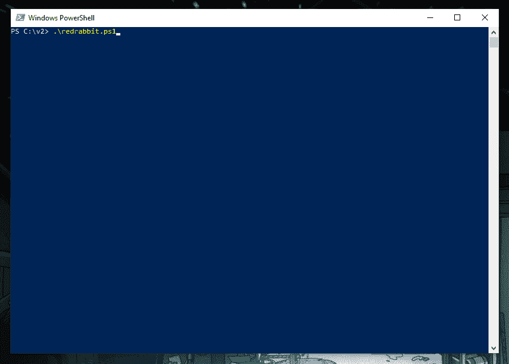

# RedRabbit:红队 PowerShell 脚本

> 原文：<https://kalilinuxtutorials.com/redrabbit/>

RedRabbit 是一个 PowerShell 脚本，旨在帮助 pentesters 进行道德黑客#RedTeam。目的是强调 PowerShell 有多强大，以及如何利用它来对付你(在道德上)。

**运行**

您可以通过下载脚本在本地运行，也可以使用以下命令远程运行:

powershell–nop–c " iex(新对象网络。WebClient)。download string('[https://raw . githubusercontent . com/secure logs/RedRabbit/master/RedRabbit . PS1 ')"](https://raw.githubusercontent.com/securethelogs/RedRabbit/master/redrabbit.ps1%E2%80%99)%E2%80%9D)

**如果你远程运行，你将总是得到最新的版本**

**另请参阅–[NTLMRecon:工具，用于列举来自启用 NTLM 认证的 Web 端点的信息](https://kalilinuxtutorials.com/ntlmrecon/)**

**求助**

选项信息和帮助可以在这里找到:[https://securethelogs.com/redrabbit-ps1/](https://securethelogs.com/redrabbit-ps1/)

[**Download**](https://github.com/securethelogs/RedRabbit)