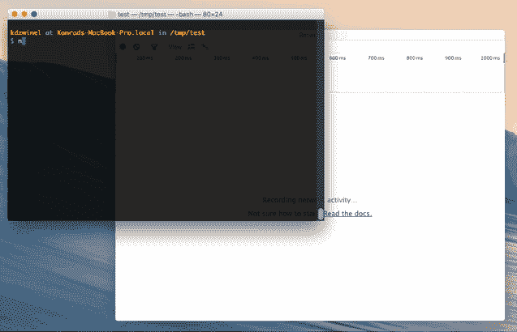
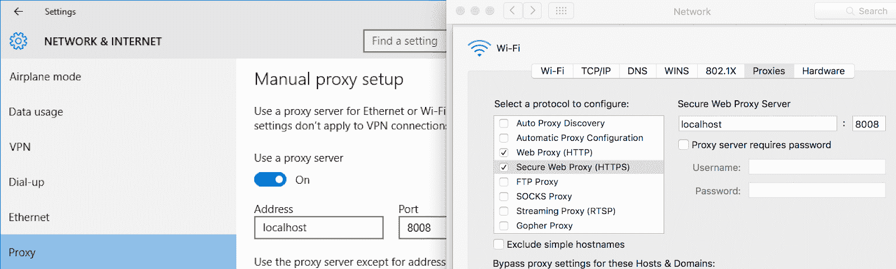
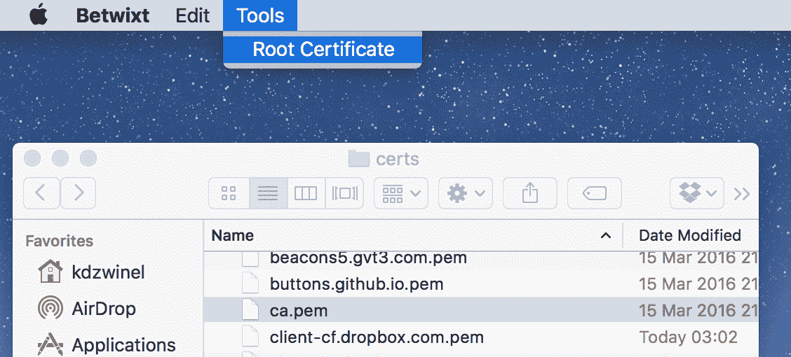
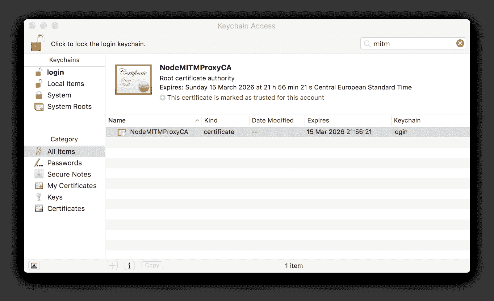
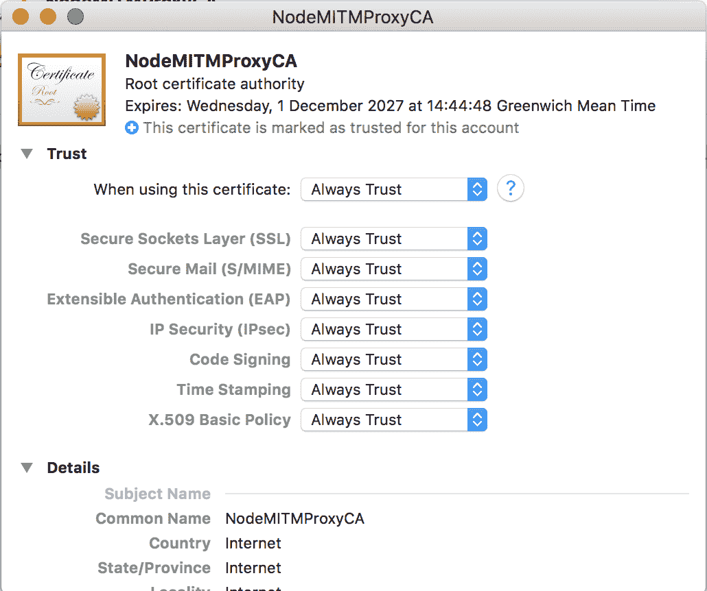
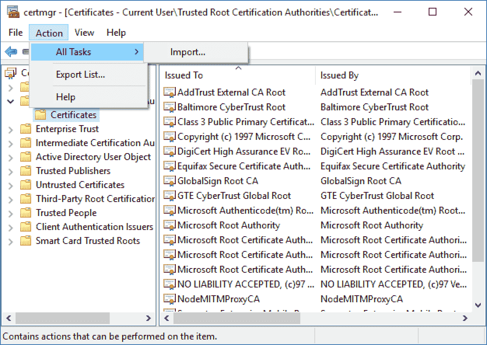
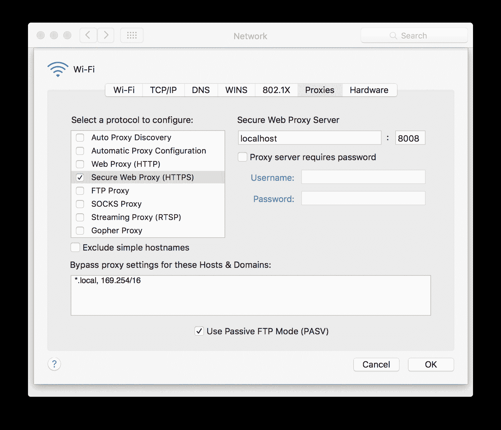
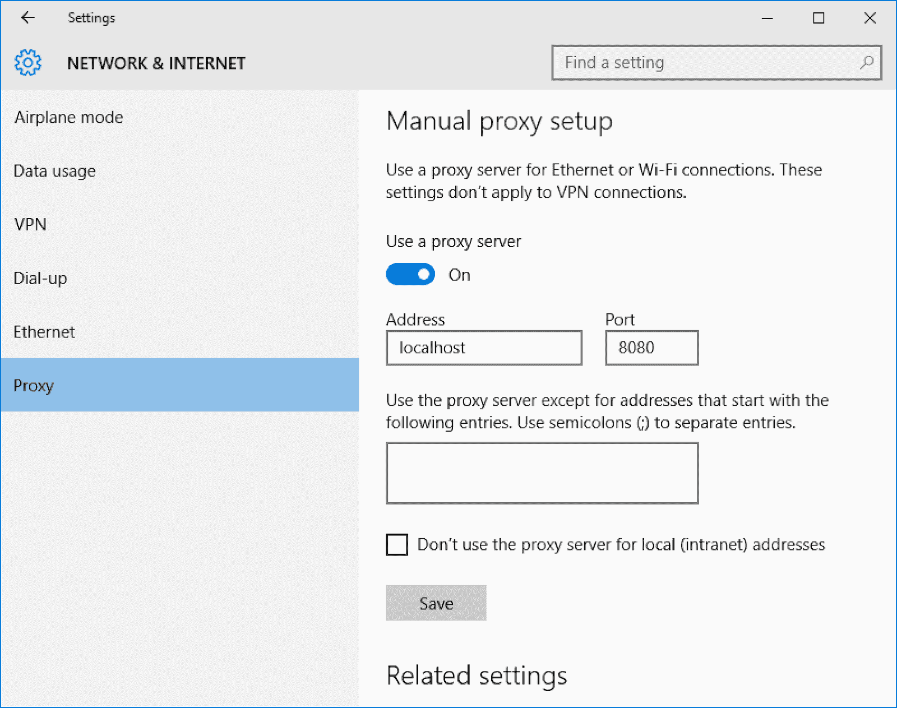

# 基于 Chrome Devtools 网络面板的 Web 调试代理

> 原文：<https://kalilinuxtutorials.com/betwixt/>

**betwext**是一个基于 Chrome DevTools 网络面板的 web 调试代理。Betwixt 将使用熟悉的 Chrome DevTools 界面帮助您分析浏览器外部的 web 流量。

**安装**

为你的操作系统下载[最新版本](https://github.com/kdzwinel/betwixt/releases/latest)，[构建你自己的包](https://github.com/kdzwinel/betwixt/blob/master/docs/building.md)或者[从源代码](https://github.com/kdzwinel/betwixt/blob/master/docs/building.md)开始运行。

**设置**

为了捕获流量，您必须将它定向到由 Betwixt 在后台创建的代理( **`http://localhost:8008`)。**

如果您希望分析整个交通系统:

*   在 macOS 上—`**System Preferences → Network → Advanced → Proxies → Web Proxy (HTTP)**`
*   在 Windows 上—`**Settings → Network & Internet → Proxy**`
*   在 Ubuntu 上-`**All Settings → Network → Network Proxy**`

如果您想要捕获来自单个终端的流量，请使用 **`export http_proxy=http://localhost:8008`。**

**也读-[RedRabbit:红队 PowerShell 脚本](https://kalilinuxtutorials.com/redrabbit/)**

捕获加密流量(HTTPS)需要额外的步骤，按照以下步骤进行说明。

**HTTPS**

**根证书:**

为了捕获加密的流量，你必须安装 Betwixt 提供的根证书。当您第一次在 Betwixt 之间启动时，系统会为您生成证书。您可以使用`**Tools > Root Certificat**e`菜单在磁盘上快速找到它。

必须导入并标记为可信。

在 OS X，这是通过如下所示的钥匙链应用程序完成的。

安装证书后，展开 **`Trust`** 部分，将第一个下拉菜单切换到 **`Always Trust` :**

在 Windows 上使用 certmgr。

**代理**

将流量定向到 Betwixt 在后台创建的代理( **`http://localhost:8008`)。**

如果您希望分析整个交通系统:

*   关于 OS X-`**System Preferences → Network → Advanced → Proxies → Secure Web Proxy (HTTPS)**`
*   在 Ubuntu 上-`**All Settings → Network → Network Proxy**`
*   在 Windows 上—`**Settings → Network & Internet → Proxy**`

如果您想要捕获来自单个终端的流量，请使用`**export https_proxy=http://localhost:80**08`。注意 NodeJS 有一个硬编码的 CA 证书列表，所以它不关心 Keychain/certmgr/等。你可能需要使用 **`export NODE_TLS_REJECT_UNAUTHORIZED=0`** 来克服这个问题。

[**Download**](https://github.com/kdzwinel/betwixt)