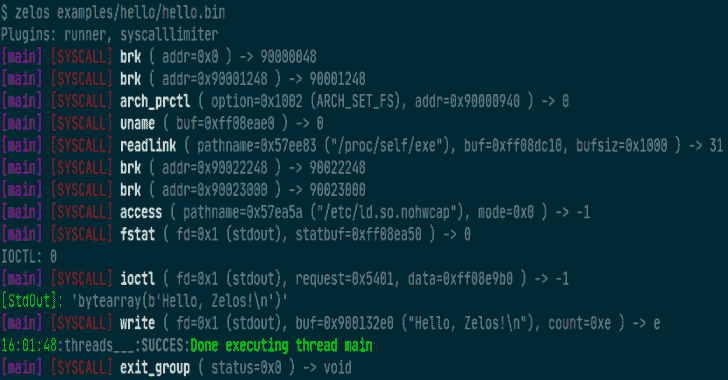
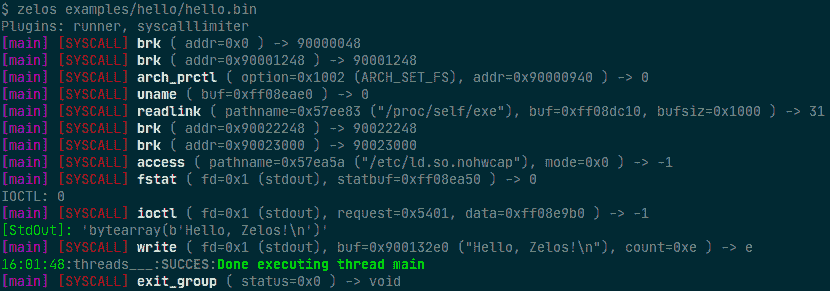

# 泽洛斯:一个全面的二进制仿真平台

> 原文：<https://kalilinuxtutorials.com/zelos/>

**泽洛斯**是一个全面的二进制仿真平台。它(**Z**eropoint**E**simulated**L**weight**O**operating**S**system)是一个基于 python 的二进制仿真平台。

它的一个用途是通过命令行或 python 脚本快速评估二进制文件的动态行为。

模拟所有的系统调用来隔离目标二进制文件。支持 Linux x86_64 (32 位和 64 位)、ARM 和 MIPS 二进制文件。Unicorn 提供 CPU 仿真。

[完整文档](https://zelos.readthedocs.io/en/latest/index.html)可从[这里](https://zelos.readthedocs.io/en/latest/index.html)获得。

**安装**

使用包管理器 [pip](https://pip.pypa.io/en/stable/) 安装工具。

**也可阅读-[Sifter:A Osint，Recon &漏洞扫描器](https://kalilinuxtutorials.com/sifter/)**

**pip 安装 zelos**

**基本用法**

**命令行**:

使用默认选项模拟二进制文件:

**$ zelos my_binary**

要查看正在执行的指令，添加`**-v**`标志:

**$ zelos -v my_binary**

使用 **`--fasttrace` :** ，可以只打印每条指令第一次执行时的内容，而不是每次执行时的

 ***$ zelos-v–fast trace my _ binary**

默认情况下，系统调用在 stdout 上发出。要改为将系统调用写入文件，请使用`**--strace**`标志:

**$ zelos–strace path/to/file my _ binary**

在二进制名称后指定任何命令行参数:

**$ zelos my_binary arg1 arg2**

**纲领性**

**进口 zelos

z = zelos。泽洛斯(" my _ binary ")
z . start(time out = 3)**

**特约**

欢迎拉取请求。对于重大更改，请首先打开一个问题，讨论您希望更改的内容。

请确保适当更新测试。

**当地发展环境**

首先，创建一个新的 python 虚拟环境。这将确保不会出现软件包版本冲突:

**python 3-m venv ~/。venv/zeres
$ source ~/。venv/zelos/bin/activate**

现在克隆存储库并切换到`zelos`目录:

**(zelos) $ git 克隆 git @ github . com:zeropointdynamics/zelos . git
(zelos)$ CD zelos**

将它的可编辑版本安装到虚拟环境中。这使得`**import zelos**`可用，对它的任何本地更改将立即生效:

**(zelos) $ pip install -e '。【开发】'**

此时，测试应该通过，文档应该建立:

**(zelos)$ pytest
(zelos)$ CD docs
(zelos)$ make html**

在 **`docs/_build/html/`中可以找到构建文档。**

将它安装到预提交挂钩上，以确保代码风格符合性:

**(zelos) $预提交安装**

除了自动运行每次提交之外，您还可以使用以下命令随时运行它们:

**(zelos) $提交前运行-所有文件**

**Windows 开发:**

Windows 上的命令略有不同:

**c:>python 3-m venv zelo _ venv
c:>zelo _ venv \ scripts \ activate . bat
【zelo】c:>pip install-e .[dev]**

[**Download**](https://github.com/zeropointdynamics/zelos)*