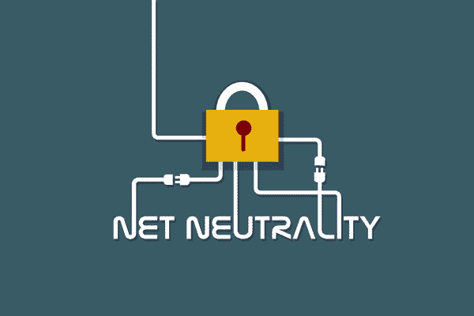

# 在网络中立的世界中使用 VPN 的 3 个理由

> 原文：<https://kalilinuxtutorials.com/3-reasons-to-use-a-vpn-in-a-net-neutrality-free-world/>

互联网早期，互联网传播是不偏不倚的。基于内容、平台、源和目的地地址以及用户，数据中继不受 ISP 的影响。网民可以自由地在网上冲浪，不受互联网服务提供商的操纵或干扰。换句话说，网络对所有个人和企业都是中立的。

## **网络中立的终结**

快进到 2018 年，互联网格局开始发生变化。通过了新的法规，取消了网络中立性。基本而言，网络中立性禁止互联网服务提供商阻止访问特定内容、限制流量和任何其他与互联网使用有关的歧视。

网络中立性的存在确保了一个“公平”的市场。这项法律废除后，ISP 不再被要求平等对待所有数据。他们开始为愿意支付更多费用的组织和个人引入优先级，限制流量和各种操纵。

ISP 现在对你的网上活动有很大的控制权，他们可以影响你的互联网体验。幸运的是，VPN 改变了这一切。虚拟专用网给你自由，这是你在许多其他好处中所缺乏的

## 为什么 VPN 在一个网络中立的世界中是不可或缺的。

### **享受您的隐私**

除非你采取措施，否则你的在线活动是不安全的。您的 ISP 可以轻松查看您访问的网站、您流化或下载的内容等。，并根据你的活动区别对待。这是我们在一个没有网络中立的世界中必须应对的难题之一。

要确保 ISP 不会监视您在网上的活动，您可以使用 VPN。VPN 隐藏了你的真实 IP 地址，并对你设备的所有流量进行加密。之后，你的 ISP 就无法理解你在做什么了，因为所有的东西看起来都是乱码。如今市场上有几家 VPN 提供商，但是这里有我们推荐的最好的 VPN。

### **避免减速**

ISP 会大量减少你的带宽，尤其是当他们发现你比其他用户使用更多的带宽时。因为这是合法的，他们也创造了快车道，并收取额外费用来换取快速的速度。消费者只能选择要么为优质服务支付额外费用，要么应对网速慢的问题。

VPN 为您提供了一个消除带宽限制的选项。通过加密您的流量，ISP 无法看到您的网络活动。这使得 ISP 很难根据你的使用量来削减你的带宽。此外，当 ISP 网络拥塞时，您可以避开它。

### **访问审查和限制的内容**

网络中立性的废除给了互联网服务提供商权力来控制哪些网站能被他们的客户访问，哪些不能。出于同样的原因，互联网服务提供商可以引导你到他们所属的特定网站。

VPN 在这种情况下非常有用，因为它们允许你避开这些限制。通过使用最高等级的 VPN，你可以不受限制地访问开放的互联网，而 ISP 可能会禁止你这样做。

一般来说，VPN 可以帮助你恢复因网络中立性的废除而被剥夺的互联网自由。这是通过确保你的活动只有你知道，并给你一个新的在线身份。