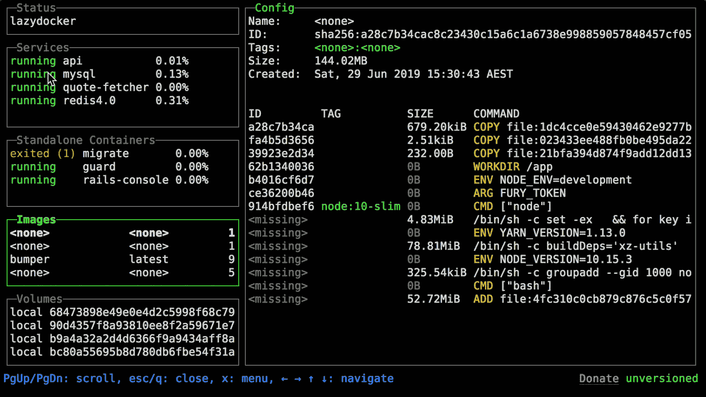

# 懒惰的方式来管理一切

> 原文：<https://kalilinuxtutorials.com/lazydocker/>

Lazydocker 是一个简单的 docker 和 docker-compose 终端 UI，使用 Go 和 gocui 库编写。

轻微的咆哮传来:有东西坏了？可能某项服务已关闭。`**docker-compose ps**`。是的，这是微服务仍然有问题。没问题，我重启一下:`**docker-compose restart**`。好的，现在让我们再试一次。哦，等等，问题还在。嗯。 **`docker-compose ps`。**没错，所以服务一定是刚开始就停止了。如果我正在读取日志流，我可能会知道，但是那里有很多来自其他服务的混乱。我可以用`**docker compose logs --follow myservice**`获得那个服务的日志，但是每次服务终止时日志都会终止，所以我每次重启服务时都需要运行那个命令。我也可以运行`**docker-compose up myservice**`，在终端窗口中，如果服务关闭，我可以再次`up`它，但现在我有一个服务霸占了一个终端窗口，即使我不再关心它的日志。我想当我想收回终端不动产的时候，我可以做`**ctrl+P,Q**`，但是……等等，出于某种原因，这不起作用。我应该用 ctrl+C 来代替吗？我不记得这是关闭了前台进程还是终止了实际的服务。

真让人头疼！

记住 docker 命令很难。记住别名稍微容易一些。跨多个终端窗口跟踪您的容器几乎是不可能的。如果您在一个终端窗口中拥有您需要的所有信息，并且每一个常用命令都离您很近(并且能够添加自定义命令)，那会怎么样呢？Lazydocker 的目标是让这个梦想成为现实。

**要求**

*   坞站> = t1]1.13(API>=**1.25**
*   坞站-复合> = t1]1 . 23 . 2(可选)

**也读作-[AWS gen . py:AWS S3 桶名生成器(beta v.)](https://kalilinuxtutorials.com/awsgen-py-aws-s3-bucket-name-generator-beta-v/)**

**安装**

*   **自制**

通常情况下，公式可以在家酿核心中找到，但是我们建议你使用我们的公式来获得经常更新的公式。它也适用于 Linux。

*   **轻击**:

**brew 安装 jesseduffield/lazy docker/lazy docker**

*   **核心**:

**brew 安装懒人时钟**

*   **勺(Windows)**

您可以使用[勺](https://scoop.sh/)安装`lazydocker`:

**勺装懒人**

*   **二进制版本(Linux/OSX/Windows)**

您可以从[发布页面](https://github.com/jesseduffield/lazydocker/releases)手动下载二进制版本。

自动安装/更新，不要忘了总是验证您输入 bash 的内容:

**curl https://raw . githubusercontent . com/jesseduffield/lazy docker/master/scripts/install _ update _ Linux . sh | bash**

默认情况下，脚本会将下载的二进制文件安装到`**/usr/local/bin**`目录，但是可以通过设置`DIR`环境变量来更改。

*   **出发**

所需 Go 版本> = **1.8**

去找 github.com/jesseduffield/lazydocker

*   **Arch Linux AUR**

您可以使用您选择的 AUR 软件包管理器或运行以下命令来安装 lazydocker:

**git 克隆 https://aur.archlinux.org/lazydocker.git ~/懒人多克
CD ~/懒人多克
make pkg–install**

AUR 软件包的开发版本也已经推出

*   **码头工人**

1.  如果您有 ARM 设备，请单击
2.  运行容器 docker run–RM-it-v \/var/run/docker . sock:/var/run/docker . sock \-v/your path:/。配置/jesseduffield/lazy docker \ lazy team/lazy docker
    *   不要忘记将`/yourpath`更改为您为存储 lazydocker 的配置而创建的实际路径
    *   也可以用这个 [docker-compose.yml](https://github.com/jesseduffield/lazydocker/blob/master/docker-compose.yml)
    *   您可能希望创建一个别名，例如:echo " alias lzd = ' docker run–RM-it-v/var/run/docker . sock:/var/run/docker . sock-v/your path/config:/。config/jesseduffield/lazy docker lazy team/lazy docker ' " > > ~/。zshrc

对于开发，您可以使用以下方式构建映像:

git 克隆 https://github.com/jesseduffield/lazydocker.git
CD lazy docker
docker BUILD-t lazy team/lazy docker \
–BUILD-arg BUILD _ DATE =`date -u +"%Y-%m-%dT%H:%M:%SZ"`\
–BUILD-arg VCS _ REF =`git rev-parse --short HEAD`\
–BUILD-arg VERSION =`git describe --abbrev=0 --tag`\

如果您遇到 docker 捆绑二进制文件的兼容性问题，请尝试使用 build 参数`**--build-arg DOCKER_VERSION="v$(docker -v | cut -d" " -f3 | rev | cut -c 2- | rev)"**`重新构建映像，以便捆绑的 docker 二进制文件与您的主机 Docker 二进制文件版本相匹配。

**用途**

在您的终端中呼叫`lazydocker`。我个人经常使用它，所以我给它取了一个别名，如下所示:

**echo“别名 lzd = ' lazy docker '”>>~/。zshrc**

(可以代入。zshrc 表示您正在使用的任何 rc 文件)

*   基础视频教程[这里](https://youtu.be/NICqQPxwJWw)。
*   这里是按键列表。

**炫酷功能**

一切只需一次按键(或一次点击！鼠标支持 FTW):

*   查看 docker 或 docker-compose 容器环境的状态
*   查看容器/服务的日志
*   查看容器度量的 ascii 图，这样你不仅能感觉到，而且看起来像一个开发人员
*   定制这些图表来测量几乎任何你想要的指标
*   附加到容器/服务
*   重启/移除/重建容器/服务
*   查看给定图像的祖先层
*   修剪占用磁盘空间的容器、映像或卷

**捐赠**

如果你想支持 lazydocker 的发展，可以考虑[赞助我](https://github.com/sponsors/jesseduffield) (github 将在 12 个月内一美元一美元地匹配所有捐款)

**社交**

如果你想知道我(杰西)在发展方面做了什么，请在 [twitter](https://twitter.com/DuffieldJesse) 上关注我，或者在 [twitch](https://www.twitch.tv/jesseduffield) 上观看我的节目

**常见问题解答**

*   如何编辑我的配置？

打开 lazydocker，点击左上方的“项目”面板，然后按“o”(或者“e”，如果你的编辑器是 vim)。参见[配置文件](https://github.com/jesseduffield/lazydocker/blob/master/docs/Config.md)

*   如何让文本在主面板中换行？

在未来，我想把它作为默认设置，但是现在有一些 CPU 的问题出现在包装上。如果您想启用换行，请使用`**gui.wrapMainPanel: true**`

*   如何选择文本？

因为我们支持鼠标事件，所以您需要在拖动鼠标时按住 option 键，以表示您正在尝试选择文本，而不是单击某个东西。或者，您可以通过`**gui.ignoreMouseEvents**`配置值禁用鼠标事件。

Mac 用户:其他选项请参见[问题#190](https://github.com/jesseduffield/lazydocker/issues/190) 。

*   **为什么我看不到我的容器的日志？**

默认情况下，我们只显示前一个小时的日志，这样我们不会给机器带来太大的压力。这可能就是你第一次启动 lazydocker 看不到日志的原因。这可以在配置的`**commandTemplates**`中被覆盖

如果你在 docker 容器中运行 lazydocker，这是一个已知的错误，你看不到日志或 CPU 使用情况。

**替代品**

*   在制作 docker 终端用户界面方面，Skanehira 抢先了我一步，所以也一定要看看这个回购！我认为这两个 repos 可以和谐共存:lazydocker 更多的是管理现有的容器/服务，而 docui 更多的是创建和配置它们。
*   Portainer 试图解决同样的问题，但它是通过你的浏览器而不是你的终端来访问的。它还支持 docker swarm。

**演示**

[点击此处](https://www.youtube.com/watch?v=NICqQPxwJWw&feature=youtu.be)观看演示。

[**Download**](https://github.com/jesseduffield/lazydocker)