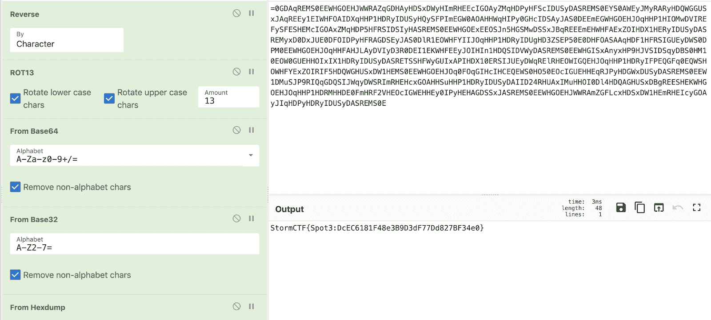

# Chepy:一个 Python lib/cli 的等价物，相当于令人敬畏的 CyberChef 工具

> 原文：<https://kalilinuxtutorials.com/chepy/>

Chepy 是一个 python 库，带有一个方便的 cli，旨在镜像 [CyberChef](https://gchq.github.io/CyberChef/) 的一些功能。为了使它与 CyberChef 提供的各种功能兼容，我们付出了相当大的努力，所有这些都是以纯 Pythonic 的方式实现的。

与赛博咖啡馆相比，它有一些主要的优势和劣势。在 Chepy 中,*堆叠*不同模块的 Cyberchef 概念仍然存在。

它还有很长的路要走，因为它没有提供赛博咖啡馆的所有功能。

**例子**

有关所有用法和示例，请参见文档。

它有一个类似于 Cyberchef 的堆叠机制。例如，在赛博咖啡馆:

这相当于

**从 chepy 导入 Chepy**

**file _ path = "/tmp/demo/encoding "**

print(
Chepy(file _ path)
)。load_file()
。反向()
。rot _ 13()
. base 64 _ decode()
. base 32 _ decode()
。hexdump_to_str()
。o

**也可理解为-[shuffled ns:用 Go 编写的包装 Massdns，使用主动暴力枚举有效子域](https://kalilinuxtutorials.com/shuffledns/)**

**Chepy vs Cyberchef**

**优势**

*   它是纯 python，具有支持和可访问的 python api
*   它有命令行界面
*   它 CLI 有完整的自动完成功能。
*   支持 pe、elf 和其他各种特定于文件格式的解析。
*   可通过[插件](https://chepy-plugins.readthedocs.io/en/latest/)扩展
*   可无限扩展，因为它可以利用完整的 Python 库。
*   它可以在一定程度上与完整的 Cyberchef web 应用程序进行交互。如果需要的话，从 Chepy 转移到 Cyberchef 是很容易的。
*   它的 python 库比 Cyberchef 节点库要快得多。
*   处理 HTTP/S 请求，没有 CORS 问题。

**缺点**

*   它不是一个 web 应用程序(至少目前是这样)。
*   它并没有提供赛博咖啡馆所做的每一件事情
*   它没有`magic`方法(目前)

**安装**

它可以通过几种方式安装。

**黑桃**

**pip3 安装 chepy
#可选有额外要求
pip3 安装 chepy[extras]**

**去**

git 克隆–递归 https://github.com/securisec/chepy.git
CD chepy
pip 3 install-e .
**#我在这里使用-e，这样如果我以后用 git pull 更新，我就不用再安装它了(除非依赖关系已经改变)**

**码头工人**

**docker run–RM-ti-v $ PWD:/data securisec/chepy " some string "[some file，" another string"]**

**独立二进制**

你也可以把它构建成一个独立的二进制文件。这包括将所有依赖项打包在一起。

git 克隆 https://github.com/securisec/chepy.git
CD chepy
pip 安装。
pip 安装 py installer
py installer CLI . py–name chepy–one file

二进制文件将在 dist/文件夹中。

**插件**

在这里查看插件文档

..toctree::
:max depth:3
:caption:Contents:
usage . MD
examples . MD
CLI . rst
chepy . MD
core . MD
modules . rst
extras . rst
plugins . MD
pull request . MD
config . MD
FAQ . MD
 **索引和表格
= = = = = = = = = = = = =**

[**Download**](https://github.com/securisec/chepy)