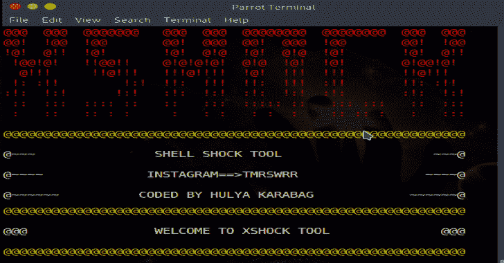
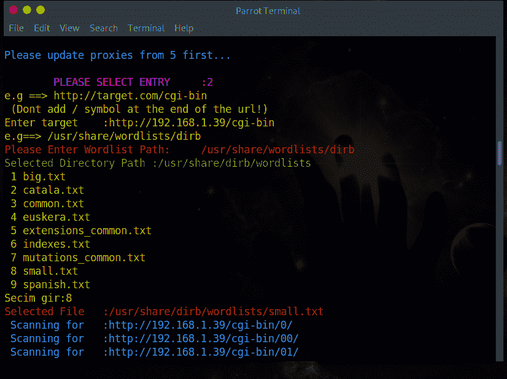
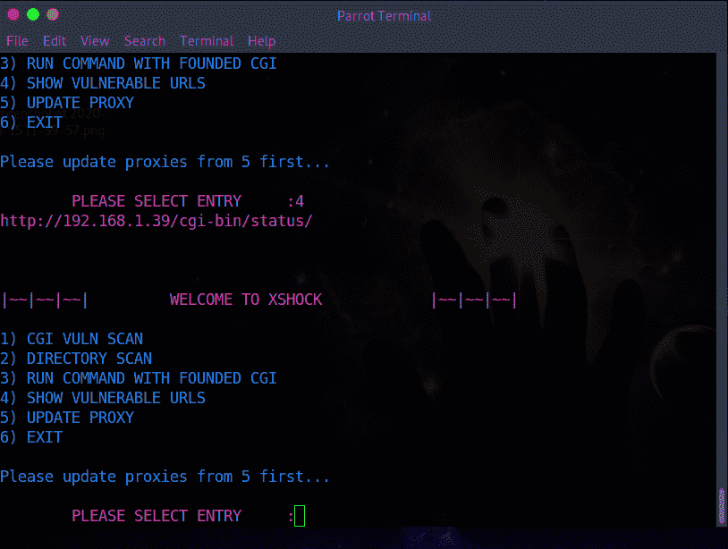
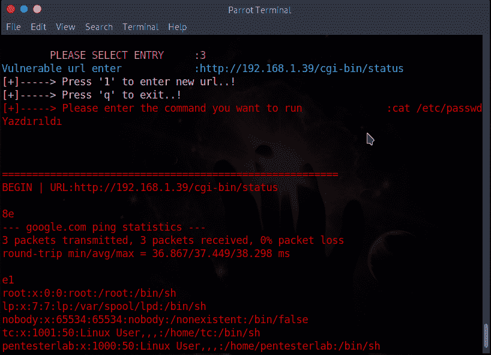

# XSHOCK:利用 ShellShock 的工具

> 原文：<https://kalilinuxtutorials.com/xshock/>

Shellshock 漏洞利用。所有创建的目录都将保存在 **vulnurl.txt** 文件中。执行命令的结果保存在 **response.txt** 中。

**特性**

该工具**包括:**

*   CGI 漏洞
*   目录扫描
*   使用创建的 CGI 运行命令
*   显示易受攻击的 URL
*   更新代理

**安装**

**git 克隆 https://github.com/capture0x/xShock/
CD x shock
pip 3 install-r requirements . txt**

**也读作-[令牌反向器:字表生成器破解安全令牌](https://kalilinuxtutorials.com/token-reverser/)**

**用途**

**python3 main.py**

**CGI 漏洞**

检查目标站点上的 cgi-bin 目录

*   例如:**http://targetsite.com**

**目录扫描**

这适用于单词表。扫描目标站点上的 url。重要通知:请在 url 后面输入单词列表的完整路径。(不是文件。应该是目录)

*   例如:[http://targetsite.com/cgi-bin/**selected worlist**](http://targetsite.com/cgi-bin/selectedworlist)
*   例如:[http://targetsite.com/cgi-bin/usr/share/wordlists/dirb](http://targetsite.com/cgi-bin/usr/share/wordlists/dirb)–>这是 wordlist 的目录。不是文件！

**用创建的 CGI 运行命令**

通过在 vuln.txt 文件中输入 url，您可以尝试在找到的 URL 中运行命令。

**http://targetsite.com/cgi-bin/status**

**显示易受攻击的网址**

显示 vuln.txt 文件中找到的 URL。

**更新代理**

您可以从 web 手动更新代理。

**如何使用？**

[https://www.youtube.com/embed/VXP6ZYyBPS4?feature=oembed&enablejsapi=1](https://www.youtube.com/embed/VXP6ZYyBPS4?feature=oembed&enablejsapi=1)

**截图**

[**Download**](https://github.com/capture0x/XSHOCK)