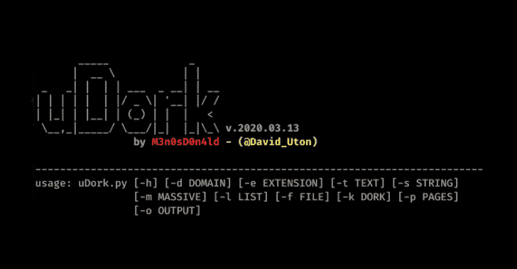
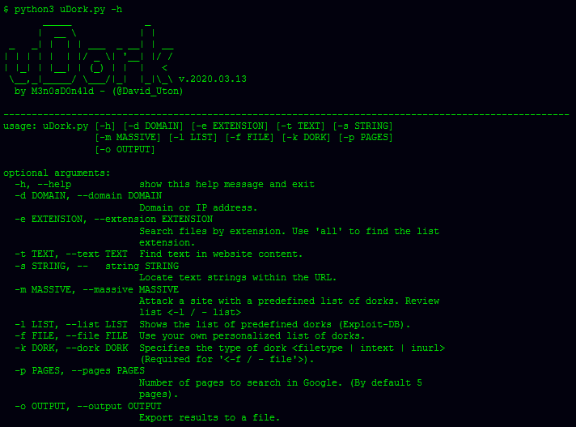
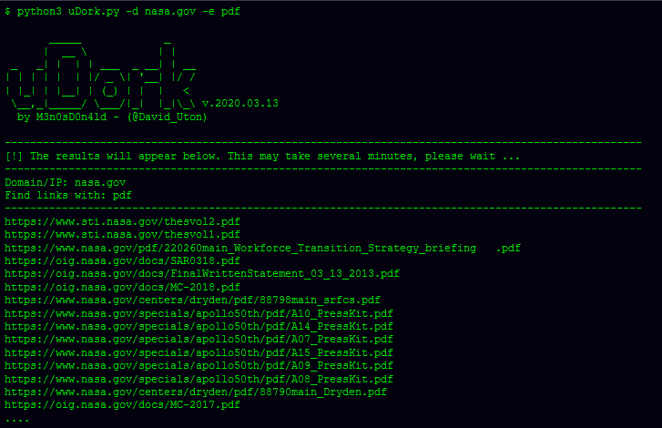
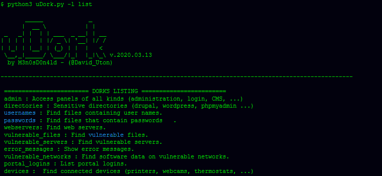
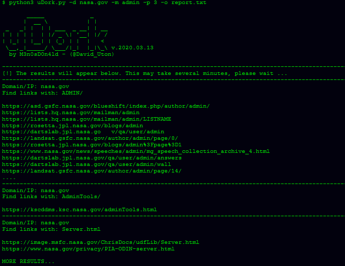

# uDork——谷歌黑客工具

> 原文：<https://kalilinuxtutorials.com/udork-google-hacking-tool/>

**uDork** 是一个用 Python 编写的脚本，它使用先进的 Google 搜索技术来获取文件或目录中的敏感信息，查找物联网设备，检测 web 应用程序的版本等等。

它不攻击任何服务器，它只使用预定义的呆子和/或来自 exploit-db.com 的官方名单(谷歌黑客数据库:[https://www.exploit-db.com/google-hacking-database](https://www.exploit-db.com/google-hacking-database))。

**你需要安装 goop】**

**pip3 安装 goop**

**下载&安装？**

$ git 克隆 https://github.com/m3n0sd0n4ld/uDork
$ CD uDork
**–打开文件，在这一行写:**

cookie = '您的 FACEBOOK COOKIES 在此'

**$ python3 uDork.py -h**

**重要**

*   为了让这个工具工作，您必须在文件`**cookie.py**`中用您的脸书 cookie 配置 uDork。
*   您还必须在使用 uDork 的电脑上登录到脸书，而不要注销。

**获取 cookie 和配置 cookie 的步骤**

*   登录 facebook.com
*   在浏览器中按 control + shift + K(火狐)o control + shift + J(谷歌 Chrome)进入控制台。
*   在控制台中编写 document.cookie，并将 cookie“c _ user = content”和“xs = content”复制到文件“cookie.py”中的变量“cookie”中

**cookie = ' c _ user = XXXXXX；xs=XXXXXX'**

注意:如果“xs”cookie 没有出现，[遵循这些步骤](https://gist.github.com/sqren/0e4563f258c9e85e4ae1)。

*   保存并记住，你不能退出脸书，否则你将不得不再次做这些步骤。

**使用**

*   菜单

*   **搜索 pdf 文件的示例**

*   **呆瓜清单**

*   **使用呆瓜大规模的例子**

[**Download**](https://github.com/m3n0sd0n4ld/uDork)