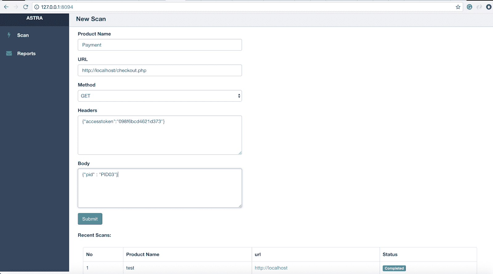
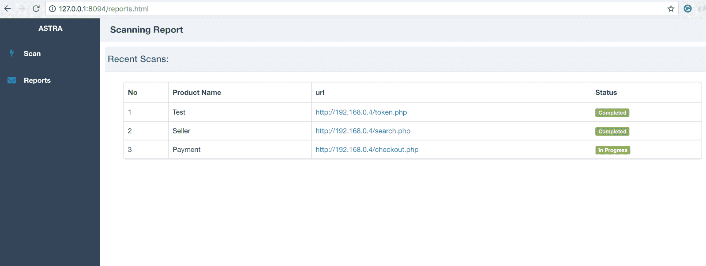
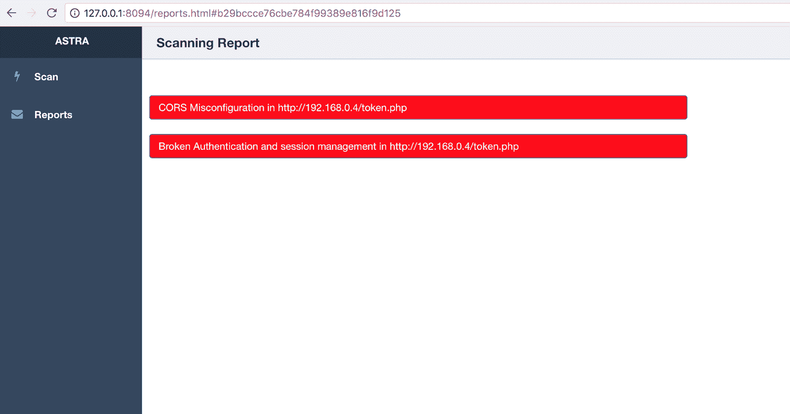
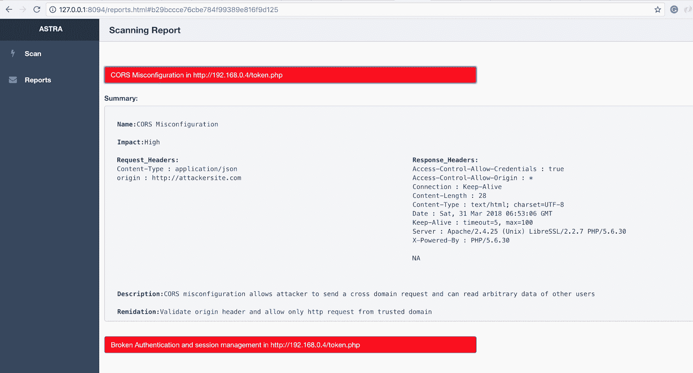

# astra:REST API 的自动化安全测试

> 原文：<https://kalilinuxtutorials.com/astra/>

由于现有 API 和新增 API 的不断变化，REST API 渗透测试非常复杂。安全工程师或开发人员可以使用 Astra 作为他们流程中不可或缺的一部分，因此他们可以在开发周期的早期检测和修补漏洞。

它可以自动检测和测试登录和注销(身份验证 API)，因此任何人都可以轻松地将其集成到 CICD 管道中。它可以将 API 集合作为输入，因此这也可以用于在独立模式下测试 API。

*   SQL 注入
*   跨站点脚本
*   信息泄露
*   身份验证和会话管理中断
*   CSRF(包括盲人 CSRF)
*   速率极限
*   CORS 错误配置(包括 CORS 旁路技术)
*   JWT 攻击
*   CRLF 检测
*   盲目 XXE 注射

**也读作——[Pypykatz:Mimikatz 在纯 Python 中的实现](https://kalilinuxtutorials.com/pypykatz/)**

**要求**

*   Linux 或 MacOS
*   Python 2.7
*   mongoDB

**安装**

**$ git 克隆 https://github.com/flipkart-incubator/Astra
$ CD 阿斯特拉
$ sudo pip install-r requirements . txt**

**码头工人安装**

*   **运行 Mongo 容器:**

**$ docker pull mongo
$ docker run–name astra-mongo-d mongo**

*   **安装 GUI Docker:**

**git 克隆 https://github . com/flipper-incubator/astra . git
CD astra
美元 docker build -t astra。
$ docker run–RM-it–astra-mongo 链接:mongo -p 8094:8094 astra**

*   **安装 CLI Docker :**

**$ git clone-b dock er-CLI https://github . com/flipper-incubator/astra . git
$ astra CD
$ docker build-t astra-CLI。
$ dock run–RM-it–link astra-mongo:mongo astra-CLI**

**依赖关系**

–请求
–记录器
–py mongo
–config parser
–pyjwt
–flask
–sqlmap

**文档**

[https://www . astra-security . info](https://www.astra-security.info)

**用法:CLI**

**$ python astra . py–help**

**用法:** astra.py [-h] [-c {Postman，Swagger }][-n COLLECTION _ NAME][-u URL]
[-HEADERS][-method { GET，POST }][-b BODY]
[-l log in nurl][-H log in HEADERS][-d log in data]

**REST API 安全测试框架**

例如:{ " token ":" 123 " }
-method {GET，POST}、–method { GET，POST}
HTTP 请求方法
-b BODY、–BODY 请求 API 的 BODY
-l log in URL、–log in URL log in URL
登录 API 的 URL
-H log in Headers、–log in Headers log in Headers
头应该是字典格式。例如:
{ " access token ":" axzvbqdadf " }
-d log in data，–log in data log in data
API 的登录数据

**用途:网页界面**

运行 api.py 并访问位于 [http://127.0.0.1:8094](http://127.0.0.1:8094) 的 web 界面

**$ cd API
$ python api.py**

**截图**

*   **新扫描**

*   **扫描报告**

*   **详细报告**

**学分**

*   Ankur Bhargava
*   严酷的格罗弗
*   Flipkart 安全团队
*   帕尔迪普拉塔

[**Download**](https://github.com/flipkart-incubator/Astra#detailed-report)