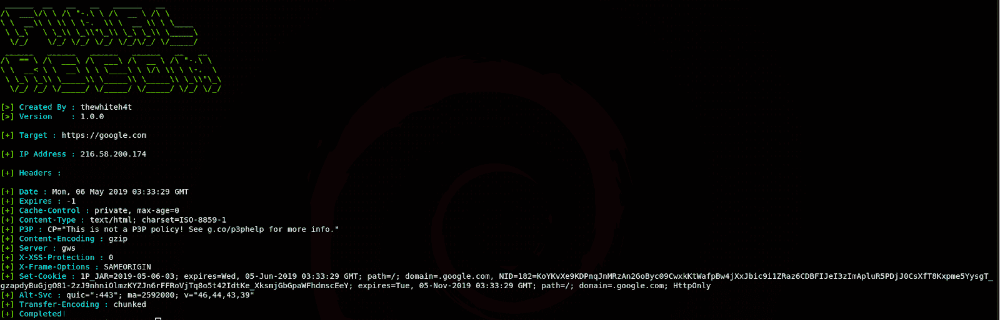
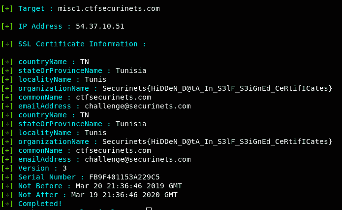
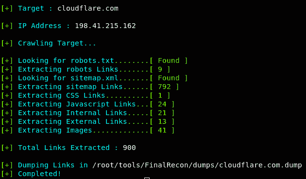
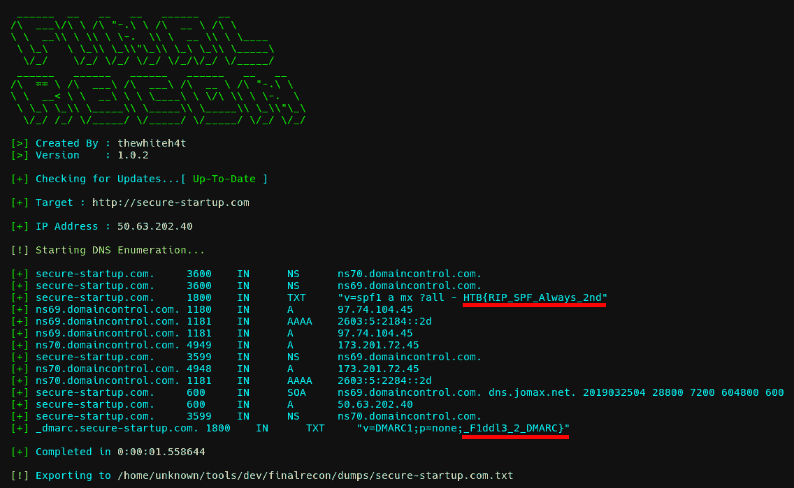
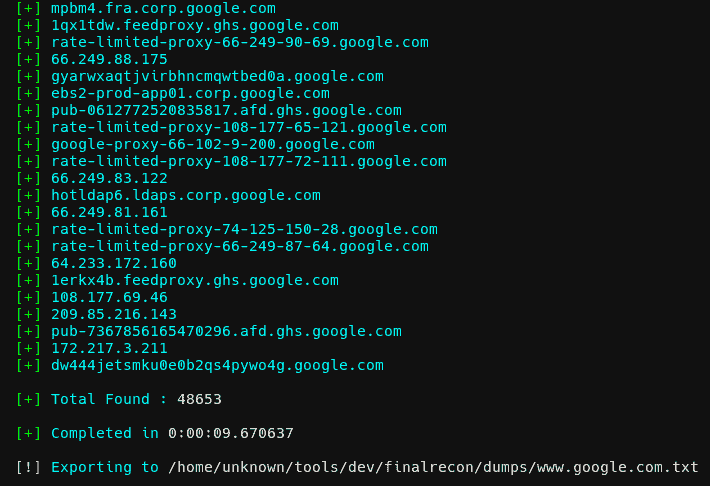
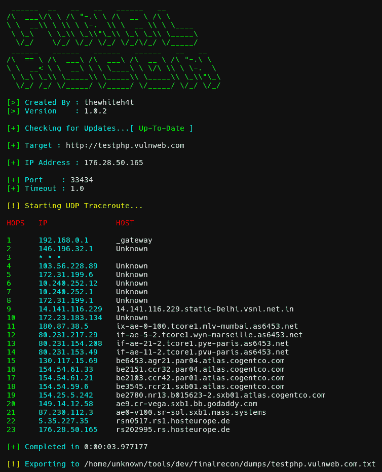
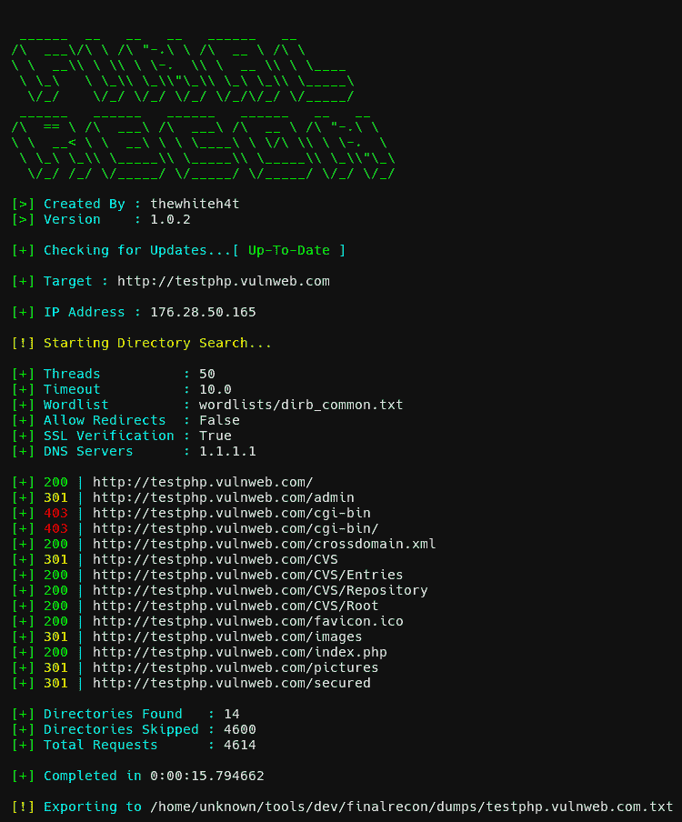
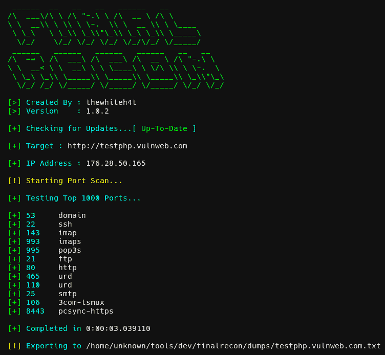

# FinalRecon:一体化网络侦察工具

> 原文：<https://kalilinuxtutorials.com/finalrecon-2/>

FinalRecon 是一个用于网络侦察的快速简单的 python 脚本。它遵循模块化结构，因此将来可以轻松添加新模块。

**特性**

它提供详细信息，例如:

*   **标题信息**
*   是
*   **SSL 证书信息**
*   **爬虫**
*   **DNS 枚举**
    *   一、AAAA、任何、CNAME、MX、NS、SOA、TXT 记录
    *   DMARC 记录
*   **子域枚举**
    *   数据源
        *   小丑
        *   crt.sh
        *   威胁人群
        *   AnubisDB
        *   威胁矿工
*   **Traceroute**
    *   协议
        *   用户数据报协议(User Datagram Protocol)
        *   传输控制协议（Transmission Control Protocol）
        *   网间控制报文协议(Internet Control Messages Protocol)
*   **目录搜索**
*   **端口扫描**
    *   快的
    *   前 1000 个端口
    *   开放标准服务端口
*   **导出**
    *   格式
        *   文本文件（textfile）
        *   可扩展标记语言
        *   战斗支援车

**也可阅读-[懒人码头工人:管理一切的懒惰方式码头工人](https://kalilinuxtutorials.com/lazydocker/)**

**截图**

*   **标题信息**

*   是

*   **SSL 证书详情**

*   **爬虫**

*   **DNS 枚举**

*   **子域枚举**

*   **Traceroute**

*   **目录搜索**

*   **端口扫描**

**测试于**

*   Kali Linux 2019.1
*   BlackArch Linux

**安装**

**git 克隆 https://github.com/thewhiteh4t/FinalRecon.git
CD final recon
pip 3 install-r requirements . txt**

**用途**

**python 3 final Recon . py-h**

**用法:**final Recon . py[-h][–headers][–sslinfo][–whois][–crawl][–DNS][–sub][–trace][–dir][–full][-T T][-T T][-W W W][-r][-s][-D D][-M M M M][-P P P][-TT·TT][-O] –帮助显示此帮助消息并退出
–标头标头信息
–SSL info SSL 证书信息
–Whois Whois 查找
–爬网爬网目标
–DNS DNS 枚举
–子域枚举
–trace Traceroute
–dir 目录搜索
–PS 快速端口扫描
–Full Full Recon

**额外选项:**
-t 线程数【T
-w W 到 Wordlist 的路径[默认:word lists/dirb _ common . txt]
-r 允许重定向[默认:False ]
-s 切换 SSL 验证[默认:True ]
-d D 自定义 DNS 服务器[默认:1.1.1.1]
-M M Traceroute 模式[默认:UDP ] [可用:TCP、ICMP]
-P Traceroute 的 P 端口[默认:80 / 33434 ]
-tt TT Traceroute 超时

*   **检查标题**

**python 3 final recon . py–headers**

*   **检查 ssl 证书**

**python 3 final recon . py–sslinfo**

*   **检查 whois 信息**

**python 3 final recon . py–whois**

*   **抓取目标**

**python 3 final recon . py–crawl**

*   **全扫描**

**python 3 final recon . py–full**

**演示**

[https://www.youtube.com/embed/10q_CKnM3x4?feature=oembed&enablejsapi=1](https://www.youtube.com/embed/10q_CKnM3x4?feature=oembed&enablejsapi=1)

[**Download**](https://github.com/thewhiteh4t/finalrecon)