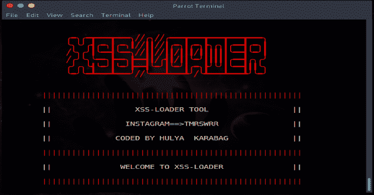
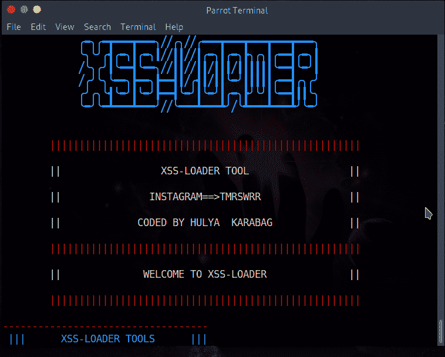
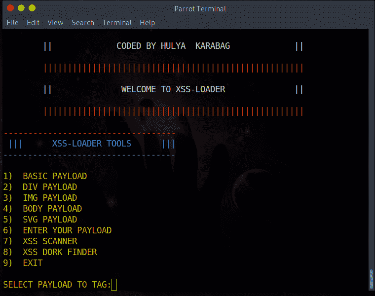
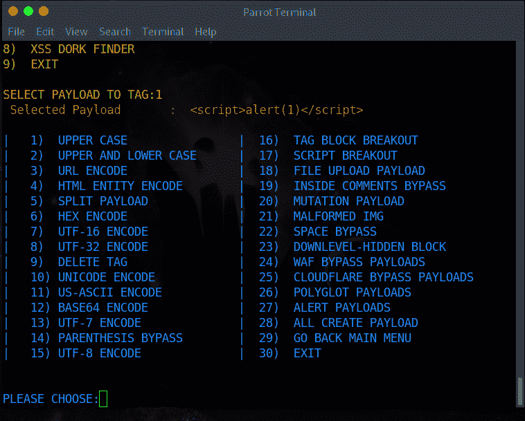
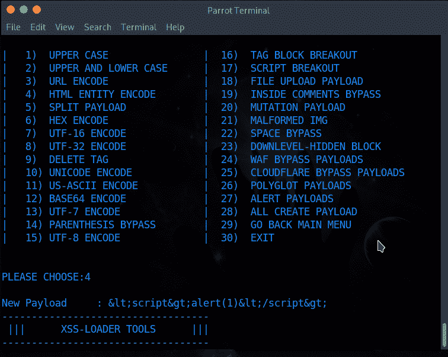
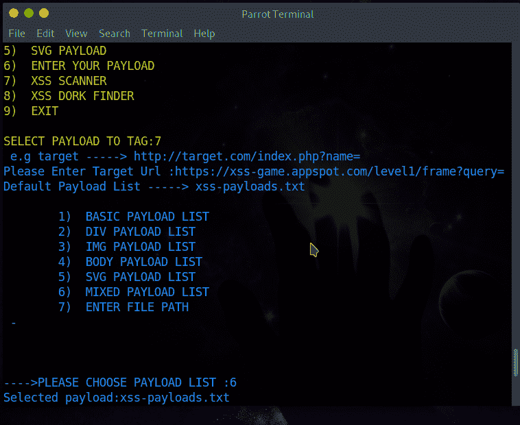

# XSS 装载机:Xss 有效载荷发生器，扫描仪和呆子发现者

> 原文：<https://kalilinuxtutorials.com/xss-loader-xss-payload-generator-scanner-dork-finder/>

XSS-装载机是一个集 XSS 有效载荷发生器-XSS 扫描仪-XSS 呆子发现者于一身的工具，由 Hulya Karabag 编写。

*   该工具创建用于 xss 注入的有效负载
*   从参数中选择默认有效负载标签或编写有效负载
*   它使 xss inj。使用 Xss 扫描仪参数
*   它使用 Xss Dork Finder 参数查找易受攻击的站点 url

**如何使用？**

[https://www.youtube.com/embed/ys_a5yx1hmY?feature=oembed&enablejsapi=1](https://www.youtube.com/embed/ys_a5yx1hmY?feature=oembed&enablejsapi=1)

**安装**

**git 克隆 https://github.com/capture0x/XSS-LOADER/
CD XSS 加载器
pip 3 install-r requirements . txt**

**用途**

**python3 payloader.py**

**特性**

*   **基本有效载荷**
    *   将默认参数设置为: **``**
*   Div 有效载荷
    *   将默认参数设置为:`**
MOVE HERE</div**`
*   Img 有效载荷
    *   将默认参数设置为: **``**
*   车身有效负载
    *   将默认参数设置为: **`<body ontouchstart=alert(1)>`**
*   Svg 有效负载
    *   将默认参数设置为: **`<svg onload=alert('1')>`**
*   输入你的有效载荷
    *   对用户写入的有效负载进行编码
*   有效负载发电机参数
    *   对选定标签上的有效负载进行编码

**又读-[x shock:利用 ShellShock](https://kalilinuxtutorials.com/xshock/) 的工具 **

*   大写-->
*   大写和小写->
*   URL 编码–> % 3c 脚本%3E 警报% 281% 29% 3C % 2f 脚本% 3E
*   HTML 实体编码–>
*   分离有效负载-> pt > > alert(1)pt > >
*   十六进制编码-> 3c 7363726970743 e 616 c 6572742831293 c2f 7363726970743 e
*   utf-16 编码--将有效负载编码为 UTF-16 格式。
*   utf-32 编码--将有效负载编码为 UTF-32 格式。
*   删除标签——>”；alert(' XSS ')；//
*   UNICODE 编码–> % uff 1c script % uff 1e alert(1)% uff 1c/script % uff 1e
*   US-ASCII 编码->脚本报警(1)/脚本
*   BASE64 编码-> phnjcmlwd 5 hbgvydccgxktwvc 2 nya XB 0 pg = =
*   UTF-7 编码–>+ADw-script+AD4-alert(1)+ADw-/script+AD4-
*   圆括号旁路——>
*   UTF-8 编码-> % C0 % BC script % C0 % BE alert % CA % B91)% C0 % BC/script % C0 % BE
*   标记块分线点–> " >
*   脚本突破——>
*   文件上传有效负载–> " >可交换的图像格式
*   内部评论绕过–>–>
*   突变载荷——> " >
*   畸形的 IMG ——> " >
*   空间旁路——
*   下层-隐藏块->
*   晶片旁路有效载荷——显示晶片旁路有效载荷列表
*   CLOUDFLARE BYPASS 有效负载——显示 Cloudflare Bypass 有效负载列表
*   多语言负载——显示多语言旁路负载列表
*   警报有效负载——显示警报有效负载列表
*   所有创建有效负载——显示创建所有有效负载
*   返回主菜单
*   出口

**Xss 扫描仪**

最初，您需要输入目标的 url。请像这样输入 URL = = >例如，目标——> http://target.com/index.php?name=被选择用于扫描有效负载列表

基本有效载荷列表== >由脚本标签组成的有效载荷列表
DIV 有效载荷列表== >由 DIV 标签组成的有效载荷列表
IMG 有效载荷列表== >由 IMG 标签组成的有效载荷列表
正文有效载荷列表== >由正文标签组成的有效载荷列表
SVG 有效载荷列表== >由 SVG 标签组成的有效载荷列表
混合有效载荷列表== >由所有标签组成的有效载荷列表
输入文件路径== >有效载荷列表由用户确定，请输入 url..！(例如路径——>/usr/share/word lists/wfuzz/Injections/XSS . txt)

扫描后结果会添加到“vulnpayload.txt”中。

**Xss 呆子探测器**

首先输入要搜索的 dork:例如—->inurl:"search.php？q= "扫描后结果会保存在“dork.txt”中。

**截图**

[**Download**](https://github.com/capture0x/XSS-LOADER)