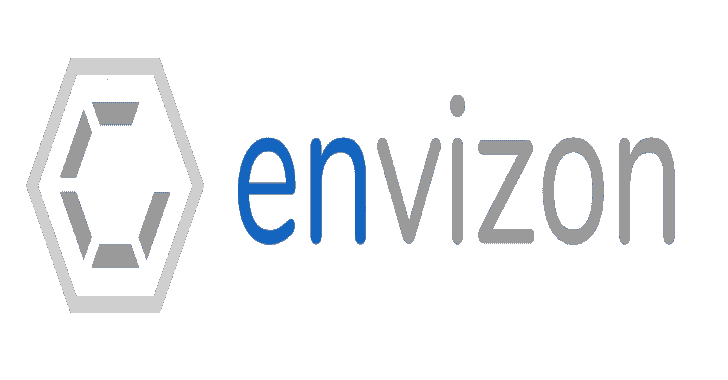

# Envizon:网络可视化和漏洞管理/报告

> 原文：<https://kalilinuxtutorials.com/envizon/>

**Envizon** 是由 evait security 设计、开发和支持的工具。为了回馈安全社区，我们发布了我们内部使用和开发的最先进的网络可视化和漏洞报告工具“envizon”。我们希望您的反馈将有助于进一步改进和完善它。

**用例**

我们使用 envizon 进行 pentests，以便对网络有一个总体了解，并快速确定最有希望的目标。3.0 版本引入了一些新功能，如截屏 web 服务、组织漏洞或使用自定义 docx 模板生成报告。

**核心功能**

*   **使用预定义或自定义的 nmap 查询扫描**网络
*   **订购**具有预配置或定制组的客户端
*   **搜索**客户的所有属性并创建复杂的链接查询
*   **借助预定义的安全标签，在测试期间获得**目标的概览
*   **截图**使用 chrome-headless(selenium)–VNC·索恩，可视化您目标的所有类似 http 的应用程序
*   **保存**并重复使用您最常用的 nmap 扫描
*   **与您的团队在项目上实时协作**
*   **将**选中的客户端导出到一个文本文件中，以快速连接其他工具
*   **管理**问题模板并在数据库中创建链接到主机的漏洞
*   **使用 docx 模板一键创建**客户报告

**如何开始？**

为了避免兼容性和依赖性问题，并使其易于设置，我们使用 Docker。您可以构建自己的映像或使用 Docker Hub 中预先构建的映像。

**使用 Docker**

需要 Docker 和 Docker Compose。

预装坞站图像

*   使用`**docker/envizon_prod**`目录中的`**docker-compose.yml**`并用`**docker-compose up**`运行它。
*   将从`**evait/envizon**`中提取 Docker 图像。
*   如果想更新 app 镜像或者手动拉取，可以用`**docker pull evait/envizon**`来完成。
*   如果您想提供自己的 SSL 证书，请根据您的需要修改`**docker-compose.yml**`，否则将会生成它们。

**对于懒人:**

$ wget https://raw . githubusercontent . com/evait-security/envisation/master/docker/envisation _ prod/docker-compose . yml
echo secret _ key _ base = " $(echo $(OpenSSL rand-hex 64)| tr-d‘\ n]’T2]。envisation _ secret . env
$ sudo dock-合成 up

**从本地 git 收银台运行**

$ git clone https://github . com/evait-security/envisation【$ CD envisation/docker/envisation _ local】
$ echo secret _ key _ base = " $(echo $(OpenSSL rand-hex 64)| tr-d‘\ n]】T3]。envisation _ secret . env
$ sudo dock-合成 up

**开发**

无论出于什么原因，如果您想在生产中运行开发环境，您可能应该考虑更改`**config/secrets.yml**`中的秘密，甚至可能手动激活 SSL。

$ git clone https://github . com/EVA-security/envisation【$ CD envisation/docker/envisation _ dev】
$ sudo docker-compose up

**也可阅读-[Maryam:开源智能(OSINT)框架](https://kalilinuxtutorials.com/maryam/)**

**用途**

**设置密码**

启动 docker 镜像后，转到: [https://localhost:3000/](https://localhost:3000/) (如果不使用 SSL，则转到 [http://localhost:3000](http://localhost:3000)

您必须为您的 envizon 实例指定一个密码。登录后可以在设置界面更改。

**扫描界面**

在扫描界面上，您可以使用预配置的参数或您自己的 nmap fu 运行新的网络扫描。您还可以上传之前创建的 nmap 扫描(使用`-oX`参数)。

扫描会自动分成较小的扫描，以减少等待结果的时间。

要指定扫描目的地，您可以使用主机名或 IP 地址。可以指定带或不带子网掩码或 CIDR 前缀的 IP 地址。要指定范围，可以用`-`或`,`分隔 IP 的各个部分。这些可以根据需要进行组合。如果完整地写出了范围，则只允许使用一个`-`。作为目标的可能值有:

scanme.nmap.org
192 . 168 . 1 . 1
192 . 168 . 1 . 0/24
192 . 168 . 1 . 0/255 . 255 . 255 . 0
192 . 168 . 1 . 1-192 . 168 . 1 . 10
192 . 168 . 1 . 1-192 . 168 . 10 . 254
192

**组**

组界面是 envizon 的核心。您可以选择、分组、排序、快速搜索、全局搜索、移动、复制、删除和查看您的客户端。左侧代表组列表。如果您单击某个群组，您将在页面中央看到该群组内容的详细视图。组中的每个客户端都有一个链接。通过单击 IP 地址，您将在右侧看到更详细的视图，包括所有属性、标签、端口和 nmap 输出。

大多数按钮和链接都有工具提示。

**全局搜索**

在这一部分中，您可以搜索数据库中的几乎任何内容，并使用' and '，'或' & 'NOT '来组合每个搜索参数。

对主机名、IP、开放端口等执行简单的查询。或者创建类似于`**hostname contains 'win' AND mac address starts with '0E:5C' OR has port 21 and 22 open**`的组合查询。端口列表提供所有客户端的端口数，并让您快速识别很少使用的端口。

**图像**

该页面通过在图像/扫描界面上开始新的扫描，呈现带有可视/交互式内容的所有端口的图像。实际上，只有 web 服务使用 selenium 和 chrome-headless 转换成 PNG 文件。扫描界面有两个功能:

*   重新扫描(检查哪个端口可以被捕获，并只添加新图像)
*   覆盖重新扫描(从数据库中删除所有图像，并从所有可能的端口截取屏幕截图)

使用左边的群组侧边栏，您可以按群组过滤所有图像。请注意，此页面上禁止任何更改中的更新(例如，有人删除了一个组),以避免对手动图像查看过程造成任何干扰。

**漏洞管理和报告**

在`**templates**`部分，您可以创建想要在报告中重复使用的问题模板。您可以设置标题、严重性、描述、评级和建议。在“报告”部分，您可以为客户创建报告。首先，您必须创建一个问题组，例如“内部网络”。在该组中，您可以使用问题模板的内容创建新问题，并将它们链接到数据库中的现有客户端。通过使用`**CTRL + v**`并按下“更新”，您可以轻松添加截图作为您的发现的证据。模板链接到新的问题，可以通过一次点击进行更新。在`**edit current report**`下，您可以编辑报告本身的基本信息，例如客户名称或管理摘要。演示模式允许您隐藏除问题及其截图之外的所有项目。

为了创建一个好看的报告，你必须编辑`**./report-templates/envizon_template.docx**`下的 docx 模板文件。所有使用的变量都包含在默认模板中。

**导入/导出**

可以在设置中导出完整的项目/数据库。

要导入导出的 zip 文件，您也可以在设置中选择并上传它。

**注意:**这将覆盖您当前项目中的任何数据，包括所有存储的图像！

导入导出的项目会在您的 envizon 容器中创建一个临时文件，只有当您的容器重新启动后，该文件才会被完全导入！这可以通过运行`**docker-compose restart envizon**`来实现。此时，将创建先前 PostgreSQL 的附加备份，并将其放在 envizon 容器的 db 子文件夹中。

**常见问题解答**

*   API？！
    *   目前没有。我们会努力的。也许吧。
*   支持哪些浏览器？
    *   最新的 Chrome/Chromium/Inox & Firefox/Waterfox/libre wolf。
*   为什么选择 rails？！
    *   想学 ruby。很酷。
*   为什么对 github 问题的讨论这么咸？
    *   这是一个社区项目。我们是一个全职的 pentesting 公司，不会进入/关心每一个不符合我们的模板或准则的开放问题。如果你得到一个粗略的答案或图片，比如从一只完全没印象的猫那里，你可能活该。

[**Download**](https://github.com/evait-security/envizon)