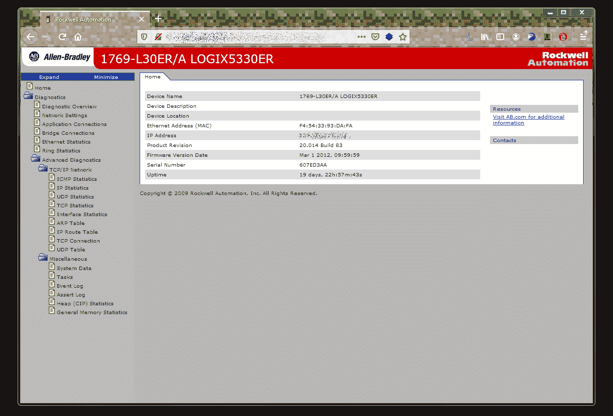
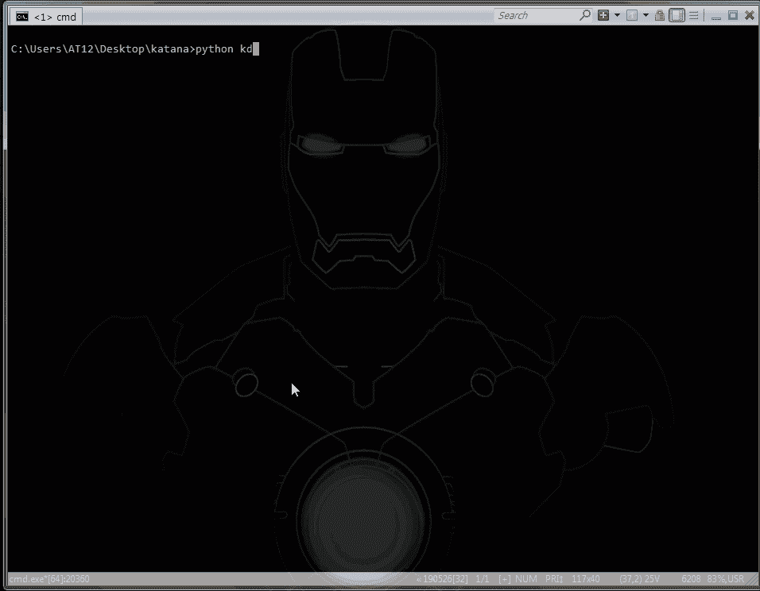
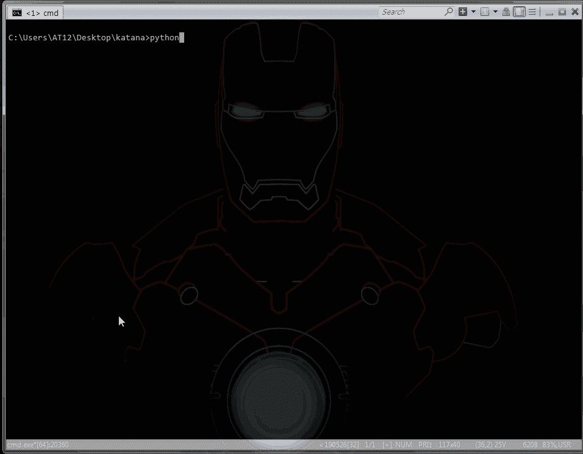
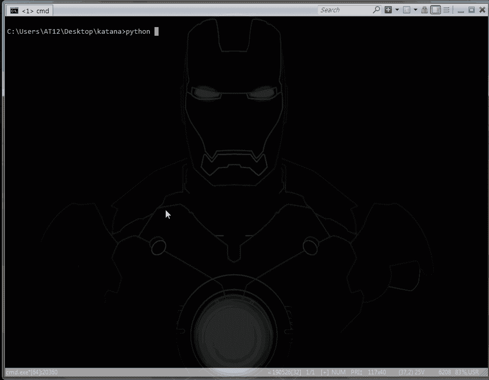

# Katana:用于谷歌黑客的 Python 工具

> 原文：<https://kalilinuxtutorials.com/katana/>

ds (ds 代表 dork_scanner)是一个简单的 python 工具，可以自动化 Google Hacking/Dorking 并支持 Tor。与 [GHDB](https://www.exploit-db.com/google-hacking-database) 组合后威力更大。

**安装**

使用包管理器 [pip](https://pip.pypa.io/en/stable/) 来安装需求

**cd 武士刀
python 3-m pip install-r requirements . txt
python 3 kds . py**

**用途**

**cd 武士刀
python3 kds.py -h(求助)
选项:**
-g:用于谷歌模式
-s:用于 scada 模式
-t:用于 tor 模式
-p:用于代理模式
-b:用于 bitly 模式

**谷歌模式:(python 3.7 和 3.8 支持)**

谷歌模式给你两个输入“呆子”和“TLD”(顶级域名)，让你能够在特定国家搜索。

例如:com 代表美国/ co.ma 代表摩洛哥/ be 代表比利时

如需更多信息，请参阅随附的 [TLDs.txt](https://github.com/adnane-X-tebbaa/Katana/blob/master/TLDs.txt) 文件。

**Scada 模式:(python 3.7 和 3.8 支持)**

在谷歌的 Scada 模式搜索在线 PLC，这实际上使用多个请求，所以你的 ip 将被谷歌封锁，所以改变 TLD 将解决这个问题，脚本为此提供输入。

-!>这只是一个例子，实际上它显示了很多结果

使用 Scada 模式找到的 [Allen-Bradley](https://ab.rockwellautomation.com/lang-selection.html) PLC 仪表板示例

**Tor 模式:(python 3.7 和 3.8 支持)**

Tor 模式为您提供 1 个输入，这是搜索查询，但在您应该在端口 9050 上运行 tor 代理之前，这一次没有 ip 阻止 3 个 tor 搜索引擎 Phobos、Tor66 和 Tordex(将添加更多)中的脚本搜索

-!>这只是一个例子，实际上它显示了很多结果

**万一:**

*   脚本打印“错误请求太多”:更改 TLD
*   更改 TLD 不起作用:通过断开连接再重新连接来更改您的 ip 地址
*   Tor 模式显示“未能建立新连接”:确保 tor 代理已启动并在端口 9050 上运行

**代理模式:(仅受 python 3.7 支持)**

代理模式查找代理服务器并打印它们，每次会打印 25 个不同的代理服务器

**Bitly 模式:(开发中)(受 python 3.7 和 3.8 支持)**

找到感兴趣的短链接，有时会导致感兴趣的网站页面，脚本打印当前 10 位链接及其响应(脚本仍在开发中，如果您有连接错误或太多 404，403，只需再次运行)

**鸣谢:** [龙庆和](https://github.com/adnane-X-tebbaa/Katana/issues/1)

[**Download**](https://github.com/adnane-X-tebbaa/Katana)