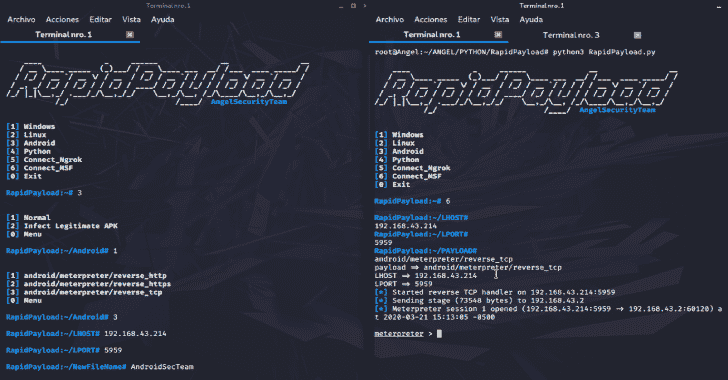
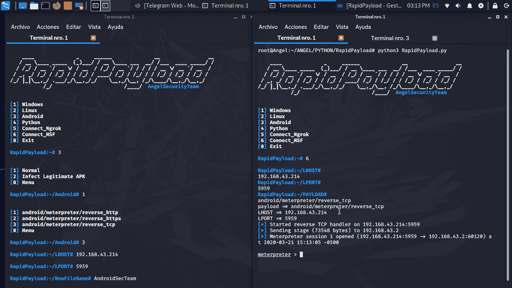
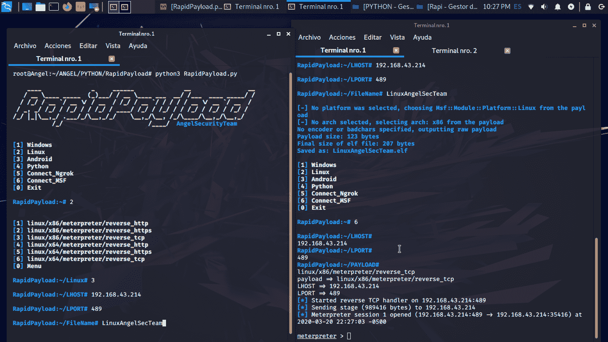
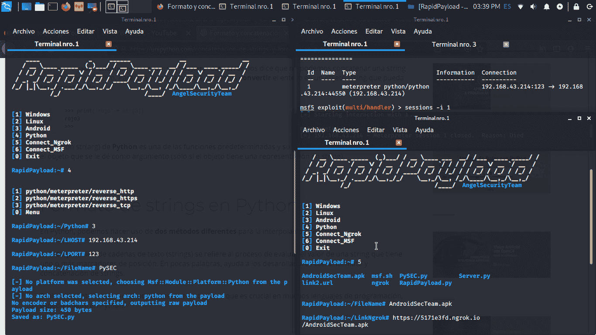

# RapidPayload:框架 Metasploit 负载生成器

> 原文：<https://kalilinuxtutorials.com/rapidpayload/>

框架 **RapidPayload** 是一个 metasploit 有效负载生成器。

**要求**

*   OpenJDK 8 (JAVA)，或更高版本。
*   Metasploit
*   Apktool
*   Python3

**执行**

git 克隆[https://github.com/AngelSecurityTeam/RapidPayload](https://github.com/AngelSecurityTeam/RapidPayload)
CD rapid payload
bash install . sh
python 3 rapid payload . py

**又读-[insta save:Python 脚本从 Instagram](https://kalilinuxtutorials.com/instasave/) 下载图片、视频&个人资料图片**

**AngelSecurityTeam**

[**Download**](https://github.com/AngelSecurityTeam/RapidPayload)