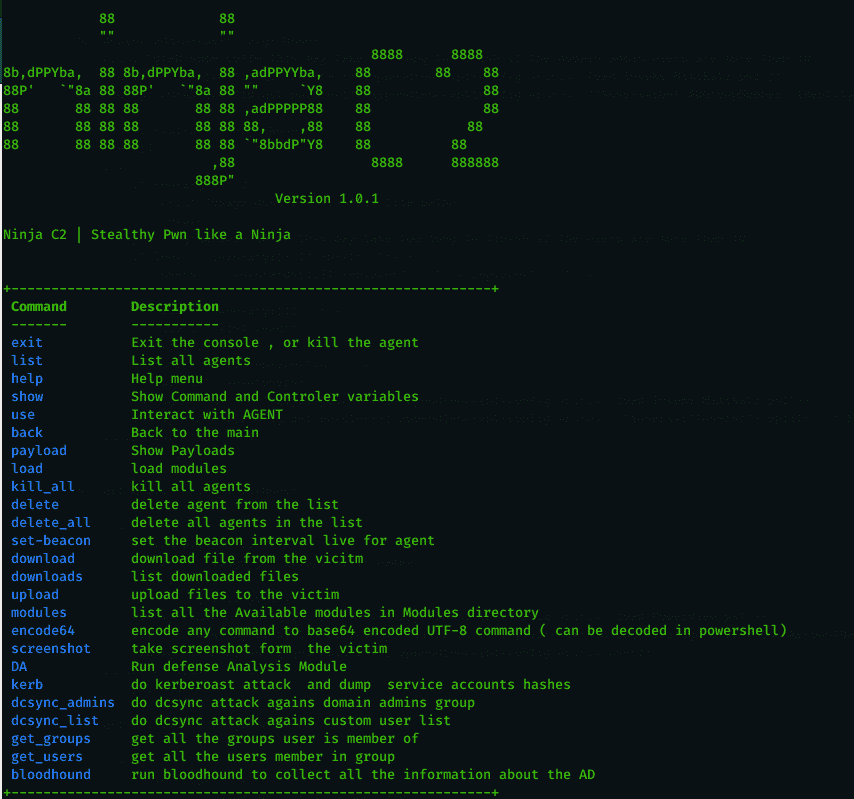
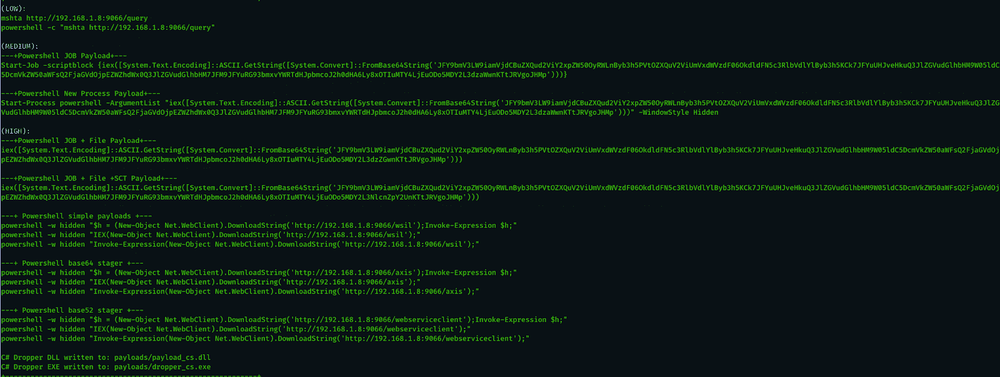
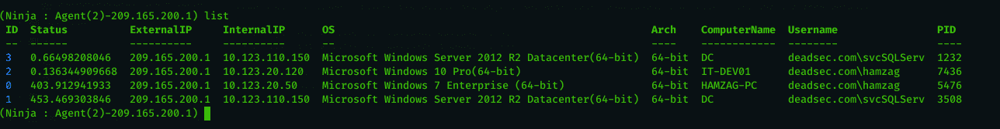
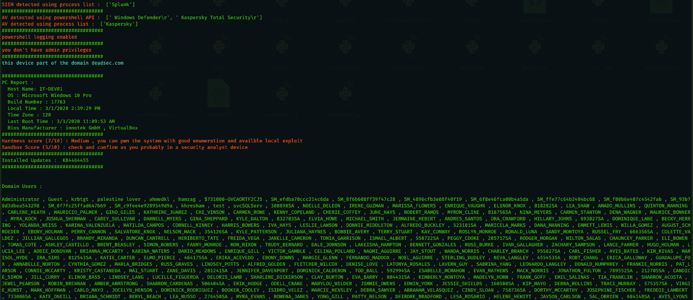
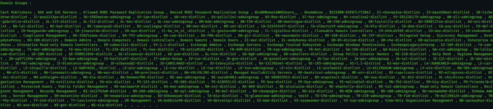
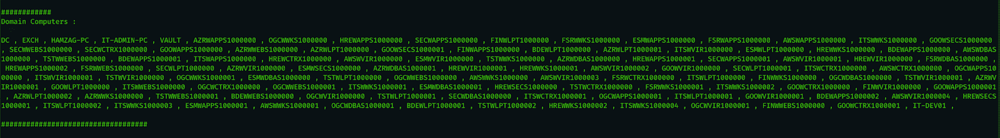
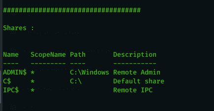

# 忍者:为秘密行动的红队创建的开源 C2 服务器

> 原文：<https://kalilinuxtutorials.com/ninja/>

忍者 C2 是一个开源的 C2 服务器，由紫色团队创建，用于在不被 SIEM 和 AVs 检测到的情况下进行隐形计算机和活动目录枚举，它仍处于测试版本，当稳定版本发布时，它将包含更多的隐形技术和反取证技术，对蓝色团队来说是一个真正的挑战，以确保所有的防御配置正确，他们可以检测复杂的攻击。

它使用 python 来服务负载和控制代理。代理基于 C#和 powershell，可以绕过领先的 AVs。忍者通过 AES-256 加密的安全通道与代理通信，密钥不是硬编码的，而是在活动开始时随机生成的，每个连接到 C2 的代理都可以获得密钥，如果 C2 重新启动，所有旧代理和新代理都将使用新密钥。Ninja 还随机分配每个战役的回拨 URL，以绕过静态检测。

*   Ninja 的主要功能是 DA(防御分析),它会进行必要的枚举以获得下面的重要信息，并对它们进行分析以获得系统防御和沙盒检测的分数。
*   检测 SIEM 解决方案:现在它可以检测 SPlUNK、Log beat collector 和 sysmon。
*   使用两种方法检测 AV，使用 powershell 命令和使用进程。
*   检查 powershell 日志记录是否已启用
*   检查用户是否有管理员权限
*   提供有关系统的信息:主机名、操作系统、内部版本号、当地时间、时区、上次引导和 bios。
*   提供有关已安装的安全更新的信息。
*   提供基于多个因素的系统 pwn 硬度分数。
*   根据(权限、bios 制造商、是否加入域、是否存在系统内部进程)提供沙盒检测分数。
*   显示所有域用户(使用 powershell 命令)。
*   显示所有域组(使用 powershell 命令)。
*   显示所有域计算机(使用 power view . PS1–取自:[https://github . com/powershell empire/power tools/blob/master/power view/power view . PS1](https://github.com/PowerShellEmpire/PowerTools/blob/master/PowerView/powerview.ps1))。
*   显示可用的共享。

Ninja 被设计成易于设置、添加更多命令和自动完成无聊的任务。您可以找到许多短命令，红队队员很难记住和搜索它们。请查看本文了解更多关于忍者的信息:[https://shell . systems/introducing-ninja-C2-the-C2-build-for-stealth-red-team-operations/](https://shells.systems/introducing-ninja-c2-the-c2-built-for-stealth-red-team-operations/)

**也可阅读-[xxexploit:帮助利用 XXE 漏洞的工具](https://kalilinuxtutorials.com/xxexploiter/)**

**特性**

它包含许多功能，使您能够在实际需要部署完整的服务或工具和技术之前，深入了解即将到来的服务，例如:

*   国防分析
*   从生成 kerberos 票据到将 SPN 散列提取为 hashcat 格式，kerberoast 攻击的自动化。
*   dc_sync 自动获取用户或域管理组列表的哈希值。
*   自动获取用户所属的组和组中的用户成员。
*   bloodhound 广告数据收集自动化。
*   自定义的 c#有效负载，加密字符串以绕过静态检测。
*   将任何命令编码为 unicode base64，以便在 powershell 编码的命令中使用。
*   对代理与命令和控制之间的所有通信进行完全加密，以绕过 AV 和 IPS 检测。
*   所有功能的动态 url，只需放置您的 URL 名称列表，c2 将随机使用它来绕过任何静态检测。
*   每次代理连接时，动态获取随机加密密钥(非硬编码)(即使重新连接也需要新密钥)
*   截图然后加密发给 C2
*   从 C2 上传文件到受害者加密绕过反病毒和 IPS
*   从受害者处下载加密文件以绕过反病毒和入侵防御
*   绕过检测的分段有效负载(base64 和 base52)
*   绕过 AVs(在卡巴斯基和趋势科技上测试)
*   绕过 SIEM 检测(在 splunk 上测试，收集常规事件日志和 sysmon 日志)未在 powershell v5 脚本块和模块日志上测试(将在下一版本中完成)。
*   即使在代理连接后也要动态设置信标间隔，并在活动开始配置中提供一个开始信标间隔
*   记录所有命令和结果，以便返回操作中遗漏的任何数据。
*   开始活动时设置一次配置，然后享受。
*   全球杀戮开关结束战役。
*   删除表格条目。
*   所有的有效载荷都写入有效载荷文件夹，以便于访问和进一步定制。
*   很容易为您想要的任何命令添加自动化。

**要求**

请注意，编译 C#依赖于带有 SHA1 哈希 C 669667 bb 4d 7870 BC 8 bb 65365d 30071 eb7 FB 86 Fe 的`**System.Management.Automation.dll**`程序集。

一些 Ninja 命令需要以下模块(已经存在于模块中),您需要从它们的 repo 中获取更新:

*   invoke-Kerberos ast:[https://raw . githubusercontent . com/xan7r/Kerberos ast/master/autokerberos ast . PS1](https://raw.githubusercontent.com/xan7r/kerberoast/master/autokerberoast.ps1)
*   Invoke-Mimikatz:[https://github . com/powershell mafia/PowerSploit/blob/master/exfiliation/Invoke-Mimikatz . PS1](https://github.com/PowerShellMafia/PowerSploit/blob/master/Exfiltration/Invoke-Mimikatz.ps1)
*   sharp hound:[https://github . com/blood hound/blood hound/blob/master/Ingestors/sharp hound . PS1](https://github.com/BloodHoundAD/BloodHound/blob/master/Ingestors/SharpHound.ps1)
*   power view:[https://github . com/powershell empire/power tools/blob/master/power view/power view . PS1](https://github.com/PowerShellEmpire/PowerTools/blob/master/PowerView/powerview.ps1)

**安装**

*   首先，确保使用以下命令下载最新版本的 Ninja:

**git 克隆 https://github.com/ahmedkhlief/Ninja/**

*   您需要通过运行 install.sh 脚本来设置 Ninja:

chmod +x ./install.sh sudo。/install.sh

*   之后，您需要初始化活动:

**python start_campaign.py**

*   现在你可以启动忍者服务器了:

**python Ninja.py**

*   一旦运行它，您将看到以下内容:

**忍者 C2 |像忍者一样鬼祟的 Pwn
命令描述
————————**
退出退出控制台 或者杀死代理
列表列出所有代理
帮助菜单
显示显示命令和控制器变量
使用与代理交互
返回主
有效负载显示有效负载
加载加载模块
kill_all 杀死所有代理
从列表中删除代理
delete_all 删除列表中的所有代理
set-beacon 为代理设置信标间隔 live
从 vicitm 下载下载文件
下载列表下载文件
上传上传文件到受害者
模块列出模块目录中所有可用的模块
编码 64 将任何命令编码为 base64 编码的 UTF-8 命令(可以在 powershell 中解码)
截图截图来自受害者
DA Run 防御分析模块
kerb do Kerberos 攻击和转储服务帐户哈希
DC sync _ admins do DC sync attack against domain admins group
DC sync _ list do DC sync attack against custom user list
get _ groups get all groups user is member of
get _ users get all users group
blood hound Run blood hound 收集关于 AD 的所有信息

**待办事项**

*   增强 DA 模块，添加更多 SIEM、AV 和沙盒检测以及更重要的枚举数据。
*   更加注重隐蔽，仅在需要时加载代理部件
*   为流行的模块添加更多简短的命令
*   使用 C#有效负载和宏为网络钓鱼添加更多定制和想法
*   与曲线球利用集成
*   与 RCE 新交易所整合
*   不可检测的持久性
*   创建一个擦除命令，安全地删除硬盘上的文件，而不被蓝队发现和分析。
*   使代理随机阻止更改，以绕过任何静态检测
*   为代理添加混淆。
*   集成钴打击有效载荷

**截图**

**主屏幕**

**有效载荷**

**代理列表**

**达**

**达**

**达**

**达**

**上传文件**

**下载文件**

[**Download**](https://github.com/ahmedkhlief/Ninja#todo)