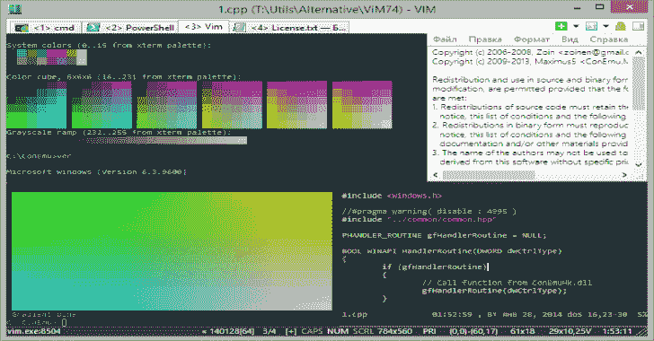
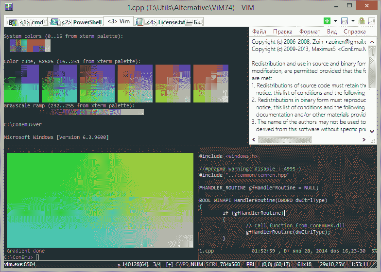
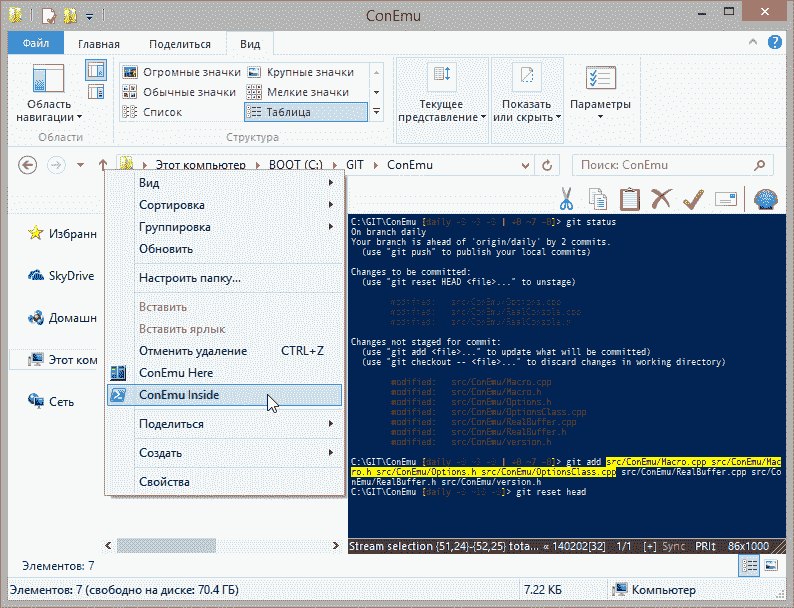

# ConEmu:可定制的 Windows 终端

> 原文：<https://kalilinuxtutorials.com/conemu/>

ConEmu maximus 5 是一个带有选项卡的 Windows 控制台模拟器，它将多个控制台表示为一个具有各种功能的可定制 GUI 窗口。

最初，这个程序是作为 Far Manager 的一个伙伴创建的，Far Manager 是我最喜欢的 shell 替代品——文件和归档管理、命令历史和完成、强大的编辑器。

如今，ConEmu 可以与任何其他控制台应用程序或简单的 GUI 工具(例如 PuTTY)一起使用。ConEmu 是一个积极的项目，欢迎提出建议。

**演示**

[https://www.youtube.com/embed/DoXkqN8Hu74?feature=oembed&enablejsapi=1](https://www.youtube.com/embed/DoXkqN8Hu74?feature=oembed&enablejsapi=1)

**描述**

ConEmu 在隐藏的控制台窗口中启动一个控制台程序，并提供一个具有各种功能的可定制 GUI 窗口:

*   平滑调整窗口大小；
*   制表符和分割线(窗格)；
*   在 Windows 7 或 64 位操作系统中轻松运行旧的 DOS 应用程序(游戏)(需要 DOS box)；
*   地震风格，正常，最大化和全屏窗口图形模式；
*   窗口字体抗锯齿:标准，清晰类型，禁用；
*   窗口字体:家族、高度、宽度、粗体、斜体等。；
*   在控制台的不同部分同时使用普通/粗体/斜体字体；
*   光标:标准控制台(水平)或 GUI(垂直)；
*   越来越多…

**也可阅读-[HTTPS-无处不在:加密你的通信的浏览器扩展](https://kalilinuxtutorials.com/https-everywhere/)**

**Far Manager 相关功能**

*   编辑器、查看器、面板和控制台的选项卡；
*   缩略图和平铺；
*   在编辑器/查看器中显示最后一个命令的完整输出(1K+行);
*   可定制的右键点击行为(长时间点击打开上下文菜单)；
*   拖放(浏览器风格)；
*   越来越多…

从注册表或 ConEmu.xml 文件中读取所有设置，然后应用[命令行参数](https://conemu.github.io/en/CommandLine.html)。您可以轻松使用多种指定的配置(例如，用于不同的电脑)。

**要求**

*   Windows 2000 或更高版本。

**安装**

总的来说，ConEmu 安装很容易。只需解压或安装到任何文件夹并运行`ConEmu.exe`。

阅读[安装维基](https://conemu.github.io/en/Installation.html)关于发布阶段，发行包，一些警告和更多…

**从源构建**

[https://github . com/maximus 5/con emu/blob/master/src/how to build . MD](https://github.com/Maximus5/ConEmu/blob/master/src/HowToBuild.md)

**截图**

**免责声明**

本软件由作者“按原样”提供，拒绝任何明示或暗示的担保，包括但不限于对适销性和特定用途适用性的暗示担保。