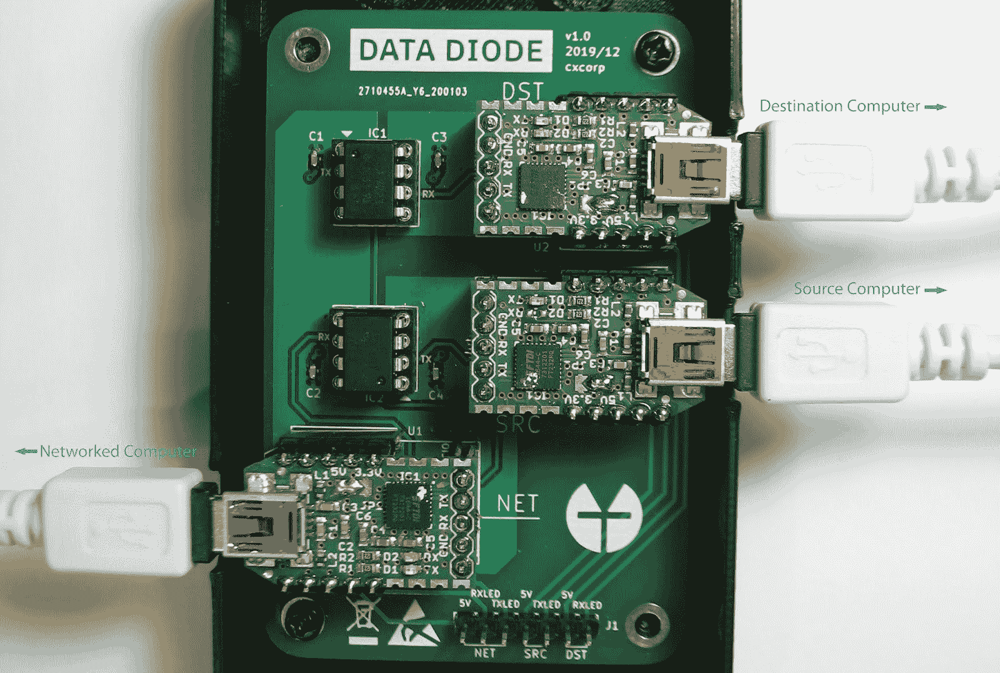
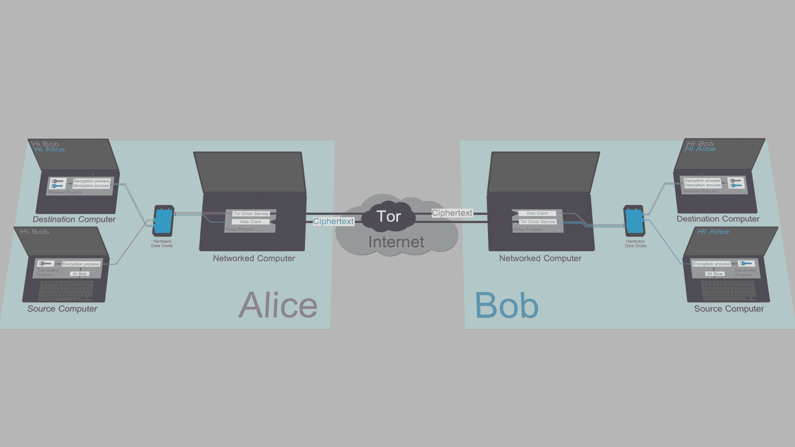
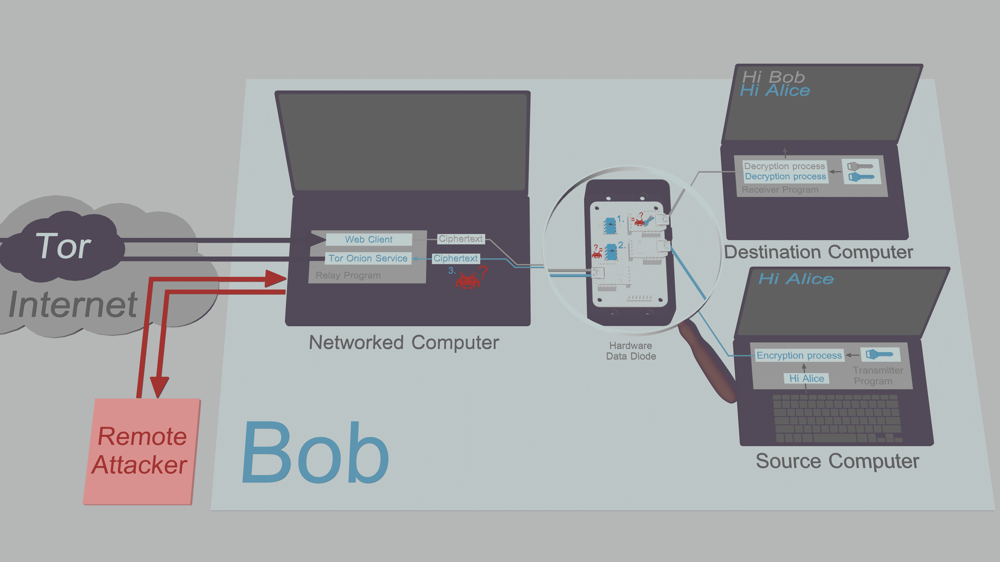

# 锡纸聊天–洋葱路由、端点安全消息系统

> 原文：<https://kalilinuxtutorials.com/tinfoil-chat/>

**Tinfoil Chat (TFC)** 是一个 [FOSS](https://www.gnu.org/philosophy/free-sw.html) + [FHD](https://www.gnu.org/philosophy/free-hardware-designs.en.html) [点对点](https://en.wikipedia.org/wiki/Peer-to-peer)消息系统，依靠高保证硬件架构来保护用户免受[被动收集](https://en.wikipedia.org/wiki/Upstream_collection)、 [MITM 攻击](https://en.wikipedia.org/wiki/Man-in-the-middle_attack)以及最重要的[远程密钥泄露](https://www.youtube.com/watch?v=3euYBPlX9LM)。

TFC 是为具有最复杂威胁模式之一的人设计的:有组织犯罪集团和民族国家黑客，他们通过入侵端点来绕过传统安全消息应用的端到端加密。

*   **最先进的加密技术**

TFC 使用[xchacha 20](https://cr.yp.to/chacha/chacha-20080128.pdf)–[poly 1305](https://cr.yp.to/mac/poly1305-20050329.pdf)[端到端加密](https://en.wikipedia.org/wiki/End-to-end_encryption)和[可否认认证](https://en.wikipedia.org/wiki/Deniable_encryption#Deniable_authentication)来保护发送给个人收件人和群组的所有消息和文件。对称密钥或者是[预共享](https://en.wikipedia.org/wiki/Pre-shared_key)，或者使用 [X448](https://eprint.iacr.org/2015/625.pdf) 进行交换，其基数为 10 的[指纹](https://en.wikipedia.org/wiki/Public_key_fingerprint)通过带外通道进行验证。TFC 用基于[哈希棘轮](https://www.youtube.com/watch?v=9sO2qdTci-s#t=1m34s)的 [BLAKE2b](https://blake2.net/blake2.pdf) 提供每条消息[的前向保密性](https://en.wikipedia.org/wiki/Forward_secrecy)。使用 XChaCha20-Poly1305 在本地加密所有持久用户数据，使用 [Argon2id](https://github.com/P-H-C/phc-winner-argon2/blob/master/argon2-specs.pdf) 从密码和 salt 中获得密钥，其参数根据最佳实践自动调整。TFC 的密钥生成依赖于 Linux 内核的 [getrandom()](https://manpages.debian.org/testing/manpages-dev/getrandom.2.en.html) ，一个基于 ChaCha20 的 [CSPRNG](https://en.wikipedia.org/wiki/Cryptographically_secure_pseudorandom_number_generator) 的系统调用。

*   **匿名设计**

TFC 通过匿名网络独家发送所有通信。它使用下一代( [v3](https://trac.torproject.org/projects/tor/wiki/doc/NextGenOnions) ) [Tor Onion 服务](https://2019.www.torproject.org/docs/onion-services)来实现永不退出 Tor 网络的 P2P 通信。这使得用户很难意外地取消自己的匿名。这还意味着，与(非)集中式信使不同，没有第三方服务器可以访问用户元数据，例如谁在与谁交谈、何时交谈以及交谈多少。网络架构意味着 TFC 只能在用户的设备上运行。没有广告或跟踪，也不会收集任何关于用户的数据。所有数据总是用用户控制的密钥加密，数据库永远不会离开用户的设备。

使用洋葱服务也意味着不需要注册账户。在首次启动期间，TFC 为用户生成一个随机的 TFC 帐户(洋葱服务地址)，例如 **`4sci35xrhp2d45gbm3qpta7ogfedonuw2mucmc36jxemucd7fmgzj3ad`。**通过知道这个 TFC 账户，任何人都可以向用户发送联系请求并与他们交谈，而无需了解他们的真实身份、IP 地址或地理位置。受保护的地理位置使物理攻击变得非常困难，因为攻击者不知道设备在地球上的位置。与此同时，这也使得通讯审查受到抵制:封锁 TFC 需要在全国范围内彻底封锁 Tor。

TFC 还具有隐藏通信类型、数量和时间表的流量屏蔽模式，即使用户的面向网络的设备被黑客攻击。为了提供更进一步的元数据保护免受黑客攻击，TFC 面向互联网的部分可以运行在 [Tails](https://tails.boum.org/) 上，这是一个专注于隐私和匿名的操作系统，不包含用户的个人文件(这使得很难推断出端点属于谁)，并为他们的匿名提供了[额外的保护层](https://github.com/Whonix/onion-grater)。

*   **首款具有端点安全性的消息系统**

TFC 设计用于提供强大的[终端安全性](https://en.wikipedia.org/wiki/Endpoint_security)的硬件配置中。这种配置在每个端点上使用三台计算机:加密和解密过程分别在两台独立的计算机上进行，即源计算机和目标计算机。这两台设备是 TFC 专用的。这种分裂的 [TCB](https://en.wikipedia.org/wiki/Trusted_computing_base) 通过用户的日常电脑与网络交互，称为联网电脑。

在 TFC，数据从源计算机移动到联网的计算机，从联网的计算机移动到目的计算机，都是单向的。数据流的单向性得到了加强，因为数据仅通过一个自由硬件设计[数据二极管](https://en.wikipedia.org/wiki/Unidirectional_network)从一个设备传递到另一个设备，每个设备使用一条 USB 电缆连接到三台计算机。源计算机和目的计算机没有连接到互联网，也没有连接到除数据二极管以外的任何设备。

数据二极管的[光耦合器](https://en.wikipedia.org/wiki/Opto-isolator)内的光中继器根据基本物理定律控制数据传输的方向。这种保护非常强大，数据二极管的认证实施通常出现在关键基础设施保护和政府网络中，其中数据的分类级别因系统而异。例如，数据二极管可以允许访问核电站的安全系统读数，同时防止攻击者利用这些关键系统。另一个用例是允许将数据从安全性较低的系统导入到包含必须防止泄露的机密文档的系统中。

在 TFC，硬件数据二极管确保任何一个 TCB 半都不能被双向访问。由于这种保护依赖于硬件功能的物理限制，因此没有任何恶意软件，甚至是零日漏洞利用都无法绕过数据二极管提供的安全性。

**也可以理解为-[Astra:REST API 的自动化安全测试](https://kalilinuxtutorials.com/astra/)**

它是如何工作的？

有了硬件，剩下的就是让用户在每台计算机上启动设备特定的 TFC 程序。

在上图中，Alice 向在源计算机上运行的传输程序输入消息和命令。传输程序对明文数据进行加密和签名，并通过数据二极管将密文从源计算机中继到她的联网计算机。

爱丽丝联网计算机上的中继程序通过数据二极管将命令和外发信息的副本中继到她的目的计算机。Alice 的目的计算机上的接收器程序对接收到的消息/命令进行认证、解密和处理。

Alice 的中继程序通过 Tor Onion 服务与 Bob 共享消息和文件。Bob 中继程序的 web 客户端从 Alice 的 Onion 服务中获取密文，并通过他的数据二极管将其转发到他的目的计算机。Bob 的接收程序然后验证、解密和处理接收到的消息/文件。

当 Bob 响应时，他将把他的消息输入到源计算机上的发送程序中，经过一个镜像过程后，Alice 从目的计算机上的接收程序中读取消息。

**为什么密钥和明文不能被泄露？**

上述架构同时利用[传统和替代数据二极管型号](https://en.wikipedia.org/wiki/Unidirectional_network#Applications)来实现两个用户之间的双向通信，同时提供硬件强制端点安全性:

*   目标计算机使用经典的数据二极管模型。这意味着它可以从不安全的联网计算机接收数据，但无法将数据发送回联网计算机。接收器程序被设计为在这些约束下运行。然而，即使该程序对所有传入的数据进行认证和验证，也不排除恶意软件仍然无法渗透到目标计算机中。然而，如果发生这种情况，恶意软件将无法将敏感密钥或明文泄漏回联网的计算机，因为数据二极管会阻止所有出站流量。
*   源计算机使用备用数据二极管模型。这意味着它可以向不安全的联网计算机输出加密数据，而不必担心受到危害:数据二极管通过物理阻止所有入站流量来保护源计算机免受所有攻击。变送器程序还设计为在数据二极管引入的数据流限制下工作；为了允许密钥交换，短椭圆曲线公钥由用户手动输入。
*   网络计算机的设计是基于这样的假设:它可以被远程攻击者破坏:所有通过中继程序的敏感数据都被加密和签名，没有例外。由于攻击者无法从源计算机或目标计算机中破解解密密钥，因此密文对攻击者没有任何价值。

**量子分离的中间溶液**

对于一些用户来说，现代世界的 apt 不是威胁模型的一部分，而对于其他人来说，必须自己构建数据二极管的要求是一个交易破坏者。然而，对他们所有人来说，在联网设备上存储私钥仍然是一个安全风险。

为了满足这些用户的需求，TFC 还可以在三个专用的[量子比特](https://www.qubes-os.org/)虚拟机上运行。借助 Qubes 配置，隔离由 [Xen 虚拟机管理程序](https://xenproject.org/users/security/)提供，虚拟机之间的数据流的单向性通过严格的防火墙规则得以加强。这种中间隔离机制在单台计算机上运行，这意味着不需要硬件数据二极管。

**支持的操作系统**

*   **源/目的计算机**
    *   Debian 10
    *   PureOS 9.0
    *   *buntu 19.10
    *   LMDE 4
    *   Qubes 4 (Debian 10 虚拟机)

*   **联网电脑**
    *   尾部 4.0
    *   Debian 10
    *   PureOS 9.0
    *   *buntu 19.10
    *   LMDE 4
    *   Qubes 4 (Debian 10 虚拟机)

[**Download**](https://github.com/maqp/tfc)