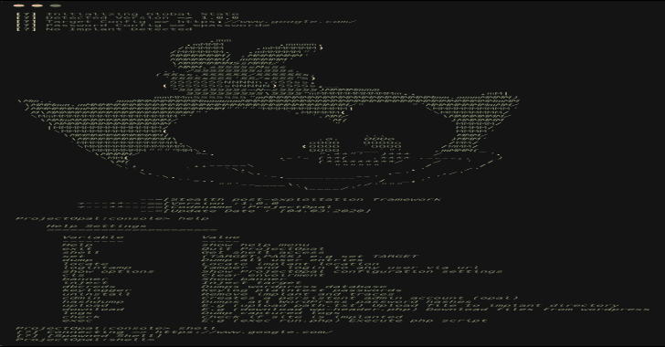
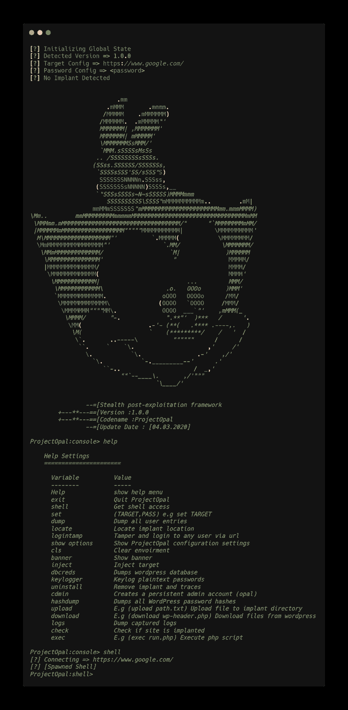

# project opal:WordPress 的隐形后开发框架

> 原文：<https://kalilinuxtutorials.com/projectopal/>

我们特意为我们的渗透测试工作制作了它，但是它现在变得灰白了，所以我们想把它传递给公众！。**工程蛋白石或蛋白石。**

是一个为 wordpress 站点设计的秘密的 post exploit 框架，可以从日志中隐藏它的踪迹，并通过系统混淆它的方式！🙂

有趣的酷功能，它创建了一个管理员用户，是隐藏的所有用户，包括管理员！请注意，它存储在数据库中，所以不要忘记删除您的痕迹。

*   WORDPRESS:T1
    *   登录:opal@wordpress.com
    *   (默认)Pass: QCa9KT4eAvxzC5Kk 或 projectopal
*   **后端登录:**
    *   (默认)登录:QCa9KT4eAvxzC5Kk
*   **登录:**允许任何用户登录
*   **CHAPPY:** 创建管理员帐户
*   **用户转储:**转储所有用户条目
*   **定位:**获取植入位置

**也可理解为-[scoringine:红/白/蓝团队比赛的评分引擎](https://kalilinuxtutorials.com/scoringengine/)**

**入门**

**用 git 克隆仓库:
git 克隆 https://github.com/shadowlabscc/ProjectOpal.git&&CD project opal
python opal . py

或

python Injector.py(编辑 config.py！)
你会看到一个启动画面。键入 help，更好地了解您的 shell】**

**特性**

这些是 Shadowlabs 团队基于该计划引以为豪的功能:

*   绕过 WAF(网络应用防火墙)
*   隐藏/秘密行动
*   让您登录到任何用户
*   转储整个用户条目
*   创建一个隐藏的永久管理员帐户
*   模糊植入
*   多功能性

∞喷油器〖t0〗多莉 2 . zip〗t1〗喷油器. py〗T2〗配置 py〖T3〗WordPress〗T4〗64fc 9f 8191 afee 3231 e 7197 a 27b8ee 0 c . PHP〗