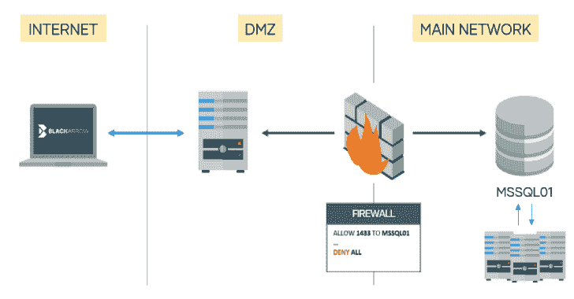

# MSSQLProxy:在受限环境中执行横向移动的工具包

> 原文：<https://kalilinuxtutorials.com/mssqlproxy/>

**MSSQLProxy** 是一个工具包，旨在通过套接字重用，在受限环境中通过受损的 Microsoft SQL Server 执行横向移动。客户端需要 SQL server 上的 [impacket](https://github.com/SecureAuthCorp/impacket) 和 **sysadmin** 权限。

它由三部分组成:

*   **CLR 汇编**:编译 assembly.cs
*   **核心 DLL** :编译 reciclador.sln
*   **客户端** : mssqlclient.py(基于 Impacket 的例子)

你可以编译这些库或者从[版本](https://github.com/blackarrowsec/mssqlproxy/releases) (x64)下载它们。

**编译**

要生成核心 DLL，只需将项目导入 Visual Studio (reciclador.sln)并编译即可。

要生成 CLR 程序集，首先需要找到 C#编译器:

**Get-child item-Recurse " C:\ Windows \ Microsoft。NET \ "-Filter " CSC . exe " | Sort-Object full name-Descending | Select-Object full name-First 1**

然后，

**C:\Windows\Microsoft。NET \ framework 64 \ v 4 . 0 . 30319 \ CSC . exe/target:library。\assembly.cs**

**用途**

编译完这两个库后，将核心 DLL (reciclador)上传到目标服务器。

认证选项与最初的 mssqlclient 中的选项相同。 **mssqlproxy** 选项:

**代理模式:**
-接收程序路径 DLL 存储在服务器中的远程路径
-安装安装 clr 程序集
-卸载卸载 CLR 程序集
-检查检查 CLR 是否准备好
-开始启动代理
-本地端口端口本地端口监听
-clr local_path 本地 CLR 路径
-否-检查-src-端口当连接不是直接连接(例如代理)时使用此选项

我们还实现了两个命令(在 SQL shell 中)用于下载和上传文件。关于代理，我们有四个命令:

*   **安装**:创建 CLR 程序集并将其链接到一个存储过程。您需要提供`**-clr**`参数来从本地 DLL 文件中读取生成的 CLR。
*   **卸载**:删除**安装**创建的内容。
*   **检查**:检查启动代理的一切是否准备就绪。需要提供服务器 DLL 位置(`**-reciclador**`)，可以使用**上传**命令上传。
*   **启动**:启动代理。如果没有指定`**-local-port**`，它将监听端口 1337/tcp。

一旦代理启动，您就可以插入您的代理链😉

*   **注意#1:** 如果使用非直接连接(例如中间的代理)，需要`**-no-check-src-port**`标志，所以服务器只检查源地址。
*   **注意#2:** 目前，仅支持 IPv4 目标(也不支持 DNS 和 IPv6 地址)。
*   **注意事项#3:** 慎用！现在，如果您试图建立多个并发连接，MSSQL 服务将会崩溃

**重要提示:**在客户端按 Ctrl+C 来停止 mssqlproxy 是很重要的。否则，服务器可能会崩溃，您必须手动重新启动 MSSQL 服务。

片名:巴勃罗·马丁内兹&胡安·曼努埃尔·费尔南德斯

[**Download**](https://github.com/blackarrowsec/mssqlproxy)