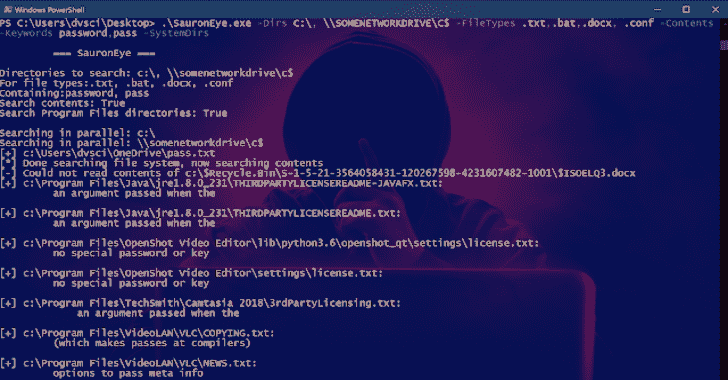

# SauronEye:搜索工具，用于查找包含特定单词的特定文件

> 原文：<https://kalilinuxtutorials.com/sauroneye/>

SauronEye 是一款搜索工具，旨在帮助红队寻找包含特定关键词的文件。

**特性**

*   搜索多个(网络)驱动器
*   搜索文件内容
*   搜索 Microsoft Office 文件的内容( **`.doc`、`.docx`、`.xls`、`.xlsx`、【T5”)**
*   在旧的 2003 年`**.xls**`和`**.doc**`文件中找到 VBA 宏
*   多线程搜索多个驱动器以提高性能
*   支持搜索关键字中的正则表达式
*   兼容钴击的`**execute-assembly**`

它也非常快，可以在一分钟内处理 50k 个文件，总共 1,3 TB 的网络驱动器(使用现实的文件过滤器)。在大约 15 秒内搜索一个 **`C:\`** (在廉价的 SATA 固态硬盘上)。

**用途**

**SauronEye.exe–目录 C:\ \ SOMENETWORKDRIVE \ C $–文件类型。txt。蝙蝠。docx。conf–内容–关键字密码通行***

=== SauronEye ===
要搜索的目录:C:\Users\vincent\Desktop\
文件类型:。txt，。doc，。docx，。xls
包含:wacht，pass
搜索内容:True
为 VBA 搜索 Office 2003 文件:True
最大文件大小:1000 KB
搜索程序文件目录:False
并行搜索:C:\ Users \ Vincent \ Desktop \
[+]C:\ Users \ Vincent \ Desktop \ test \ wachtwoord–Copy(2)。txt
[+]C:\ Users \ Vincent \ Desktop \ test \ wachtwoord–Copy(3)。txt
[+]C:\ Users \ Vincent \ Desktop \ test \ wachtwoord–copy . txt
[+]C:\ Users \ Vincent \ Desktop \ test \ wachtwoord . txt
[+]C:\ Users \ Vincent \ Desktop \ pass . txt
[*]完成搜索文件系统，现在搜索内容
[+]C:\ Users \ Vincent \ Desktop \ pass . txt
…admin 密码= admin 123……【T16 经过的时间= 00:00:01.6656911

**也可阅读-[武士刀:谷歌黑客的 Python 工具](https://kalilinuxtutorials.com/katana/)**

**C:>SauronEye.exe–帮助
===索隆眼===**
**用法:**SauronEye.exe【选项】+自变量
在目录中搜索包含特定关键字的文件。
**选项:**
-d，–Directories = VALUE 要搜索的目录
-f，–Filetypes = VALUE 要搜索的文件类型/in
-k，–keyyy = VALUE 要搜索的关键字
-c，–contents 搜索文件内容
-m，–Max filesize = VALUE 要搜索内容的最大文件大小，以千字节为单位
-b，–before date =值过滤在此日期之前最后修改的文件，
格式:yyyy-MM-dddoc 和*。xls)
包含一个 VBA 宏
-h，–help 显示帮助

**备注:**蜥蜴眼不搜索`%WINDIR%`和`%APPDATA%`。使用`--systemdirs`标志搜索`Program Files*`的内容。SauronEye 依赖的功能仅来自。NET 4.7.2，所以需要> =。NET 4.7.2 来运行。

[**Download**](https://github.com/vivami/SauronEye)