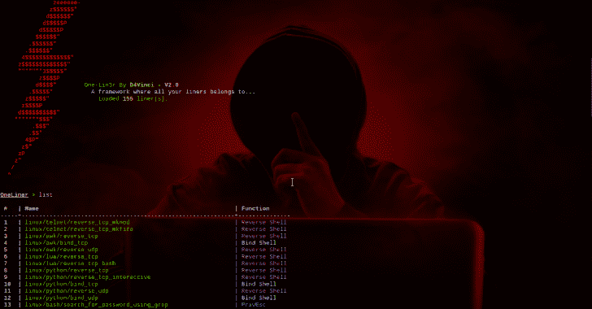
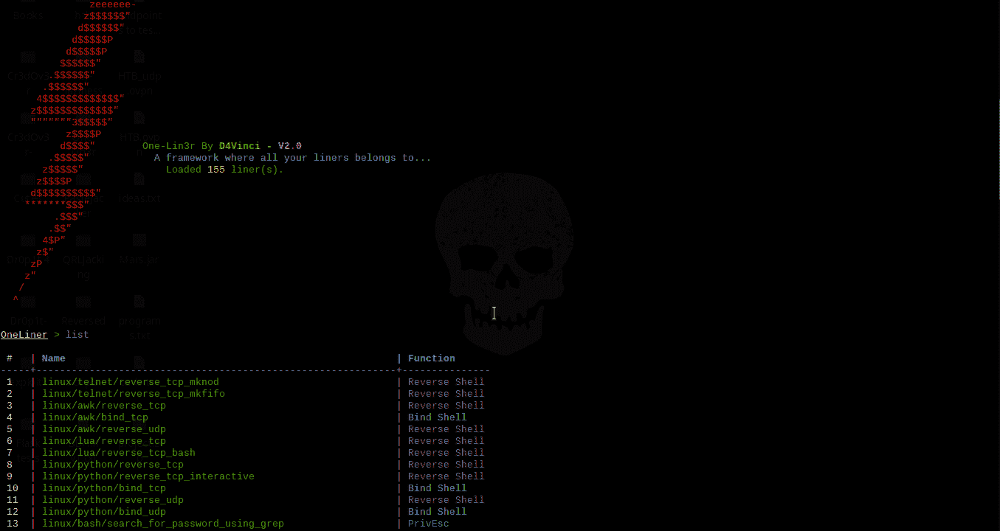
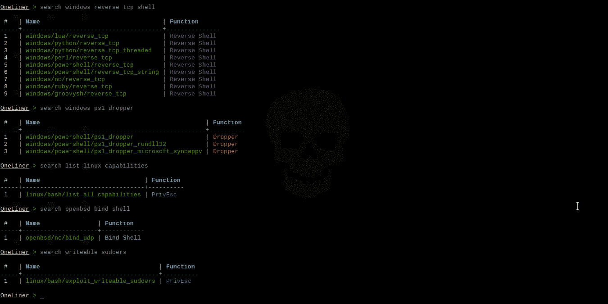
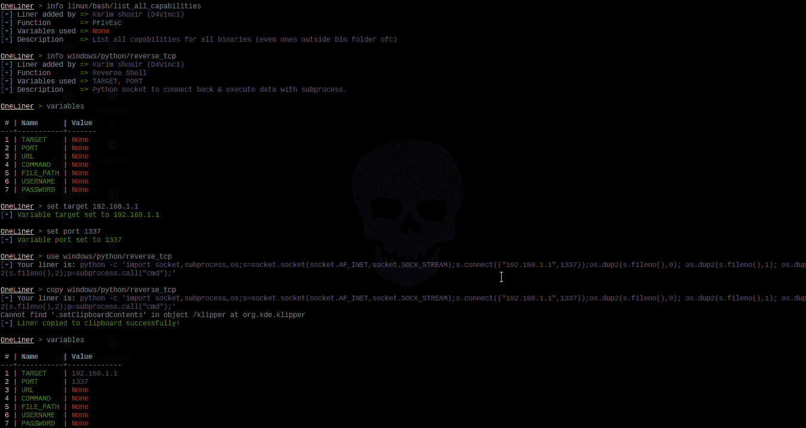
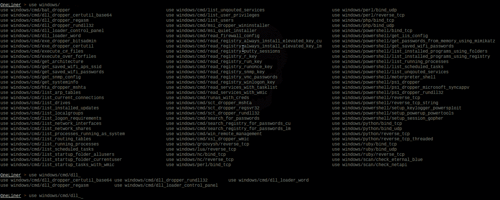

# One-Lin3r:为您提供一个有助于渗透测试操作的衬垫

> 原文：<https://kalilinuxtutorials.com/one-lin3r/>

One-Lin3r 是一个简单的模块化轻量级框架，为您提供了渗透测试(Windows、Linux、macOS 甚至 BSD 系统)或黑客攻击时所需的所有一行程序，通常具有许多新功能，使所有这些完全自动化(例如:您甚至不需要复制一行程序)。

**它由具有不同功能的各种类型的一行程序组成，其中包括:**

| 一行函数 | 这个函数指的是什么 |
| --- | --- |
| 反向外壳 | 各种方法和命令给你一个反向外壳。 |
| PrivEsc | 许多命令有助于枚举和权限提升 |
| 绑定外壳 | 各种方法和命令给你一个绑定外壳。 |
| 使滴下的东西 | 许多下载和执行各种有效载荷类型的方法。 |

**也读作-[rapid Payload:框架 Metasploit 有效负载生成器](https://kalilinuxtutorials.com/rapidpayload/)**

**特性**

*   很多班轮使用不同的目的，**目前有超过 155 艘班轮。**
*   在这个框架中实现的自动完成特性并不是你经常看到的，这里有一些亮点:
    *   它的目的是修复输入命令中的错别字，只需点击一个 tab 键就可以得到最相似的命令，这样 **`seach`** 就变成了 **`search`** 等等，即使你在这个框架中输入了任何与命令相似的随机单词。
    *   对于像我一样懒惰的人来说，它可以通过输入任何一部分来预测你想要使用什么样的 liner。例如，如果您键入`**use capabilities**`并单击 tab，它将被替换为`**use linux/bash/list_all_capabilities**`等等。我能看到你的微笑，欢迎你！
    *   如果你输入了任何错误的命令，然后按下回车键，框架会告诉你什么是最接近你输入的命令，这可能是你真正想要的。
    *   一些不太令人印象深刻的东西，如在`**set**`命令后自动完成变量，在`**use**`和`**info**`命令后自动完成换行，最后它会自动将所有大写字母转换成小写字母，以防您在键入时错误地转换了大小写。
    *   最后，您会发现您以前使用的正常自动完成功能，如命令自动完成和持久历史等…
*   自动化
    *   你可以用命令`**copy <liner>**`自动复制你想要的衬里到剪贴板，而不是使用`**use <liner>**`然后复制它，这样可以节省很多时间，当然，如果你用下面的特性合并它。
    *   您可能已经注意到，在启动框架本身之前，您可以从命令行参数中使用资源文件，或者直接发送命令。
    *   在框架内部，您可以像在 Metasploit 中一样使用`**makerc**`命令，但这次它只保存正确的重要命令。
    *   有`**history**`和`**resource**`命令，所以你不需要退出框架。
    *   通过用分号分隔命令，您可以同时执行任意多的命令。
    *   在这里搜索任何一个 liner 都是如此的容易和准确，你可以通过它的名字、功能、描述、将 liner 添加到框架中的作者甚至是 liner 本身来搜索一个 liner。
*   您可以通过[按照这些步骤](https://github.com/D4Vinci/One-Lin3r/wiki)添加自己的 liner，以 python 文件的形式创建一个 liner。之后你可以用它做一个拉取请求，然后它会被添加到框架中，当然是以你的名字命名的😄。
*   如果您添加了任何 liner，无需重启框架即可重新加载数据库。
*   您可以将任何平台添加到 liners 数据库中，只需在 liners 文件夹中创建一个文件夹并创建一个。班轮”文件在那里。
*   更多…

> 注意:liners 数据库不是太大，但随着更新和贡献，它会变得更大。

**用途**

**命令行参数**

**用法:one-lin3r[-h][-R R][-X X][-q]**
**可选参数:**
-h，–help 显示此帮助信息并退出
-r 执行一个资源文件(历史文件)。
-x 执行特定命令(使用；对于倍数)。
-q 静音模式(无横幅)

**框架命令**

**命令描述**
**——————————**
帮助/？显示此帮助菜单。
列出/显示数据库中所有的一行程序。
搜索(-h)【关键词..]通过名称、作者姓名或功能在数据库中搜索特定的 liner。
使用可用的一行程序。
复制使用可用的一行程序，并将其自动复制到剪贴板。
信息获取关于可用班轮的信息。
set 将特定于上下文的变量设置为在使用一行程序时使用的值。
变量打印所有先前指定的变量。
横幅展示横幅。
重新加载/刷新重新加载 liners 数据库。
检查打印核心版本并检查您是否是最新的。
历史从头显示命令行最重要的历史。
makerc 将命令行历史保存到文件中。
资源运行存储在文件中的命令
os 执行系统命令而不关闭框架
退出/退出退出框架

**安装前的先决条件**

*   Python 3.x。
*   任何操作系统，它应该都可以工作，但它在 Kali 2018+，Ubuntu 18+，Manjaro，Black Arch，Windows 10，Android Termux 和 Mac-OS 10.11 上进行了测试

**安装&运行**

*   使用 pip(在任何操作系统上安装的最佳方式):

**pip 安装一个-lin3r
一个-lin3r -h**

*   在黑拱门或任何带有黑拱门的拱门上使用 pacman:

**sudo pacman -S one-lin3r**

*   从 GitHub 安装它:
    *   对于具有管理员权限的 cmd 上的 windows:(下载 ZIP 并解压缩后)`**python -m pip install ./One-Lin3r-master --user one-lin3r -h**`
    *   对于基于 Linux Debian 的发行版。(例如:卡利、乌班图..) **`git clone https://github.com/D4Vinci/One-Lin3r.git sudo apt install libncurses5-dev sudo pip3 install ./One-Lin3r --user one-lin3r -h`**
    *   对于其余的 Linux 发行版。: **`git clone https://github.com/D4Vinci/One-Lin3r.git sudo pip3 install ./One-Lin3r --user one-lin3r -h`**

**更新框架或数据库**

*   如果您是从 pip 安装的，请执行以下操作:

**pip 安装 one-lin3r-升级**

*   如果您是从 GitHub 安装的，请执行以下操作:
    *   在 Linux 上，在目录外`**cd One-Lin3r && git pull && cd .. pip3 install ./One-Lin3r --upgrade**`
    *   在 Windows 上，如果你没有安装 git，重新下载压缩的框架！

**注意:**liner 是作为 python 模块编写的，所以它被认为是框架的一部分。因此，每一个新的班轮加入框架，其版本将得到更新。

**截图**

[**Download**](https://github.com/D4Vinci/One-Lin3r)