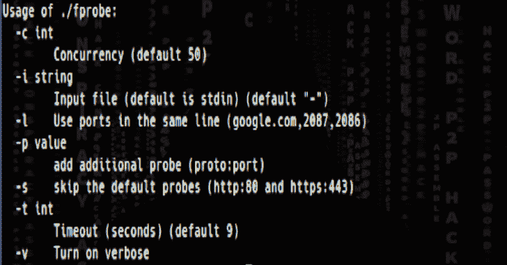

# FProbe:工作 Http/Https 服务器的域/子域和探针

> 原文：<https://kalilinuxtutorials.com/fprobe/>

**FProbe** 是一个域/子域列表，用于探测工作的 http/https 服务器。

**安装**

**go 111 module = on go get-u github.com/theblackturtle/fprobe**

**特性**

*   获取域/子域列表，并探测工作的 http/https 服务器。
*   运行时优化 RAM 和 CPU。
*   支持每个域的特殊端口
*   JSON 格式的 Verbose，带有一些额外的头，比如`Status Code`、`Content Type`、`Location`。

**用途**

**用法**
* * * * * * * * **-c int 并发(默认 50)
-i 字符串输入文件(默认为 stdin)(默认“-”
-l 使用同一行中的端口(google.com，2087，2086)
-p 值添加额外的探针(proto:port)
-s 跳过默认探针(http:80 和 https:443)
-t int 超时(秒)(默认 9) 【T**

 ****基本用法**

*   **Stdin input**

**❯猫域名. txt | fprobe**

*   **文件输入**

**❯ fprobe -i domains.txt**

**也可阅读-[R00kie-Kr00kie:CVE PoC 漏洞利用-2019-15126 Kr00k 漏洞](https://kalilinuxtutorials.com/r00kie-kr00kie/)**

**并发**

**❯猫域. txt | fprobe -c 200**

**使用直插端口**

如果你想为每个域使用特殊的端口，你可以使用`-l`标志。您可以解析 Nmap/Masscan 输出并将其重新格式化以使用此功能。

*   **输入(domains.txt)**

> > google.com，2087，2086，8880，2082，443，80，2052，2096，2083，8080，8443，2095，2053 >>yahoo.com，2087，2086，8880，2082，443，80，2052，2096，2083，8080，8443，2093

*   **命令**

**❯猫域. txt | fprobe -l**

**超时**

**❯猫域. txt | fprobe -t 10**

**特殊端口**

**❯猫域名. txt | f probe-p http:8080-p https:8443**

**用于检查工作 URL**

**'https://google.com/path1 附和❯？param = 1“| f probe
https://google.com/path1?param=1**

**使用内置端口集合(默认包含 80，443)**

*   **中等:** 8000，8080，8443
*   **大:**81 591 2082 2087 2095 2096 3000 8000 8001 8008 8080 8083 8443 8834 8888
*   81300591593 832981 1010 1311 2082 2087 2095 2096 2480 3000 3128 3333 4243 4567 4711 4712 4993 5000 5104 5108 5800

**❯cat domains . txt | f probe-p medium/large/xlarge**

**跳过默认探针**

如果您不想在端口 80 上探测 HTTP 或者在端口 443 上探测 HTTPS，您可以使用`-s`标志。

**❯猫域. txt | fprobe -s**

**啰嗦**

详细输出将被格式化为 JSON 格式，并带有一些额外的头，如`Status Code`、`Content Type`、`Location`。

**❯猫域. txt | fprobe -v**

> > **{"site":"http://google.com "，" status_code":301，" server":"gws "，" content _ type ":" text/html；charset = UTF-8 ”" location ":" http://www . Google . com/" }>>{ " site ":" https://Google . com "，" status_code":301，" server":"gws "，" content _ type ":" text/html；charset = UTF-8 " location ":" https://www . Google . com/" }**

**Credit** : tomnomnom

[**Download**](https://github.com/theblackturtle/fprobe)**