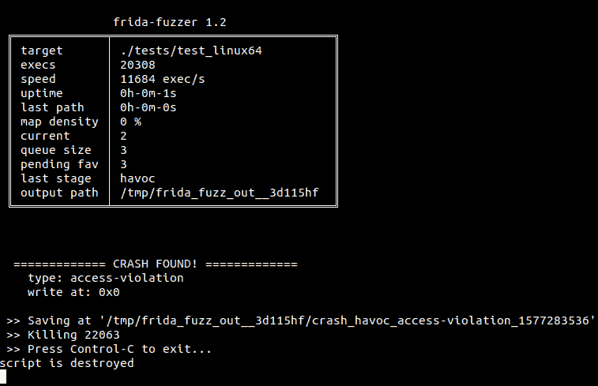
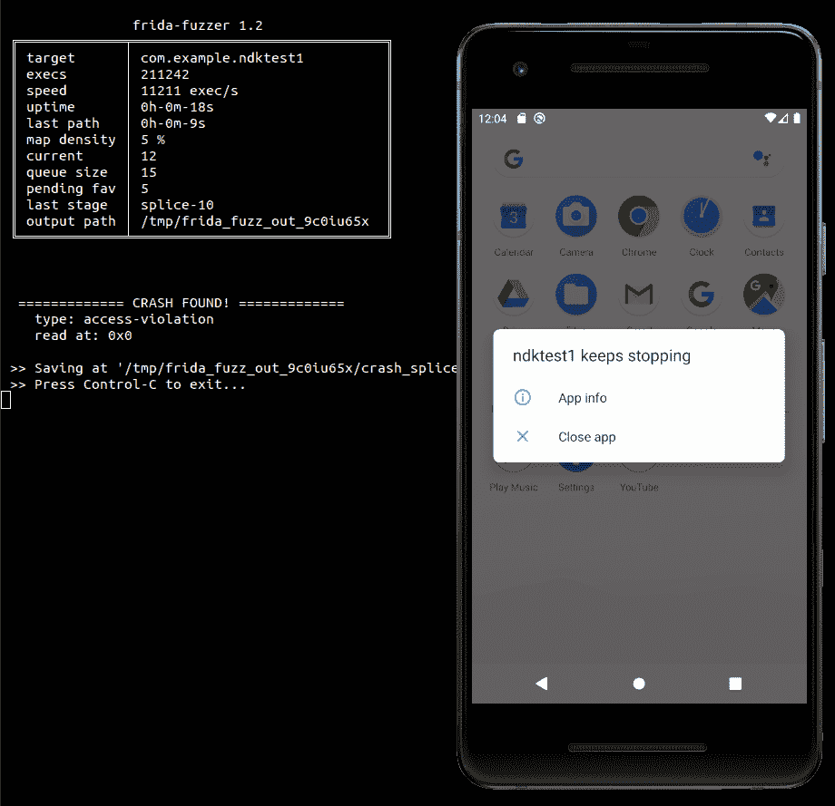

# Frida-Fuzzer:用于 API 内存模糊化的实验性模糊化器

> 原文：<https://kalilinuxtutorials.com/frida-fuzzer/>

Frida-Fuzzer 是一个实验性的 Fuzzer，旨在用于 API 内存模糊化。设计灵感十足，基于 AFL/AFL++。ATM 变异体很简单，只有 AFL 的破坏和拼接阶段。

我只测试了 tests/下的例子，这是一个 WIP 项目，但已知至少可以在 GNU/Linux x86_64 和 Android x86_64 上工作。你需要 Frida >= 12.8.1 来运行这个( **pip3 install -U frida** )和 frida-tools 来编译这个工具。

**用途**

这个`**fuzz**`库必须被导入到一个定制的工具中，然后用`**frida-compile**`编译以生成代理，这个代理将由 **`frida-fuzzer`** 注入到目标应用中。

fuzzer 的大部分逻辑都在代理中。

线束具有以下格式:

var fuzz = require("。/fuzz ")；
var TARGET _ MODULE = " test _ Linux 64 "；
var TARGET _ func = debug symbol . from name(" TARGET _ func ")。地址；；
var RET _ TYPE = " void "；
var ARGS_TYPES = ['pointer '，' int ']；
var func _ handle = new native FUNCTION(TARGET _ FUNCTION，RET_TYPE，ARGS_TYPES，{ traps:' all ' })；
fuzz.target_module =目标 _ 模块；
var payload _ mem = memory . alloc(fuzz . config . max _ FILE)；
fuzz . fuzzer _ test _ one _ input = function(/* uint 8 array */payload){
memory . writebytearray(payload _ mem，payload，payload . length)；
func_handle(有效载荷 _ 记忆，有效载荷.长度)；
}

`**fuzz.fuzzer_test_one_input**`是必填项。如果不指定`**fuzz.target_module**`，所有执行的代码都将被检测。

你也可以设置`**fuzz.manual_loop_start = true**`来告诉 fuzzer 你将在回调中调用`**fuzz.fuzzing_loop()**`，这样它就不会为你调用它(例如，当在 Android 应用中点击一个按钮时开始 fuzzer)。

回调`**fuzz.init_callback**`可以被设置为在 fuzzer 准备开始时执行代码。参见`**tests/test_java.js**`中的示例。

`**fuzz.dictionary**`是一个经典的 fuzzer 字典，一个数组，您可以在其中添加项目(接受的类型有 array、ArrayBuffer、Uint8Array、String ),这些项目在 mutator 中用作附加值。参见`**tests/test_libxml2.js**`中的示例。

**又读-[Pulsar:网络足迹扫描平台](https://kalilinuxtutorials.com/pulsar/)**

`**frida-fuzzer**`接受以下论点:

| -i 文件夹 | 包含初始种子的文件夹 |
| -o 文件夹 | 带有中间种子和崩溃的输出文件夹 |
| -你 | 连接到 USB |
| -产卵 | 繁殖并附加，而不是简单地附加 |
| -脚本脚本 | 脚本文件名(默认为 fuzzer-agent.js) |

如果不指定输出文件夹，将在/tmp 下创建一个临时文件夹。如果不指定带有初始种子的文件夹，一个未知的种子`0000`将被用作起始种子。

如果你正在模糊一个本地应用程序，你可能想要在`**frida-fuzzer**`之前执行`**system-config**`来调整你的系统参数和加速。

运行`**./frida-fuzzer -spawn ./tests/test_linux64**`您将在终端上看到类似如下的状态屏幕:

您还可以在`**fuzz/fuzzer.js**`中轻松添加自定义阶段，并将其添加到 **`fuzz/index.js`中的阶段列表。**

要定制模糊器，编辑`**fuzz/config.js**`。您可能想要更改的变量是 MAP_SIZE(如果您正在模糊的代码很小，您可以减少它并获得一点速度)、MAX_FILE(生成的输入的最大大小)和 QUEUE_CACHE_MAX_SIZE(增加队列缓存大小以获得更高的速度，尤其是在 Android 上)。

**例子**

让我们模糊一下`tests`中示例 Android 应用中的原生共享库。

确保您在虚拟设备上拥有 root 权限:

**host$ adb root**

从 repo 发布页面下载 Android x86_64 frida-server，复制到设备上/data/local/tmp 下(使用 adb push)。

启动一个 shell 并运行 frida-server:

**设备号 cd /data/local/tmp
设备号。/弗里达-服务器**

现在使用拖拽&到模拟器窗口来安装测试应用`**tests/app-debug.apk**`。

然后，打开 app。

用 frida-compile 编译代理脚本:

**host $ Frida-compile-x tests/test _ ndk _ x64 . js-o fuzzer-agent . js**

在模拟器中打开应用程序。

使用以下命令模糊测试应用程序附带的`**libnative-lib.so**`库的`**test_func**`函数:

**主人$。/Frida-fuzzer-U-o output _ folder/com . example . ndk test 1**

有趣的测试案例和崩溃都保存在 output_folder 中。

享受吧。

[**Download**](https://github.com/andreafioraldi/frida-fuzzer)