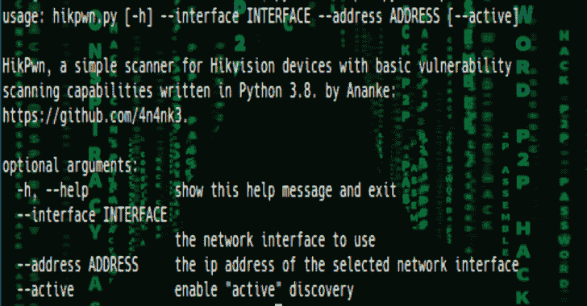
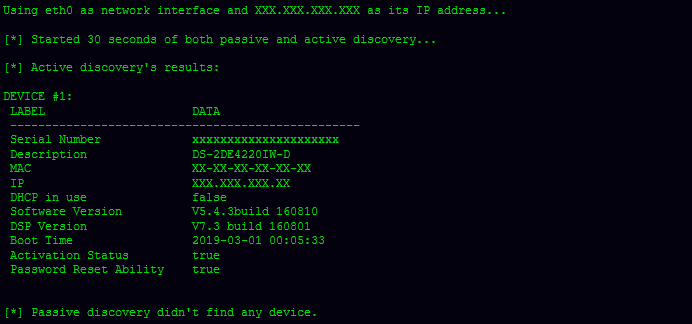

# HikPwn:用于海康威视设备的简单扫描仪，具有基本的漏洞扫描功能

> 原文：<https://kalilinuxtutorials.com/hikpwn/>

**HikPwn** ，用 Python 3.8 编写的，具有基本漏洞扫描能力的海康威视设备简易扫描仪。这个项目是在我捕捉和观察一些海康威视软件和设备产生的网络流量时出于好奇而产生的。

**设置指令**

**git 克隆 https://github.com/4n4nk3/HikPwn.git
CD HikPwn
pip install-r requirements . txt**

**测试于**

Linux 4.19 x86_64 上的 Python 3.8

**功能&特性**

*   被动发现海康威视设备。
*   通过 UDP 探测主动发现和枚举海康威视设备。

**又读-[MSSQLi-DUET:基于 MSSQL 注入的域用户枚举工具](https://kalilinuxtutorials.com/mssql-injection/)**

**待办事项**

*   为 ICSA-17-124-01 添加检测和利用功能。

**帮助**

**用法:**HikPwn . py[-h]–INTERFACE INTERFACE–ADDRESS ADDRESS[–active]

HikPwn，用 Python 3.8 编写的具有基本漏洞扫描能力的海康威视设备简易扫描器。by https://github.com/4n4nk3.:

**可选参数:**
-h，–help 显示此帮助消息并退出
–INTERFACE INTERFACE 要使用的网络接口
–ADDRESS 选定网络接口的 ip 地址
–active 启用“主动”发现

**审查预览**

这个项目仅用于教育目的。不要用于非法活动。我不支持也不宽恕非法或不道德的行为，我不能对可能滥用该软件负责。

[**Download**](https://github.com/4n4nk3/HikPwn)