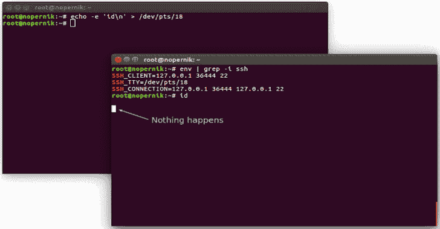

# SSH pry V2-间谍和控制操作系统 SSH 连接客户端的 TTY

> 原文：<https://kalilinuxtutorials.com/sshpry-v2/>

这是**s shry 工具**的第二个版本，增加了多个特性。

*   控制目标的 TTY
*   内置键盘记录器
*   控制台级网络钓鱼
*   记录和重放以前的会话

我总是很好奇，在你不知何故找到了根，并且已经谈论了一些利用高度特权帐户的技术之后，还能做些什么:

*   [SSH 窥探](http://www.korznikov.com/2015/10/ssh-snooping-in-action.html)
*   [RDP 会话劫持](http://www.korznikov.com/2017/03/0-day-or-feature-privilege-escalation.html)

**也可理解为-[One-Lin3r:给你一个衬垫，帮助渗透测试操作](https://kalilinuxtutorials.com/one-lin3r/)**

**演示**

[https://www.youtube.com/embed/2gfnBvu1u34?feature=oembed&enablejsapi=1](https://www.youtube.com/embed/2gfnBvu1u34?feature=oembed&enablejsapi=1)

**如何？**

**。/sshpry2.py**

[**Download**](https://github.com/nopernik/SSHPry2.0)