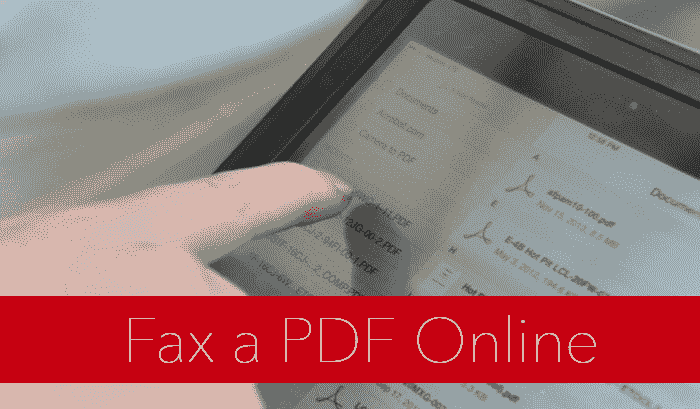
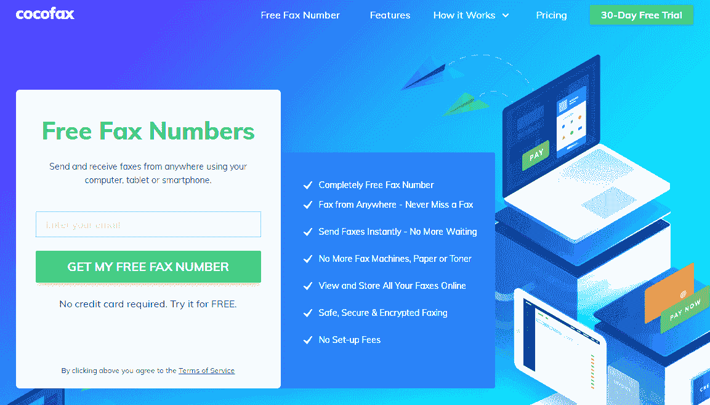
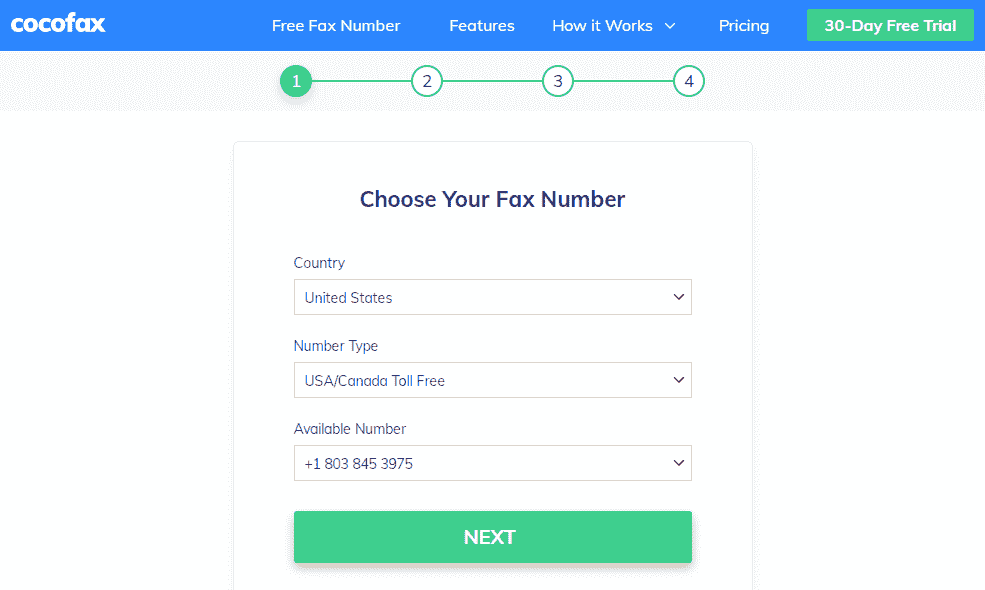
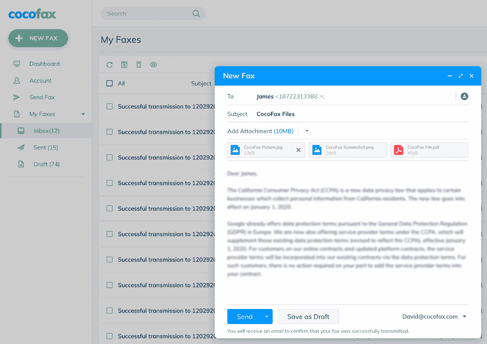

# 如何轻松、快速、安全地将 PDF 发送到传真机？

> 原文：<https://kalilinuxtutorials.com/how-to-send-a-pdf-to-a-fax-machine-easily-quickly-and-securely/>

您想将 PDF 发送到传真机吗？

你需要在线传真服务来管理重要文件的传输。CocoFax 和其他在线传真应用程序可以帮助您管理这种传输。

有了在线传真应用，你可以把智能手机当作虚拟传真机使用。

查看一些最好的传真应用程序，帮助您将 PDF 发送到传真机。

**CocoFax: All in One 传真应用**

使用 CocoFax，你可以把传真机从你的办公室搬走。这是避免电话和传真维护费用的简单方法。

[Google Fax Free 帮助你用最好的免费传真选项发送 pdf 到传真](https://googlefaxfree.com/pdf-to-fax/)，比如 Cocofax。有了这样的工具，你将获得一个免费的传真号码来接收传真。如果您想获得 30 天的免费试用期，请使用您的电子邮件 ID 并创建一个帐户。

下载其 iPhone 或 Android 传真应用程序，将您的手机变成虚拟传真机。

CocoFax 允许您向世界各地发送和接收传真。它适用于国际和国内传真。出于这个原因，它已经被《数字趋势》、《生活黑客》、《TechRadar》和许多其他媒体报道。

 **通过网络浏览器发送 PDF 传真**

这项传真服务使您能够使用手机发送和接收传真。请随意下载 CocoFax 的应用程序或打开浏览器。

创建您的帐户后，您可以通过其仪表板轻松发送和接收 pdf 文档。

有了 HIPAA 兼容传真，就不必担心网络攻击。请参阅以下简单易行的步骤:

**步骤 01:** 获得 30 天免费试用，并注册选择传真号码。CocoFax 将带您到一个仪表板。

 **步骤 02: ** CocoFax dashboard 让您选择“发送传真”来创建传真并填写重要字段。例如，你必须在“收件人”栏写一个传真号码，上传一份 PDF 文档并制作一个封面。

 **第 03 步:**完成所有工作后，点击“发送”选项。CocoFax 会将您的传真发送到接收方的传真机上。您可以从 CocoFax 的 Google Fax 免费 获取更多 [**信息。**](https://googlefaxfree.com/)

**PC-FAX.com**

你可以使用这个应用程序从你的 iPhone 或 Android 发送免费传真，而无需订阅或注册任何东西。

有了这项免费的传真服务，你可以用照片的形式发送你的文件。它能让你直接用智能手机发传真。

此外，您可以上传文档来传输电子邮件附件。这是一个用户友好的应用程序，可以从 Google Drive 和 DropBox 发送文档。请随意键入合适的传真信息。这个应用程序可以让你每天向近 50 个国家免费发送一页传真。

若要发送更多页面，您需要应用内购买。这些购买的费用可能会因总页数和区域而异。购买号码后可以用同一个 app 接收传真。

**摄像头扫描仪**

CamScanner 适用于 Android 和 iPhone 用户。

从 Play Store 或 App Store 下载此应用程序并安装到您的手机上。它有几个发送传真的功能。随意添加传真文件，点击相机图标或使用 OCR 扫描。

OCR 扫描可以将文档的图片转换成 PDF。添加要通过传真发送的文件，并单击它们以查看这些文档。

要通过传真发送，请点击“共享”图标，并选择是否共享 JPG 或 PDF 图像。

完成选择后，请查看标准共享菜单，然后选择传真/打印/上传。选择正确的选项后，选择“传真”选项卡以输入收件人的信息。

**HelloFax 手机**

使用手机版的 HelloFax 在线发送传真。

它的手机版以其用户友好的功能而闻名。访问他们的网站，注册一个免费计划，然后开始。不幸的是，他们的移动网站缺少一些功能。没有什么可担心的，因为它对偶尔的传真很有用。

注册时创建一个安全密码，然后登录以发送传真。点击“上传文件”选项卡，用相机点击文档的图片，或者从您的设备中选择文件。现在你必须键入一个传真号码，然后点击“发送”。

你可以使用他们的免费计划免费发送五页。

**结论**

最终，我们清楚了如何轻松安全地将 PDF 发送到传真机。

你需要一个在线传真服务来摆脱传真机。因此，为每个人选择传真解决方案并不容易。每个人，包括企业和个人，都有自己的需求。

对于商业用户，我们有一个明确的选择，CocoFax，因为它的安全性，功能，速度和效率。

你可以使用它的应用程序或仪表盘来管理手机传真。它具有处理大量传真的潜力。对于偶尔使用的用户，CamScanner 可以有效地工作。

如果你需要一个便携和专业的传真解决方案，请随时查看 CocoFax 官方网站上的基本细节。