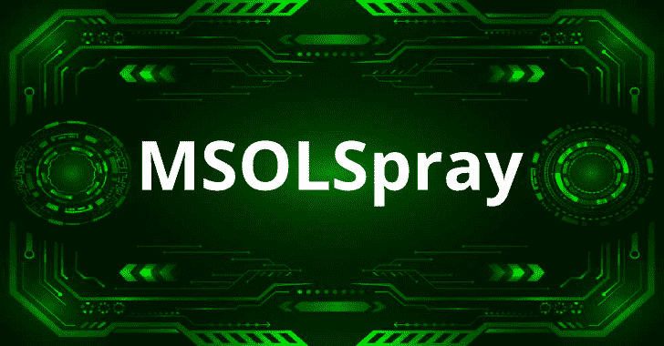

# MSOLSpray:微软在线账户的密码喷射工具

> 原文：<https://kalilinuxtutorials.com/msolspray/>

**MSOLSpray** 是一款针对微软在线账户(Azure/O365)的密码喷涂工具。该脚本记录用户凭据是否有效、帐户上是否启用了 MFA、租户是否不存在、用户是否不存在、帐户是否被锁定或帐户是否被禁用。

**为什么是另一种喷涂工具？**

是的，我意识到 O365/Azure 还有其他的密码喷涂工具。与这个工具的主要区别在于，这个工具不仅寻找有效的密码，还寻找 Azure AD 错误代码给你的极其详细的信息。这些错误代码提供了有关帐户上是否启用了 MFA、租户是否不存在、用户是否不存在、帐户是否被锁定、帐户是否被禁用、密码是否过期等信息。

所以这是双倍的，不仅是一个密码喷射工具，也是一个微软在线侦察工具，将提供帐户/域枚举。在有限的测试中，似乎在有效登录到 Microsoft Online OAuth2 端点时，它不会自动触发 MFA 文本/推送通知，这对于在不提醒目标的情况下查找有效凭证非常有用。

最后，这个工具与 [FireProx](https://github.com/ustayready/fireprox) 配合得很好，可以在认证请求上轮换源 IP 地址。在测试中，这似乎避免了被 Azure 智能锁定阻止。

**也可理解为-[f Probe:域/子域&探测工作的 Http/Https 服务器](https://kalilinuxtutorials.com/fprobe/)**

**快速启动**

您将需要一个用户列表文件，每行一个目标电子邮件地址。使用“**powershell.exe-执行旁路**”从 Windows 命令行打开 PowerShell 终端。

**导入-模块 MSOLSpray.ps1
调用-MSOLSpray -UserList。\ userlist . txt-Password winter 2020**

**调用-MSOLSpray 选项**

**>>UserList—**UserList 文件，以“user @ domain . com”
**>>的格式一行一个用户名填充，密码—**用于执行密码喷射的单个密码。
**>>OutFile—**输出有效结果的文件。
**> >强制—**当检测到多个帐户被锁定时，强制喷射继续进行而不停止。
**>>URL—**要喷反的 URL。如果指向用 FireProx 之类的工具生成的 API 网关 URL 来随机化您正在进行身份验证的 IP 地址，这可能很有用。

[**Download**](https://github.com/dafthack/MSOLSpray)