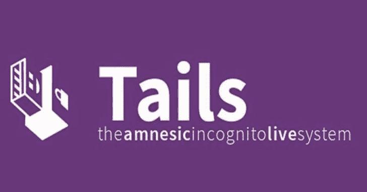

# tails——保护您隐私和匿名的实时系统

> 原文：<https://kalilinuxtutorials.com/tails-live-system-to-preserve-your-privacy-anonymity/>

Tails 团队很高兴发布 Tails 4.5，这是第一个支持安全引导的 Tails 版本。这个版本还修复了[的许多安全漏洞](https://tails.boum.org/security/Numerous_security_holes_in_4.4.1/)。你应该尽快升级。

**新功能**

*   **安全启动**
    *   Tails 现在可以在启用了安全引导的计算机上启动。
    *   如果您的 Mac 显示以下错误:
    *   安全设置不允许这台 Mac 使用外置启动磁盘。
    *   然后你必须[改变你 Mac 的*启动安全实用程序*](https://tails.boum.org/install/mac/usb/#startup-security) 的设置，以授权从 Tails 启动。

**变化&更新**

*   将 Tor 浏览器更新至 9.0.9。
*   本次更新修复了 Firefox 中的几个[漏洞](https://www.mozilla.org/en-US/security/advisories/mfsa2020-13/)，包括[的一些关键漏洞](https://www.mozilla.org/en-US/security/advisories/mfsa2020-11/)。
*   Mozilla 已经意识到在野外有针对性的攻击会滥用这些漏洞。

**已知问题**

*   没有特定于此版本的。
*   参见[长期问题清单](https://tails.boum.org/support/known_issues/)。

**得到尾巴 4.5**

*   **升级您的 Tails 盘并保留您的永久存储**
    *   从 Tails 4.2 或更高版本自动升级到 4.5。
    *   如果您无法进行自动升级，或者自动升级后 Tails 无法启动，请尝试进行[手动升级](https://tails.boum.org/doc/upgrade/#manual)。

**安装**

遵循我们的安装说明:

*   [从 Windows 安装](https://tails.boum.org/install/win/)
*   [从 macOS 安装](https://tails.boum.org/install/mac/)
*   [从 Linux 安装](https://tails.boum.org/install/linux/)