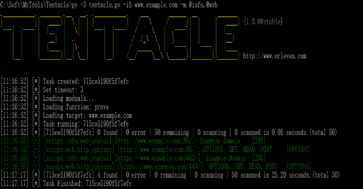

# 触手:一个 POC 漏洞验证和利用框架

> 原文：<https://kalilinuxtutorials.com/tentacle/>

[](https://1.bp.blogspot.com/-5vo9DKwu8gw/XpMyOV4jdaI/AAAAAAAAF4o/-z-hZkT5FfMam9s_ZY-do8EKm3zhgddMwCLcBGAsYHQ/s1600/Tentacle%25281%2529.png)

**触手**是一个 POC 漏洞验证和利用框架。它支持漏洞的自由扩展，并使用 POC 脚本。它支持调用 zoomeye、fofa、shodan 等 API 对多个目标进行批量漏洞验证。

**安装**

**pip 3 install-r request . txt**

**也可阅读-[DigiTrack:使用 Arduino](https://kalilinuxtutorials.com/digitrack/) 攻击 5 美元或更少 T3**

**用途**

第一次运行时，会自动生成配置文件 **conf/tentacle.conf** 。

```
# Show help for tentacle.
python3 tentacle.py --help

# Show all modual, and you can see it in `script` path.
python3 tentacle.py --show

# Show all function of module by -f show or -f help
python3 tentacle.py -m script/web/web_status -f show
python3 tentacle.py -m script/web/web_status -f help

# Load target by iS/iN/iF/iT/iX/iE/gg/sd/ze/ff.
# Scan port and then it will try to send the poc.
python3 tentacle.py -m script/web/web_status -iS www.examples.com             # Load target by url or host 
python3 tentacle.py -m script/web/web_status -iN 192.168.111.0/24             # Load target by network
python3 tentacle.py -m script/web/web_status -iF target.txt                   # Load target by file
python3 tentacle.py -m script/web/web_status -iT dcc54c3e1cc2c2e1             # Load target by recode's target
python3 tentacle.py -m script/web/web_status -iX nmap_xml.xml                 # Load target by nmap.xml
python3 tentacle.py -m script/web/web_status -iE "powered by discuz"          # Load target by baidu/bing/360so
python3 tentacle.py -m script/web/web_status -gg 'intext:powered by discuz'   # Load target by google api
python3 tentacle.py -m script/web/web_status -sd 'apache'                     # Load target by shodan api
python3 tentacle.py -m script/web/web_status -ze 'app:weblogic'               # Load target by zoomeye api
python3 tentacle.py -m script/web/web_status -ff 'domain="example.com"'       # Load target by fofa api

# Load modual by -m (e.g. script/info/web_status,@web)
python3 tentacle.py -iS 127.0.0.1 -m script/web/web_status                    # Load web_status module
python3 tentacle.py -iS 127.0.0.1 -m @web                                     # Load all module of web path
python3 tentacle.py -iS 127.0.0.1 -m script/web/web_status,@web               # Load all module of web path and web_status module
python3 tentacle.py -iS 127.0.0.1 -m "*"                                      # Load all module of script path

# Set port scan scope
python3 tentacle.py -iS 127.0.0.1 -m script/web/web_status                    # Scan top 150 ports and then perform bulk vulnerability verification for multiple targets.
python3 tentacle.py -iS 127.0.0.1 -m script/web/web_status -sP                # Skip port scan and then it will try the default port number server
python3 tentacle.py -iS 127.0.0.1 -m script/web/web_status -lP 80-90,443      # Scan 80-90 ports and 443 port and then perform bulk vulnerability verification for multiple targets.

# Use function of modual by -m and -f  (e.g. -m web_status -f prove), and you should make sure the function of module is exist.
python3 tentacle.py -m script/web/web_status -f prove

# Show task's result by -tS 
python3 tentacle.py -tS 8d4b37597aaec25e

# Export task's result by -tS to test.xlsx
python3 tentacle.py -tS 8d4b37597aaec25e  -o test

# Update by git
python3 tentacle.py --update
```

**更新**

*   [2018-11-15]代码重构并修复 bug。
*   [2019-06-08]代码重构，添加端口扫描。
*   [2020-03-15]代码重构和添加脚本。

**信用**

1.  [sqlcmap](https://github.com/sqlmapproject/sqlmap)的缩写
2.  [POC-T](https://github.com/Xyntax/POC-T)

[**Download**](https://github.com/orleven/Tentacle)