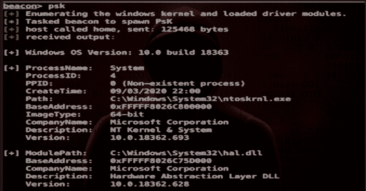

# Ps-Tools:进攻作战的高级过程监控工具包

> 原文：<https://kalilinuxtutorials.com/ps-tools/>

**Ps-Tools** 是进攻作战的高级流程监控工具包。在合约期间，对我们着陆的系统有很好的技术理解是决定行动中下一步行动的关键条件。

从受损系统中收集和分析运行流程的数据为我们提供了丰富的信息，并帮助我们更好地了解目标组织的 IT 环境是如何设置的。

此外，定期轮询流程数据使我们能够对环境中的变化做出反应，或者在进行调查时提供触发器。

为了能够从受损的端点收集详细的流程数据，我们编写了一个流程工具集，将这些高级流程实用程序的功能引入 C2 框架(如 Cobalt Strike)。

**工具包中包含以下功能:**

**Psx:** 显示系统上运行的所有进程的详细列表。
**Psk:** 显示详细的内核信息，包括加载的驱动模块。 **Psc:** 显示已建立 TCP 连接的所有进程的详细列表。 **Psm:** 显示特定进程 id 的详细模块信息(例如，加载的模块、网络连接)。
**Psh:** 显示特定进程 id 的详细句柄信息(例如，对象句柄、网络连接)。
**Psw:** 显示带有活动窗口的进程的窗口标题。

**也读作-[TweetShell:Shell 脚本中的多线程 Twitter brute forcer](https://kalilinuxtutorials.com/tweetshell/)**

**用途**

*   下载**包抄-Ps-Tools** 文件夹，在**钴击脚本管理器**中加载 **Ps-Tools.cna** 脚本。使用**信标**帮助命令显示语法信息。
*   这个项目是用 **C/C++** 编写的
*   您可以使用 **Visual Studio** 从源代码编译反射 dll。

**演职员表**:科内利斯·德·普拉(@Cneelis) /包抄

[**Download**](https://github.com/outflanknl/Ps-Tools)