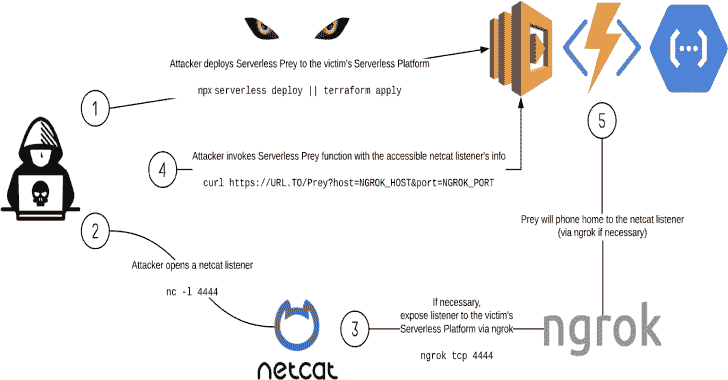

# 无服务器-猎物:建立反向外壳的无服务器函数

> 原文：<https://kalilinuxtutorials.com/serverless-prey-serverless-functions-for-establishing-reverse-shells/>

**Serverless-Prey** 是一个无服务器函数(FaaS)的集合，一旦启动到云环境并被调用，就会建立一个 TCP 反向外壳，使用户能够自省底层容器:

*   [Panther](https://github.com/pumasecurity/serverless-prey/blob/master/panther) :写在 Node.js 中的 AWS Lambda
*   [美洲狮](https://github.com/pumasecurity/serverless-prey/blob/master/cougar):用 C#写的 Azure 函数
*   [猎豹](https://github.com/pumasecurity/serverless-prey/blob/master/cheetah):用 Go 写的谷歌云功能

该存储库还包含使用这些功能执行的研究，包括关于机密存储位置、如何提取敏感数据以及识别监控/事件响应数据点的文档。

**又读——[SSH pry V2——间谍&控制 OS SSH 连接客户端的 TTY](https://kalilinuxtutorials.com/sshpry-v2/)**

**了解更多信息**

*   纳什维尔 2020

[https://www.youtube.com/embed/SV69iUrYlTQ?feature=oembed&enablejsapi=1](https://www.youtube.com/embed/SV69iUrYlTQ?feature=oembed&enablejsapi=1)

*   【2020 年 RSA 大会

[https://www.youtube.com/embed/tlZ2PIXTHxc?feature=oembed&enablejsapi=1](https://www.youtube.com/embed/tlZ2PIXTHxc?feature=oembed&enablejsapi=1)

**鸣谢:** [埃里克·约翰逊](https://github.com/ejohn20) & [布兰登·埃文斯](https://github.com/BrandonE)

**免责声明**

It 职能仅用于研究目的，不应部署到生产客户中。就其本质而言，它们提供了对您的运行时环境的 shell 访问，恶意参与者可以滥用它来泄漏敏感数据或获得对相关云服务的未授权访问。

[**Download**](https://github.com/pumasecurity/serverless-prey)