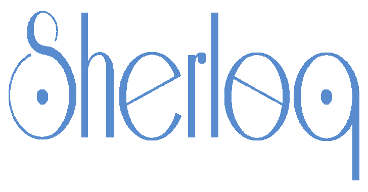
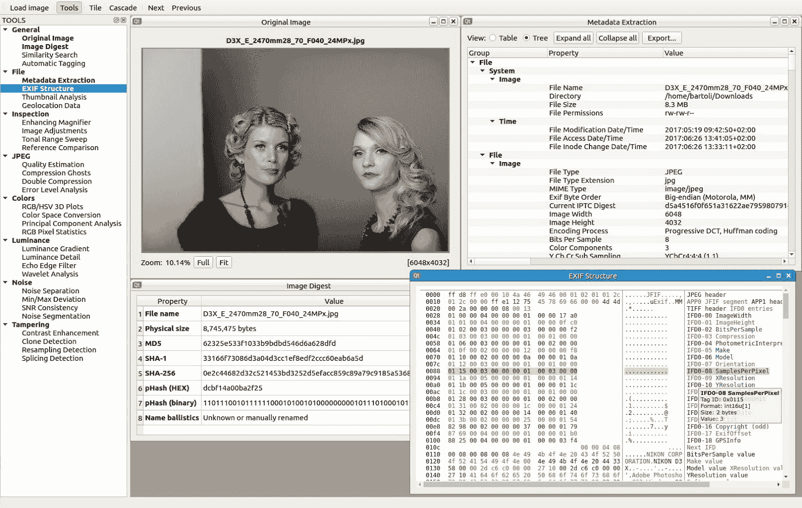
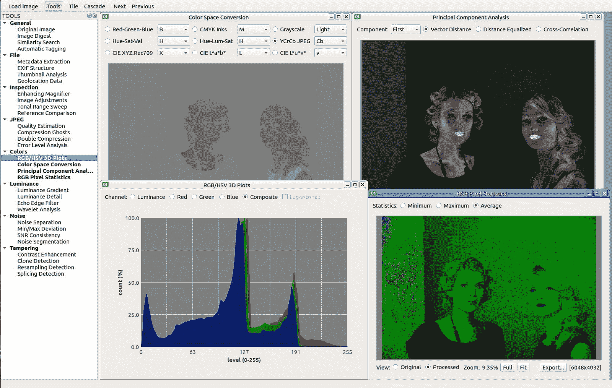
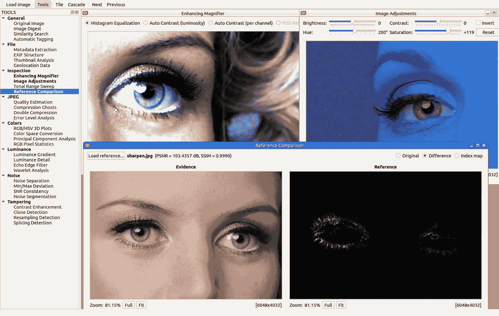
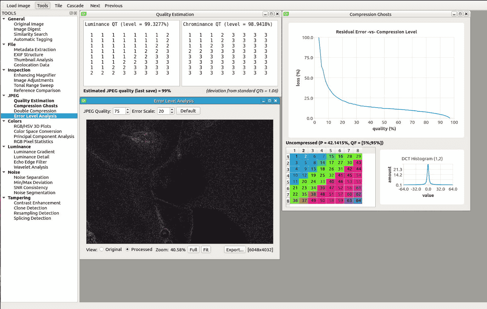
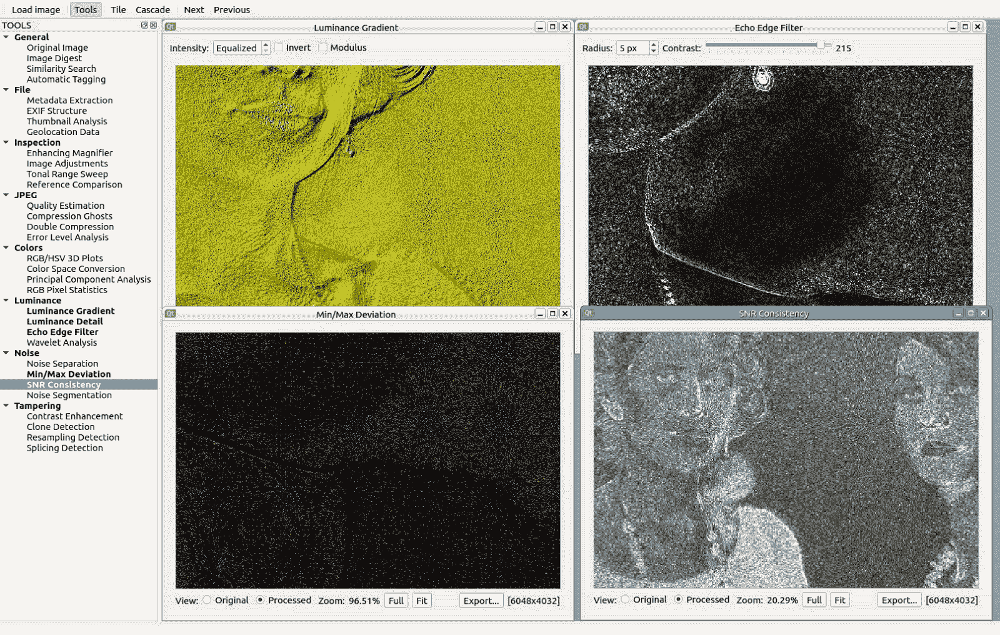

# Sherloq:一个开源的数字图像取证工具集

> 原文：<https://kalilinuxtutorials.com/sherloq/>

Sherloq 是一个关于实现完全集成的数字图像取证环境的个人研究项目。它并不意味着是一个自动工具来决定一个图像是否是伪造的(这个工具可能永远不会存在…)，而是作为一个伙伴来使用各种算法来发现潜在的图像不一致。

虽然许多商业解决方案价格昂贵，并且只为执法部门和政府机构保留，但该工具集旨在成为一个强大且可扩展的框架，为任何对测试或开发最先进的取证算法感兴趣的人提供一个起点。

我强烈认为，以模糊的方式提供安全服务是错误的方式(例如，“使用这个专有软件，我向你保证这张照片是原始的…你必须相信我！”).相反，遵循开源的思想，每个人都应该能够亲自试验各种技术，获得更多的知识并分享给社区…如果他们提出代码改进就更好了！

**特性**

基于 Qt 的 GUI 提供了用于平移、缩放和检查图像的高度响应的小部件，而所有图像处理例程都由 OpenCV 处理，以获得最佳效率。该软件基于多文档界面，可以使用浮动或选项卡式子窗口视图，工具输出可以以各种文本和图形格式导出。

这些是当前计划的功能[(**) =完全实施，(* *) =部分实施，(*)=尚未实施]:

**通用**

*   **原始图像**:显示未修改的参考图像，用于目视检查(***)
*   **图像摘要**:计算字节和感知散列以及扩展弹道(**)
*   **相似性搜索**:使用反向搜索服务在网络上寻找相似的图片(*)
*   **自动标记**:利用深度学习算法进行自动图片标记(*)

**文件**

*   **元数据转储**:收集所有元数据信息，显示安全警告(**)
*   **EXIF 结构**:转储物理 EXIF 结构，显示交互视图(***)
*   **缩略图分析**:如果存在，提取嵌入的缩略图并突出显示差异(***)
*   **地理位置数据**:如果存在，获取地理数据并在世界地图视图上定位它们(***)

**又读-[触手:一个 POC 漏洞验证&漏洞利用框架](https://kalilinuxtutorials.com/tentacle/)**

**检查**

*   **增强放大镜**:应用局部视觉增强以更好地识别伪造品(***)
*   **图像调整**:应用标准调整(对比度、亮度、色调、饱和度……)(* * *)
*   **音调范围扫描**:交互式音调范围压缩，更容易检测伪像(***)
*   **参考比较**:同步双视图，比较参考和证据图像(***)

**JPEG**

*   **质量评估**:提取量化表，评估上次保存的 JPEG 质量(***)
*   **压缩重影**:使用误差残差检测不同级别的多次压缩(**)
*   **双重压缩**:利用第一位数统计数据发现潜在的双重压缩(**)
*   **错误级别分析**:根据固定质量(***)确定具有不同压缩级别的区域

**颜色**

*   **RGB/HSV 3D 图**:显示 RGB 和 HSV 像素数据的交互式 2D 和 3D 图(*)
*   **色彩空间转换**:将图像转换成 RGB/HSV/YCbCr/Lab/CMYK 色彩空间(***)
*   **主成分分析**:使用 PCA 将 RGB 值投影到不同的向量空间(***)
*   **RGB 像素统计**:计算每个像素的最小/最大/平均 RGB 值(***)

**亮度**

*   **亮度梯度**:分析图像沿 X/Y 轴的亮度变化(***)
*   **频率分离**:提取亮度通道最细微的细节(*)
*   **回声边缘滤波器**:使用 2D 拉普拉斯滤波器显示人工模糊区域(***)
*   **小波重构**:改变小波系数阈值重新合成图像(*)

**噪音**

*   **噪声提取**:估计并分离图像的自然噪声成分(***)
*   **最小/最大偏差**:高亮显示偏离基于块的最小/最大统计值的像素(***)
*   **SNR 一致性**:评估整个图像信噪比的均匀性(***)
*   **噪声分割**:聚集均匀噪声区域，以便于篡改检测(*)

**篡改**

*   **对比度增强**:分析增强引起的直方图不一致(***)
*   **克隆检测**:使用不变特征描述符进行复制/旋转克隆区域检测(**)
*   **重采样检测**:分析 2D 像素插值，检测重采样痕迹(**)
*   **拼接检测**:使用 DCT 系数统计进行自动拼接区检测(*)

**设置**

软件用 C++11 编写，使用 Qt 框架实现平台无关的 GUI，使用 OpenCV 库实现高效的图像处理。其他外部依赖包括用于元数据提取的 [ExifTool](https://www.sno.phy.queensu.ca/~phil/exiftool/) ，用于伪造检测的 [LIBSVM](https://www.csie.ntu.edu.tw/~cjlin/libsvm/) ，以及用于直方图操作的 [AlgLib](http://www.alglib.net/) 。

即使项目的目标是明确的，实际上该软件是一个早期的原型，所以一些功能仍然缺失(见上面的列表),它只能在 Linux 下的 Qt Creator 中运行。我把它放在 Github 上来跟踪我的开发进度，甚至在 alpha 阶段也是如此，所以可以预期问题、错误和安装问题，但是，如果你想四处看看，如果你在运行它时遇到问题，请随时联系我。

**截图**

**File Analysis**: Metadata, Digest and EXIF

****Color Analysis**: Space Conversion, PCA Projection, Histograms and Statistics**

****Visual Inspection**: Magnifier Loupe, Image Adjustments and Evidence Comparison**

****JPEG Analysis**: Quantization Tables, Compression Ghosts and Error Level Analysis**

**Luminance and Noise**: Light Gradient, Echo Edge, Min/Max Deviation and SNR Consistency

[**Download**](https://github.com/GuidoBartoli/sherloq)