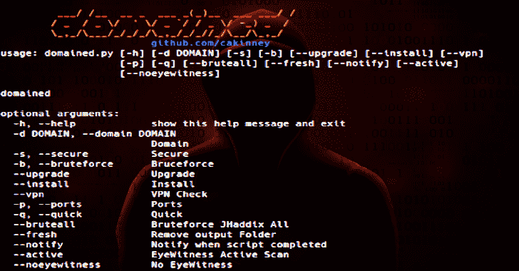

# 域:多工具子域枚举

> 原文：<https://kalilinuxtutorials.com/domained/>

**域名**是一个域名枚举工具。其中包含的工具需要 Kali Linux(首选)或 Debian 7+和 Recon-ng。

它使用几个子域枚举工具和单词表来创建一个独特的子域列表，该列表被传递给 Witness，用于报告分类截图、服务器响应头和基于签名的默认凭证检查。(资源保存到。/bin，输出保存到。/output)。

**初始安装**

*   域名工具

**python 3 domained . py–安装**

*   Python 必需的模块

**sudo pip install-r ./ext/requirements . txt**

**其他依赖关系**

*   [用于 dns 编程的 ldns](https://www.nlnetlabs.nl/documentation/ldns/) 库:

**sudo apt-get install libldns-dev-y**

*   [Go](https://golang.org) 编程语言:

**sudo apt-get 安装 golang**

**注意:**这是一次主动侦察，仅在您有权测试的应用程序上执行。

**又读-[Chrome pass:黑客入侵 Chrome 保存的密码](https://kalilinuxtutorials.com/chromepass/)**

**工具杠杆**

*   **子域枚举工具**
    *   艾哈迈德·阿布勒-埃拉
    *   杰森·哈德克斯
    *   吉安尼·阿马托敲敲
    *   [子树](https://github.com/TheRook/subbrute)通过树
    *   B. Blechschmidt 的 massdns
    *   蒂姆·托姆斯的《侦察》
    *   杰夫·福利的《积聚》
    *   [子 finder](https://github.com/subfinder/subfinder)by ice 3 man 543
*   **报告+词汇表:**
    *   《目击者》,作者:克里斯特伦瑟
    *   丹尼尔·米斯勒的 (DNS 侦察列表)
    *   Jason Haddix 的 LevelUp All.txt 子域名列表

**用途**

**第一步:**
安装需要的 Python 模块:sudo pip Install-r ./ext/requirements . txt
安装工具:sudo Python 3 domain ed . py–Install

**例 1:**Python 3 domain ed . py-d example.com
使用子域 example.com(sublist 3r(+subbrute)、enumall、Knock、Amass、SubFinder)

**例 2:**Python 3 domain ed . py-d example.com 添加端口 8443/8080 并检查是否在 VPN 上

**示例 3:**python 3 domain . py-d example.com-b–bruteall
使用子域 example.com 和 large-all.txt 强制(massdns、subbrute、Sublist3r、Amass、enumall 和 SubFinder)

**示例 4:**python 3 domain . py-d example.com–quick
使用子域 example.com

**注意:**–bruteall 必须与-b 标志一起使用

| [计]选项 | 描述 |
| --- | --- |
| –安装/–升级 | 两者的功能相同——安装所有必备工具 |
| –虚拟专用网 | 检查您是否在 VPN 上(向您的提供商更新) |
| -快 | 仅使用 mass 和 SubFinder |
| -残忍 | 用 JHaddix All.txt 列表代替 SecList |
| –新鲜 | 从输出文件夹中删除旧数据 |
| –通知 | 发送推送或 Gmail 通知 |
| –活动 | 目击者主动扫描 |
| –无目击者 | 没有目击者 |
| -d | 您想要执行侦察的领域 |
| -乙 | 使用 subbrute/massdns 和 SecList 单词表的 Bruteforce |
| -s n | 仅 HTTPs 域 |
| -p | 为 HTTP 添加端口 8080，为 HTTPS 添加端口 8443 |

**通知**

*   完成推播或 Gmail 通知的 ext/notifycfg.ini。( *Enable 必须设置为 True*
*   请点击这里查看 Pushover API 信息[，点击这里](https://pushover.net/api)查看如何在您的 gmail 帐户上允许不太安全的应用程序的说明

**信用:** ccsplit，jafoca，mortymorty，Chan9390，dainok & Apoorv Raj Saxena

[**Download**](https://github.com/TypeError/domained)